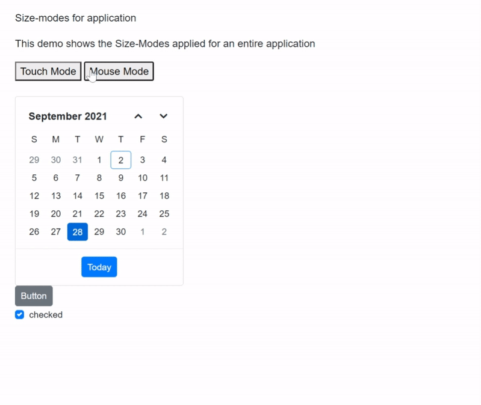
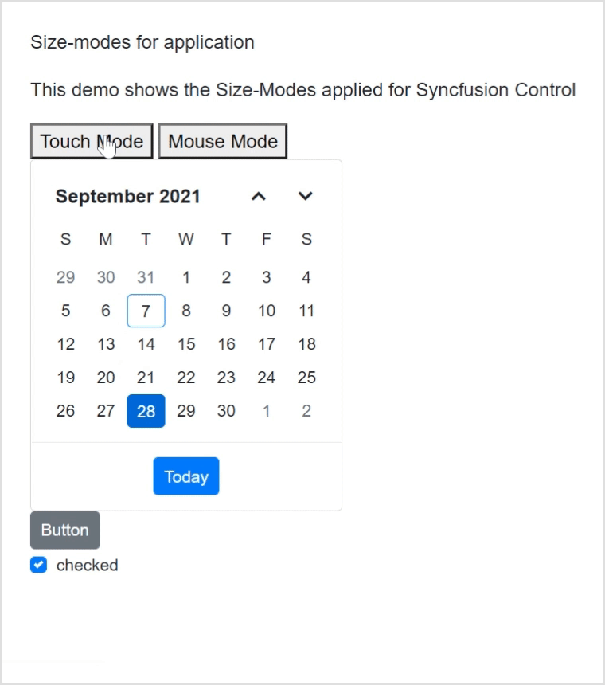

# Size Mode for ASP.NET MVC Controls

Syncfusion ASP.NET MVC controls support touch (bigger theme) and normal size modes. Below topics explains how to enable the same in your application.

## Size mode for application

You can enable touch mode (bigger theme) for an application by adding `.e-bigger` class in the `~/Content/Site.css` file and assign to the `body` element in the `~/Views/Shared/_Layout.cshtml` page.




.e-bigger {
    font-size: x-large;
}







<body class="e-bigger">...</body>




## Size mode for a Control

You can enable touch mode (bigger theme) for ASP.NET MVC controls by adding `.e-bigger` class and assign to the `div` which contains the control.




   @Html.EJS().Calendar("calendar").Render()

    @Html.EJS().Button("element").Content("Button").Render()

    @Html.EJS().CheckBox("default").Label("Checked").Checked(true).Render()




## Change size mode for application at runtime

You can change the size mode of an application between touch and normal (mouse) mode at runtime by adding and removing the `.e-bigger` class.

Follow the below steps to change the size mode for an application at runtime.

1.Add the `e-bigger` CSS class in the `~/Content/Site.css` file.




.e-bigger {
    font-size: x-large;
}




2.Refer to the following code for adding control and the JavaScript click action inside the script tag of `~/Views/Home/Index.cshtml` file to switch between touch and mouse mode using `e-bigger` class.




 Size-modes for application 

 This demo shows the Size-Modes applied for an entire application 

<button id="touch">Touch Mode</button>
<button id="mouse">Mouse Mode</button>

    @Html.EJS().Calendar("calendar").Render()

    @Html.EJS().Button("element").Content("Button").Render()

    @Html.EJS().CheckBox("default").Label("Checked").Checked(true).Render()




N> [View sample in GitHub](https://github.com/SyncfusionExamples/asp-net-mvc-size-modes/tree/main/SizeModeApp)

## Change size mode for a control at runtime

You can change the size mode of a control between touch and normal (mouse) mode at runtime by setting `.e-bigger` CSS class.  

Refer to the following code, in which the `e-bigger` class is added for enabling touch mode using the for loop in ASP.NET MVC application.




 Size-modes for application 

 This demo shows the Size-Modes applied for Syncfusion Control 

<button id="touch">Touch Mode</button>
<button id="mouse">Mouse Mode</button>

    @Html.EJS().Calendar("calendar").Render()

    @Html.EJS().Button("element").Content("Button").Render()

    @Html.EJS().CheckBox("default").Label("Checked").Checked(true).Render()




N> [View sample in GitHub](https://github.com/SyncfusionExamples/asp-net-mvc-size-modes/tree/main/SizeModeControl)

## See Also

Refer below topics to learn about responsiveness controls based on the available size in Syncfusion ASP.NET MVC Controls.

* [Sidebar Responsiveness](https://ej2.syncfusion.com/aspnetmvc/documentation/sidebar/auto-close)
* [DataGrid Responsiveness](https://ej2.syncfusion.com/aspnetmvc/documentation/grid/columns/responsive-columns)
* [TreeGrid Responsiveness](https://ej2.syncfusion.com/aspnetmvc/documentation/tree-grid/scrolling#responsive-with-parent-container)
* [Dashboard Layout Responsiveness](https://ej2.syncfusion.com/aspnetmvc/documentation/dashboard-layout/adaptive-layout)
* [Kanban Responsiveness](https://ej2.syncfusion.com/aspnetmvc/documentation/kanban/responsive-mode)
* [Toolbar Responsiveness](https://ej2.syncfusion.com/aspnetmvc/documentation/toolbar/responsive-mode)
* [Tab Responsiveness](https://ej2.syncfusion.com/aspnetmvc/documentation/tab/responsive-modes)
