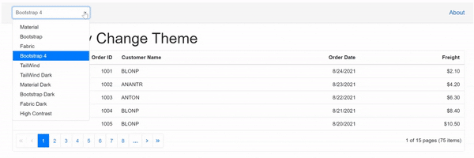

# Syncfusion ASP.NET MVC Themes

The following list of themes are included in the Syncfusion ASP.NET MVC controls library.

|Theme |Style Sheet Name|
|--------|--------|
|Bootstrap 5 | bootstrap5.css |
|Bootstrap 5 Dark | bootstrap5-dark.css |
|Bootstrap 4 | bootstrap4.css |
|Bootstrap 3 | bootstrap.css |
|Bootstrap 3 Dark | bootstrap-dark.css |
|Google’s Material | material.css |
|Google’s Material-Dark | material-dark.css |
|Tailwind CSS | tailwind.css |
|Tailwind CSS Dark | tailwind-dark.css |
|Fluent | fluent.css |
|Fluent Dark | fluent-dark.css |
|Microsoft Office Fabric | fabric.css |
|Microsoft Office Fabric Dark | fabric-dark.css |
|High Contrast | highcontrast.css |

The Syncfusion ASP.NET MVC Bootstrap theme is designed based on Bootstrap v3, whereas the Bootstrap4 theme is designed based on Bootstrap v4. Syncfusion ASP.NET MVC themes provide support for the Fusion Theme that can only be downloaded from [ThemeStudio](https://ej2.syncfusion.com/themestudio/?theme=fusion).

## Reference themes in ASP.NET MVC application

Syncfusion ASP.NET MVC themes can be used in your ASP.NET MVC application by referencing the style sheet. Refer the ASP.NET MVC Styles Sheet inside the `<head>` element of `~/Views/Shared/_Layout.cshtml` layout page.

Using the below approaches the themes can be referenced in the ASP.NET MVC application,

1. [CDN](#cdn-reference) - Used to reference complete css via static web assets.
2. CRG - Used to generate resources only for the selected (used) components.
3. [Theme Studio](https://ej2.syncfusion.com/aspnetmvc/documentation/appearance/theme-studio/) - Used to customize and generate themes only for the selected (used) components.

## CDN Reference

Instead of using a local resource on your server, you can use a cloud CDN to reference the theme style sheets. CDN Stands for "Content Delivery Network". A CDN is a group of servers distributed in different locations. While CDN are often used to host websites, they are commonly used to provide other types of downloadable data as well. Examples include software programs, images, videos, and streaming media.

Syncfusion ASP.NET MVC Themes are available in the CDN. Make sure that the version in the URLs matches the version of the Syncfusion Essential JS 2 ASP.NET MVC Package you are using.




<head>
    <link href="https://cdn.syncfusion.com/ej2/{{ site.ej2version }}/bootstrap5.css" rel="stylesheet"/>
</head>




| Theme Name | CDN Reference |
|--- | --- |
| Bootstrap 5 | https://cdn.syncfusion.com/ej2/{{ site.ej2version }}/bootstrap5.css |
| Bootstrap 5 Dark| https://cdn.syncfusion.com/ej2/{{ site.ej2version }}/bootstrap5-dark.css |
| Bootstrap 4 | https://cdn.syncfusion.com/ej2/{{ site.ej2version }}/bootstrap4.css |
| Bootstrap 3 | https://cdn.syncfusion.com/ej2/{{ site.ej2version }}/bootstrap.css |
| Bootstrap 3 Dark| https://cdn.syncfusion.com/ej2/{{ site.ej2version }}/bootstrap-dark.css |
| Google’s Material | https://cdn.syncfusion.com/ej2/{{ site.ej2version }}/material.css |
| Google’s Material Dark | https://cdn.syncfusion.com/ej2/{{ site.ej2version }}/material-dark.css |
| Tailwind CSS | https://cdn.syncfusion.com/ej2/{{ site.ej2version }}/tailwind.css |
| Tailwind Dark CSS | https://cdn.syncfusion.com/ej2/{{ site.ej2version }}/tailwind-dark.css |
| Fluent | https://cdn.syncfusion.com/ej2/{{ site.ej2version }}/fluent.css |
| Fluent Dark | https://cdn.syncfusion.com/blazor/{{ site.ej2version }}/fluent-dark.css |
| Microsoft Office Fabric  | https://cdn.syncfusion.com/ej2/{{ site.ej2version }}/fabric.css |
| Microsoft Office Fabric Dark | https://cdn.syncfusion.com/ej2/{{ site.ej2version }}/fabric-dark.css |
| High Contrast  | https://cdn.syncfusion.com/ej2/{{ site.ej2version }}/highcontrast.css |

## Change theme dynamically

In the ASP.NET MVC application, the application theme can be changed dynamically by changing its style sheet reference in code.

1.Add `id` attribute in the Syncfusion style sheet references in **~/Views/Shared/_Layout.cshtml** page like below.




<head>
    ...
    <!-- Syncfusion ASP.NET MVC controls styles -->
    <link id="cssfile" rel="stylesheet" href="https://cdn.syncfusion.com/ej2/{{ site.ej2version }}/bootstrap5.css" />
</head>




2.Create a **ThemeDetails.cs** model page and use the following code for dropdown data on the **~/Models/ThemeDetails.cs** page.




using System.Collections.Generic;

namespace ThemeSwitch.Models
{
    public class ThemeDetail
    {
        public string ID { get; set; }
        public string Text { get; set; }

        public List<ThemeDetail> ThemeDetails()
        {
            List<ThemeDetail> themes = new List<ThemeDetail>();
            themes.Add(new ThemeDetail() { ID = "material", Text = "Material" });
            themes.Add(new ThemeDetail() { ID = "bootstrap", Text = "Bootstrap" });
            themes.Add(new ThemeDetail() { ID = "fabric", Text = "Fabric" });
            themes.Add(new ThemeDetail() { ID = "bootstrap4", Text = "Bootstrap 4" });
            themes.Add(new ThemeDetail() { ID = "tailwind", Text = "TailWind" });
            themes.Add(new ThemeDetail() { ID = "tailwind-dark", Text = "TailWind Dark" });
            themes.Add(new ThemeDetail() { ID = "material-dark", Text = "Material Dark" });
            themes.Add(new ThemeDetail() { ID = "bootstrap-dark", Text = "Bootstrap Dark" });
            themes.Add(new ThemeDetail() { ID = "fabric-dark", Text = "Fabric Dark" });
            themes.Add(new ThemeDetail() { ID = "highcontrast", Text = "High Contrast" });
            return themes;
        }
    }
}




3.Implement a theme change dynamically using the Syncfusion ASP.NET MVC dropdown control in the application as in the below code.




@using Syncfusion.EJ2.DropDowns;
@using ThemeSwitch.Models;

    @Html.EJS().DropDownList("theme").Placeholder("Select a theme").PopupHeight("220px").Index(2).Width("20%").DataSource(
    (IEnumerable<ThemeDetail>)ViewBag.data).Change("onThemeChange").Fields(new DropDownListFieldSettings { Text = "Text", Value = "ID" }).Render()




> [View sample in GitHub](https://github.com/SyncfusionExamples/ASP-NET-MVC-Getting-Started-Examples/tree/main/ThemeSwitch)
