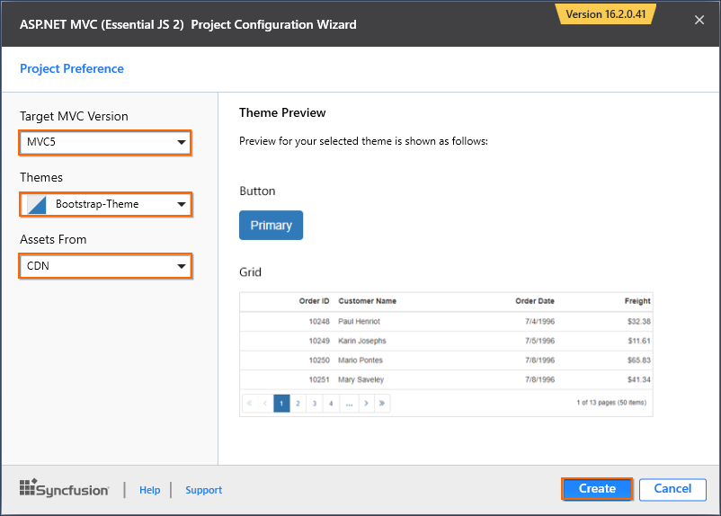
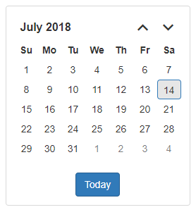
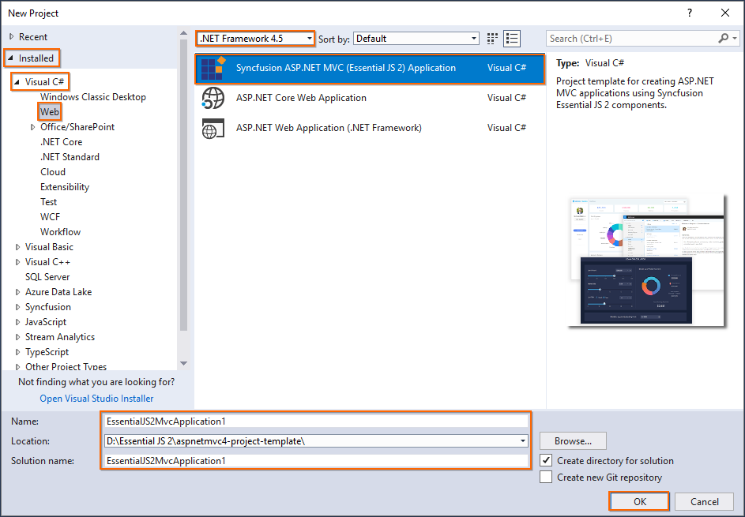

<!-- markdownlint-disable MD024 -->

# Getting Started with ASP.NET MVC and Syncfusion® Project Template

Syncfusion<sup style="font-size:70%">&reg;</sup> provides the **Visual Studio Project Templates** for the Syncfusion<sup style="font-size:70%">&reg;</sup> ASP.NET MVC platform to create the Syncfusion<sup style="font-size:70%">&reg;</sup> ASP.NET MVC web application using Essential<sup style="font-size:70%">&reg;</sup> JS 2 controls.

N> Starting with v16.2.0.x, if you reference to Syncfusion<sup style="font-size:70%">&reg;</sup> assemblies from trial setup or NuGet feed, you should include a license key in your projects. Refer to this [link](https://help.syncfusion.com/common/essential-studio/licensing/license-key) to learn about registering Syncfusion<sup style="font-size:70%">&reg;</sup> license key in your ASP.NET MVC application to use the controls.

## Getting started with ASP.NET MVC 5

### Prerequisites

To get started with ASP.NET MVC 5 application, ensure the following software to be installed on the machine.

* .Net Framework 4.5 and above.
* ASP.NET MVC 5
* Visual Studio 2017
* Essential Studio<sup style="font-size:70%">&reg;</sup> for [ASP.NET MVC (Essential<sup style="font-size:70%">&reg;</sup> JS 2)](https://www.syncfusion.com/downloads/aspnetmvc-js2/)

### Create ASP.NET MVC 5 web application

1. Choose **File > New > Project...** in the Visual Studio menu bar.

    

2. Select **Installed > Visual C# > Web** and choose the required **.NET Framework** in the drop-down.

3. Select **Syncfusion<sup style="font-size:70%">&reg;</sup> ASP.NET MVC (Essential<sup style="font-size:70%">&reg;</sup> JS 2) Application** and change the application name, and then click **OK**.

    N> The Essential<sup style="font-size:70%">&reg;</sup> JS 2 supports 4.5+ .NET Framework in the ASP.NET MVC application. i.e. The minimum target framework is 4.5 for Syncfusion<sup style="font-size:70%">&reg;</sup> ASP.NET MVC (Essential<sup style="font-size:70%">&reg;</sup> JS 2).

    

4. Choose the options to configure the Syncfusion<sup style="font-size:70%">&reg;</sup> ASP.NET Core (Essential<sup style="font-size:70%">&reg;</sup> JS 2) application by using the following Project Configuration dialog.

    **Target MVC Version:** Select the version of ASP.NET MVC project as MVC5.

    **Assets From:** Load the Syncfusion<sup style="font-size:70%">&reg;</sup> Essential<sup style="font-size:70%">&reg;</sup> JS 2 assets from ASP.NET MVC project such as NuGet, CDN or installed location.

    N> Installed location option is available only when the Syncfusion<sup style="font-size:70%">&reg;</sup> Essential JavaScript 2 setup has been installed.

    **Theme Selection:** Choose the required Theme.

    

5. Click **Create**, the Syncfusion<sup style="font-size:70%">&reg;</sup> ASP.NET MVC (Essential<sup style="font-size:70%">&reg;</sup> JS 2) application has been created.

    The required Syncfusion<sup style="font-size:70%">&reg;</sup> Essential<sup style="font-size:70%">&reg;</sup> JS 2 NuGet/NPM packages, Scripts, and CSS have been added to the new project.

    

    If you are choosing assets from `NuGet` or `Installed Location`, then the styles and scripts will be installed in the `Content/ej2` and `Scripts/ej2`.

    
    

6. Add the Syncfusion<sup style="font-size:70%">&reg;</sup> Essential<sup style="font-size:70%">&reg;</sup> JS 2 controls directly in any web page (cshtml) in the Views folder and run the application.

    For example, the calendar control is added to the `~/Views/Home/Index.cshtml` page.

    ```html
    <div>
        @Html.EJS().Calendar("calendar").Render()
    </div>
    ```

    The final output of Essential<sup style="font-size:70%">&reg;</sup> JS 2 calendar control in the web browser is shown as follows.

    

## Getting Started with ASP.NET MVC 4

### Prerequisites

To get started with ASP.NET MVC 4 application, ensure the following software to be installed on the machine.

* .Net Framework 4.5 and above.
* ASP.NET MVC 4
* Visual Studio 2017
* Essential Studio<sup style="font-size:70%">&reg;</sup> for [ASP.NET MVC (Essential<sup style="font-size:70%">&reg;</sup> JS 2)](https://www.syncfusion.com/downloads/aspnetmvc-js2/)

### Create ASP.NET MVC 4 web application

1. Choose **File > New > Project...** in the Visual Studio menu bar.

    

2. Select **Installed > Visual C# > Web** and choose the required **.NET Framework** in the drop-down and select **Syncfusion<sup style="font-size:70%">&reg;</sup> ASP.NET MVC (Essential<sup style="font-size:70%">&reg;</sup> JS 2) Application**. Change the application name and click **OK**.

    N> The Syncfusion<sup style="font-size:70%">&reg;</sup> ASP.NET MVC UI Controls supports 4.5+ .NET Framework in the ASP.NET MVC application. i.e. The minimum target framework is 4.5.

    

3. Choose the options to configure the Syncfusion<sup style="font-size:70%">&reg;</sup> ASP.NET Core (Essential<sup style="font-size:70%">&reg;</sup> JS 2) application by using the following Project Configuration dialog.

    **Target MVC Version:** Select the version of ASP.NET MVC Project as MVC4.

    **Assets From:** Load the Syncfusion<sup style="font-size:70%">&reg;</sup> Essential<sup style="font-size:70%">&reg;</sup> JS 2 assets to ASP.NET MVC Project, either NuGet, CDN or installed location.

    N> Installed location option will be available only when the Syncfusion<sup style="font-size:70%">&reg;</sup> Essential JavaScript 2 setup has been installed.

    **Theme Selection:** Choose the required Theme.

    

4. Click **Create**, the Syncfusion<sup style="font-size:70%">&reg;</sup> ASP.NET MVC (Essential<sup style="font-size:70%">&reg;</sup> JS 2) application has been created.

5. Required Syncfusion<sup style="font-size:70%">&reg;</sup> Essential<sup style="font-size:70%">&reg;</sup> JS 2 NuGet/NPM packages, Scripts, and CSS have been added to the new project.

    

    If you are choosing assets from `NuGet` or `Installed Location`, then the styles and scripts will be installed in the `Content/ej2` and `Scripts/ej2`.

    
    

6. Add the Syncfusion<sup style="font-size:70%">&reg;</sup> ASP.NET MVC UI controls directly in any web page (cshtml) in the `Views` folder and run the application.

    For example, the calendar control is added to the `~/Views/Home/Index.cshtml` page.

    ```html
    <div>
        @Html.EJS().Calendar("calendar").Render()
    </div>
    ```

    The final output of Syncfusion<sup style="font-size:70%">&reg;</sup> ASP.NET MVC Calendar UI control in the web browser is shown as follows.

    