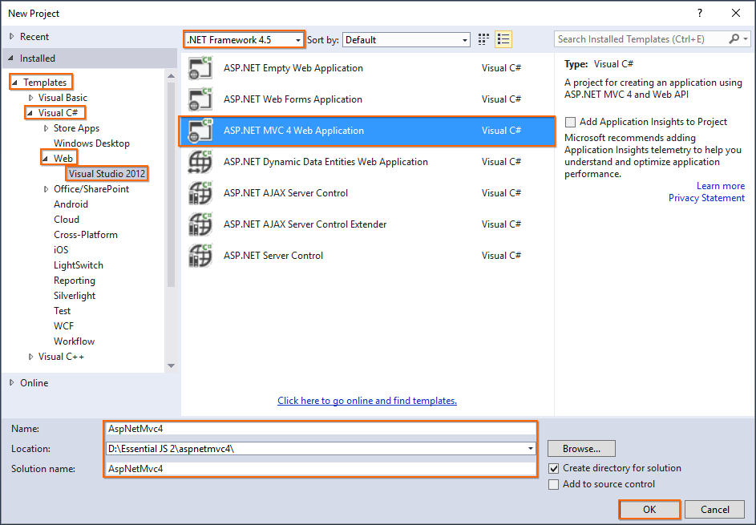
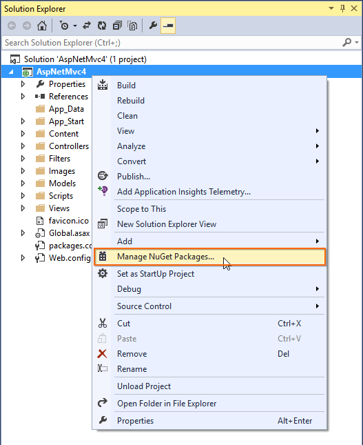

<!-- markdownlint-disable MD024 -->

# Getting Started with Essential JS 2 for ASP.NET MVC in Visual Studio

This article provides a step-by-step introduction to configure Essential JS 2 setup, build and publish a simple ASP.NET MVC web application using [Visual Studio](https://aka.ms/vsdownload?utm_source=mscom&utm_campaign=msdocs).

> Starting with v16.2.0.x, if you reference to Syncfusion assemblies from trial setup or NuGet feed, you should include a license key in your projects. Refer to this [link](https://help.syncfusion.com/common/essential-studio/licensing/license-key) to learn about registering Syncfusion license key in your ASP.NET MVC application to use the components.

## Using Visual Studio 2019

### Getting Started with ASP.NET MVC 5 Web Application

#### Prerequisites

To get started with ASP.NET MVC 5 application, ensure the following software to be installed on the machine.

* .Net Framework 4.5 and above.
* ASP.NET MVC 5 
* Visual Studio 2019

#### Create ASP.NET MVC web application

1. Choose **File > New > Project...** in the Visual Studio menu bar.

    

2. Select **ASP.NET Web Application (.NET Framework)** in visual studio 2019.

    
  
3. Change the application name, and then click **Create**.

    > The Essential JS 2 supports 4.5+ .NET Framework in the ASP.NET MVC application. i.e. The minimum target framework is 4.5 for Syncfusion ASP.NET MVC (Essential JS 2).

    

4. Choose **MVC** and then click **Create**. Now, the MVC web application project is created with default ASP.NET MVC template.

    

#### Configure Essential JS 2 in the application

1. Add the [`Syncfusion.EJ2.MVC5`](https://www.nuget.org/packages/Syncfusion.EJ2.MVC5/) NuGet package to the new application by using the Nuget Package Manager. Right-click the project and select **Manage NuGet Packages...**.

    > Refer to [this article](./../nuget-packages/) to learn more details about installing Essential JS 2 NuGet packages in various OS environment.

    

2. Search the `Syncfusion EJ2 MVC5` keyword in the **Browse** tab and install **Syncfusion.EJ2.MVC5** NuGet package in the application.

    

    The Essential JS 2 MVC5 NuGet package will be included in the project, after the installation process is completed.

    > The Syncfusion.EJ2.MVC5 NuGet package has dependencies, [`Newtonsoft.Json`](https://www.nuget.org/packages/Newtonsoft.Json/) for JSON serialization and [`Syncfusion.Licensing`](https://www.nuget.org/packages/Syncfusion.Licensing/) for validating Syncfusion license key.

3. Open `~/Views/Web.config` file and add the `Syncfusion.EJ2` namesapce reference to the `<system.web.webPages.razor>` element and `Syncfusion.EJ2` assembly reference to `<system.web>` element.

    ```html
    <configuration>
        ....
        ....
        <system.web.webPages.razor>
            ....
            ....
            <pages pageBaseType="System.Web.Mvc.WebViewPage">
                <namespaces>
                    ....
                    ....
                    <add namespace="Syncfusion.EJ2"/>
                </namespaces>
            </pages>
        </system.web.webPages.razor>
        ....
        ....
        <system.web>
            <compilation>
                <assemblies>
                    ....
                    ....
                    <add assembly="Syncfusion.EJ2, Culture=neutral" />
                </assemblies>
            </compilation>
        </system.web>
    </configuration>
    ```

4. Add the client-side resources through [CDN](https://ej2.syncfusion.com/documentation/deployment/#cdn) in the `<head>` element of `~/Views/Shared/_Layout.cshtml` layout page.

    ```html
    <head>
        ....
        ....

        <!-- Syncfusion Essential JS 2 Styles -->
        <link rel="stylesheet" href="https://cdn.syncfusion.com/ej2/material.css" />

        <!-- Syncfusion Essential JS 2 Scripts -->
        <script src="https://cdn.syncfusion.com/ej2/dist/ej2.min.js"></script>
    </head>
    ```

5. Add the Essential JS 2 Script Manager at the end of `<body>` element in the `~/Views/Shared/_Layout.cshtml` layout page.

    ```html
    <body>
        ....
        ....
        <!-- Syncfusion Essential JS 2 ScriptManager -->
        @Html.EJS().ScriptManager()
    </body>
    ```

6. Add the Syncfusion Essential JS 2 components in any web page (`cshtml`) in the `~/Views` folder.

    For example, the calendar component is added to the `~/Views/Home/Index.cshtml` page.

    ```html
    <div>
        @Html.EJS().Calendar("calendar").Render()
    </div>
    ```

7. Run the application and the Essential JS 2 calendar component will render in the web browser.

    

## Using Visual Studio 2017

### Getting Started with ASP.NET MVC 5

#### Prerequisites

To get started with ASP.NET MVC 5 application, ensure the following software to be installed on the machine.

* .Net Framework 4.5 and above.
* ASP.NET MVC 5
* Visual Studio 2017

#### Create ASP.NET MVC 5 web application

1. Choose **File > New > Project...** in the Visual Studio menu bar.

    

2. Select **Installed > Visual C# > Web** and choose the required **.NET Framework** in the drop-down.

3. Select **ASP.NET Web Application (.NET Framework)** and change the application name, and then click **OK**.

    > The Essential JS 2 supports 4.5+ .NET Framework in the ASP.NET MVC application. i.e. The minimum target framework is 4.5 for Syncfusion ASP.NET MVC (Essential JS 2).

    

4. Choose **MVC** and then click **OK**. Now, the MVC web application project is created with default ASP.NET MVC template.

    

#### Configure Essential JS 2 in the application

1. Add the [`Syncfusion.EJ2.MVC5`](https://www.nuget.org/packages/Syncfusion.EJ2.MVC5/) NuGet package to the new application by using the Nuget Package Manager. Right-click the project and select **Manage NuGet Packages...**.

    > Refer to [this article](./../nuget-packages/) to learn more details about installing Essential JS 2 NuGet packages in various OS environment.

    

2. Search the `Syncfusion EJ2 MVC5` keyword in the **Browse** tab and install **Syncfusion.EJ2.MVC5** NuGet package in the application.

    

    The Essential JS 2 MVC5 NuGet package will be included in the project, after the installation process is completed.

    > The Syncfusion.EJ2.MVC5 NuGet package has dependencies, [`Newtonsoft.Json`](https://www.nuget.org/packages/Newtonsoft.Json/) for JSON serialization and [`Syncfusion.Licensing`](https://www.nuget.org/packages/Syncfusion.Licensing/) for validating Syncfusion license key.

3. Open `~/Views/Web.config` file and add the `Syncfusion.EJ2` namesapce reference to the `<system.web.webPages.razor>` element and `Syncfusion.EJ2` assembly reference to `<system.web>` element.

    ```html
    <configuration>
        ....
        ....
        <system.web.webPages.razor>
            ....
            ....
            <pages pageBaseType="System.Web.Mvc.WebViewPage">
                <namespaces>
                    ....
                    ....
                    <add namespace="Syncfusion.EJ2"/>
                </namespaces>
            </pages>
        </system.web.webPages.razor>
        ....
        ....
        <system.web>
            <compilation>
                <assemblies>
                    ....
                    ....
                    <add assembly="Syncfusion.EJ2, Culture=neutral" />
                </assemblies>
            </compilation>
        </system.web>
    </configuration>
    ```

4. Add the client-side resources through [CDN](https://ej2.syncfusion.com/documentation/deployment/#cdn) in the `<head>` element of `~/Views/Shared/_Layout.cshtml` layout page.

    ```html
    <head>
        ....
        ....

        <!-- Syncfusion Essential JS 2 Styles -->
        <link rel="stylesheet" href="https://cdn.syncfusion.com/ej2/material.css" />

        <!-- Syncfusion Essential JS 2 Scripts -->
        <script src="https://cdn.syncfusion.com/ej2/dist/ej2.min.js"></script>
    </head>
    ```

5. Add the Essential JS 2 Script Manager at the end of `<body>` element in the `~/Views/Shared/_Layout.cshtml` layout page.

    ```html
    <body>
        ....
        ....
        <!-- Syncfusion Essential JS 2 ScriptManager -->
        @Html.EJS().ScriptManager()
    </body>
    ```

6. Add the Syncfusion Essential JS 2 components in any web page (`cshtml`) in the `~/Views` folder.

    For example, the calendar component is added to the `~/Views/Home/Index.cshtml` page.

    ```html
    <div>
        @Html.EJS().Calendar("calendar").Render()
    </div>
    ```

7. Run the application and the Essential JS 2 calendar component will render in the web browser.

    

### Getting Started with ASP.NET MVC 4

#### Prerequisites

To get started with ASP.NET MVC 4 application, ensure the following software to be installed on the machine.

* .Net Framework 4.5 and above.
* ASP.NET MVC 4
* Visual Studio 2013

#### Create ASP.NET MVC 4 web application

1. Choose **File > New > Project...** in the Visual Studio menu bar.

    

2. Select **Installed > Templates > Visual C# > Web > Visual Studio 2012** and choose the required **.NET Framework** in the drop-down.

3. Select **ASP.NET MVC 4 Web Application** and change the application name and click **OK**.

    > The Essential JS 2 supports 4.5+ .NET Framework in the ASP.NET MVC application. i.e. The minimum target framework is 4.5 for Syncfusion ASP.NET MVC (Essential JS 2).

    

4. Choose **Internet Application** and select **View engine** as **Razor**, and then click **OK**. Now, the MVC web application project is created with default ASP.NET MVC 4 template.

    

#### Configure Essential JS 2 in the application

1. Add the [`Syncfusion.EJ2.MVC4`](https://www.nuget.org/packages/Syncfusion.EJ2.MVC4/) NuGet package into the new application by using the Nuget Package Manager. Right-click the project and select **Manage NuGet Packages...**.

    > Refer to [this article](./../nuget-packages/) to learn more details about installing Essential JS 2 NuGet packages in various OS environment.

    

2. Select **Online** option and search the keyword `Syncfusion EJ2 MVC4` in the search text box, and then install **Syncfusion.EJ2.MVC4** NuGet package in the application.

    

    The Essential JS 2 MVC4 NuGet package will be included in the project, after the installation process is completed.

    > The Syncfusion.EJ2.MVC4 NuGet package has dependencies, [`Newtonsoft.Json`](https://www.nuget.org/packages/Newtonsoft.Json/) for JSON serialization and [`Syncfusion.Licensing`](https://www.nuget.org/packages/Syncfusion.Licensing/) for validating Syncfusion license key.

3. Open `~/Views/Web.config` file and add the `Syncfusion.EJ2` namesapce reference to the `<system.web.webPages.razor>` element, and then add `Syncfusion.EJ2` assembly reference to the `<system.web>` element.

    ```html
    <configuration>
        ....
        ....
        <system.web.webPages.razor>
            ....
            ....
            <pages pageBaseType="System.Web.Mvc.WebViewPage">
                <namespaces>
                    ....
                    ....
                    <add namespace="Syncfusion.EJ2"/>
                </namespaces>
            </pages>
        </system.web.webPages.razor>
        ....
        ....
        <system.web>
            ....
            ....
            <pages>
                <controls>
                    ....
                    ....
                    <add assembly="Syncfusion.EJ2, Culture=neutral" tagPrefix="mvc"/>
                </controls>
            </pages>
        </system.web>
    </configuration>
    ```

4. Add the client-side resources through [CDN](https://ej2.syncfusion.com/documentation/deployment/#cdn) in the `<head>` element of `~/Views/Shared/_Layout.cshtml` layout page.

    ```html
    <head>
        ....
        ....

        <!-- Syncfusion Essential JS 2 Styles -->
        <link rel="stylesheet" href="https://cdn.syncfusion.com/ej2/material.css" />

        <!-- Syncfusion Essential JS 2 Scripts -->
        <script src="https://cdn.syncfusion.com/ej2/dist/ej2.min.js"></script>
    </head>
    ```

5. Add the Essential JS 2 Script Manager at the end of `<body>` element in the `~/Views/Shared/_Layout.cshtml` layout page.

    ```html
    <body>
        ....
        ....
        <!-- Syncfusion Essential JS 2 ScriptManager -->
        @Html.EJS().ScriptManager()
    </body>
    ```

6. Add the Syncfusion Essential JS 2 components in any web page (`cshtml`) in the `~/Views` folder.

    For example, the calendar component is added to the `~/Views/Home/Index.cshtml` page.

    ```html
    <div>
        @Html.EJS().Calendar("calendar").Render()
    </div>
    ```

7. Run the application and the Essential JS 2 Calendar component will render in the web browser.

    
