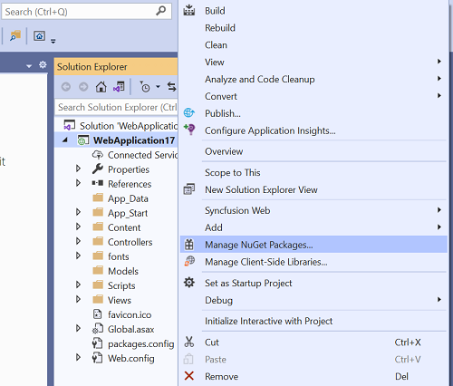
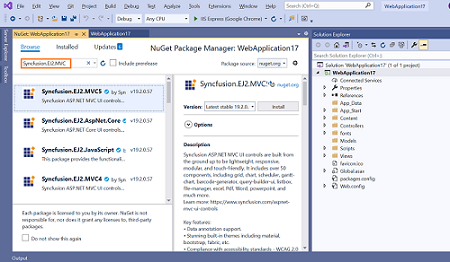
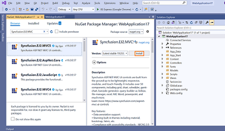
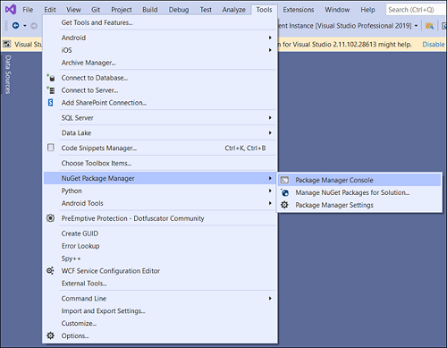
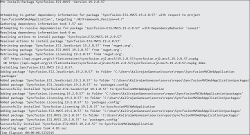

# Install Syncfusion<sup style="font-size:70%">&reg;</sup> ASP.NET MVC NuGet Packages

This guide explains how to install the Syncfusion<sup style="font-size:70%">&reg;</sup> ASP.NET MVC (EJ2) NuGet packages the **Package Manager Console** in Visual Studio.

**Prerequisites**

* Visual Studio 2017 or later with the **ASP.NET and web development** workload installed.
* The [.NET Framework] 4.5.2 or later installed.
* An existing ASP.NET MVC web application (or a new one created through **File** → **New** → **Project** → **ASP.NET Web Application (.NET Framework)** with the **MVC** template).
* A Syncfusion<sup style="font-size:70%">&reg;</sup> account, or a Syncfusion<sup style="font-size:70%">&reg;</sup> unlock key for the target version.

## Overview

**NuGet** is a Package management system for Visual Studio. It makes it easy to add, update and remove external libraries in our application. Syncfusion<sup style="font-size:70%">&reg;</sup> publishes all ASP.NET MVC (EJ2) NuGet packages on [nuget.org](https://www.nuget.org/packages?q=Tags%3A%22AspNet.MVC%20EJ2%22+syncfusion). The Syncfusion<sup style="font-size:70%">&reg;</sup> ASP.NET MVC (EJ2) NuGet packages can be used without installing the Syncfusion<sup style="font-size:70%">&reg;</sup> setup. You can simply reference the Syncfusion<sup style="font-size:70%">&reg;</sup> ASP.NET MVC (EJ2) NuGet packages in an ASP.NET MVC application to develop with the Syncfusion<sup style="font-size:70%">&reg;</sup> ASP.NET MVC (EJ2) components.

N> The `Syncfusion.EJ2.MVC5` NuGet package, which contains all Syncfusion<sup style="font-size:70%">&reg;</sup> ASP.NET MVC (EJ2) components in a single package, is available beginning with v16.1.0.24 (Essential Studio<sup style="font-size:70%">&reg;</sup> 2018 Volume 1).

## Installation Using the Package Manager UI

The NuGet **Package Manager UI** allows you to search, install, uninstall, and update Syncfusion<sup style="font-size:70%">&reg;</sup> ASP.NET MVC (EJ2) NuGet packages in your applications and solutions. You can find and install the Syncfusion<sup style="font-size:70%">&reg;</sup> ASP.NET MVC (EJ2) NuGet packages in your Visual Studio ASP.NET MVC web application, and this process is easy with the steps below:

1. To open the Manage NuGet packages UI, follow either one of the options below:

    **Option 1:**

    Right-click on the ASP.NET MVC web application or solution in the Solution Explorer, and choose **Manage NuGet Packages...**

    

    **Option 2:**

    After opening the ASP.NET MVC web application in Visual Studio, go to the **Tools** menu and, after hovering **NuGet Package Manager**, select **Manage NuGet Packages for Solution...**

    

2. The Manage NuGet Packages window will open. Navigate to the **Browse** tab, then search for the Syncfusion<sup style="font-size:70%">&reg;</sup> ASP.NET MVC (EJ2) NuGet packages using a term like **`Syncfusion.EJ2.MVC5`**, and select the appropriate Syncfusion<sup style="font-size:70%">&reg;</sup> ASP.NET MVC NuGet package for your development.

    N> The [nuget.org](https://api.nuget.org/v3/index.json) package source is selected by default in the **Package source** drop-down. If your Visual Studio does not have nuget.org configured, follow the instructions in the [Microsoft docs](https://docs.microsoft.com/en-us/nuget/tools/package-manager-ui#package-sources) to set up the nuget.org feed URL.

    

3. When you select a package, the right side panel will provide more information about it.

4. By default, the package is selected with the latest version. You can choose the required version and click the **Install** button and accept the license terms. The package will be added to your ASP.NET MVC application.

    

5. At this point, your application has all the required Syncfusion<sup style="font-size:70%">&reg;</sup> assemblies, and you will be ready to start building high-performance, responsive apps with [Syncfusion<sup style="font-size:70%">&reg;</sup> ASP.NET MVC (EJ2) components](https://www.syncfusion.com/aspnet-mvc-ui-controls). Also, you can refer to the [ASP.NET MVC (EJ2) help documentation](https://ej2.syncfusion.com/aspnetmvc/documentation/introduction) for development.

## Installation Using the Package Manager Console

The **Package Manager Console** saves NuGet package installation time since you don't have to search for the `Syncfusion.EJ2.MVC5` NuGet package you want to install — you can just type the installation command. Follow the instructions below to use the Package Manager Console to reference the Syncfusion<sup style="font-size:70%">&reg;</sup> ASP.NET MVC (EJ2) component as a NuGet package in your ASP.NET MVC web application.

1. To show the Package Manager Console, open your ASP.NET MVC web application in Visual Studio and navigate to **Tools** → **NuGet Package Manager** → **Package Manager Console**.

    

2. The **Package Manager Console** will be shown at the bottom of the screen. You can install the Syncfusion<sup style="font-size:70%">&reg;</sup> ASP.NET MVC (EJ2) NuGet packages by entering the following NuGet installation commands.

    **Install the specified Syncfusion<sup style="font-size:70%">&reg;</sup> ASP.NET MVC (EJ2) NuGet package**

    The command below installs the Syncfusion<sup style="font-size:70%">&reg;</sup> ASP.NET MVC (EJ2) NuGet package in the default ASP.NET MVC application:

    ```powershell
    Install-Package <PackageName>
    ```

    **For example:**

    ```powershell
    Install-Package Syncfusion.EJ2.MVC5
    ```

    N> You can find the list of Syncfusion<sup style="font-size:70%">&reg;</sup> ASP.NET MVC (EJ2) NuGet packages published on nuget.org from [here](https://www.nuget.org/packages?q=Tags%3A%22AspNet.Mvc%20EJ2%22+syncfusion).

    **Install the specified Syncfusion<sup style="font-size:70%">&reg;</sup> ASP.NET MVC (EJ2) NuGet package in a specified ASP.NET MVC application**

    The command below installs the Syncfusion<sup style="font-size:70%">&reg;</sup> ASP.NET MVC (EJ2) NuGet package in the given ASP.NET MVC application:

    ```powershell
    Install-Package <PackageName> -ProjectName <ProjectName>
    ```

    **For example:**

    ```powershell
    Install-Package Syncfusion.EJ2.MVC5 -ProjectName SyncfusionMVCWebApplication
    ```

3. By default, the package will be installed with the latest version. You can specify the required version with the `-Version` flag to install the Syncfusion<sup style="font-size:70%">&reg;</sup> ASP.NET MVC (EJ2) NuGet packages at the appropriate version:

    ```powershell
    Install-Package Syncfusion.EJ2.MVC5 -Version 19.2.0.57
    ```

    

4. The NuGet package manager console will install the Syncfusion<sup style="font-size:70%">&reg;</sup> ASP.NET MVC (EJ2) NuGet package and its dependencies. When the installation is complete, the console will show that your Syncfusion<sup style="font-size:70%">&reg;</sup> ASP.NET MVC (EJ2) package has been successfully added to the application.

5. At this point, your application has all the required Syncfusion<sup style="font-size:70%">&reg;</sup> assemblies, and you will be ready to start building high-performance, responsive apps with [Syncfusion<sup style="font-size:70%">&reg;</sup> ASP.NET MVC (EJ2) components](https://www.syncfusion.com/aspnet-mvc-ui-controls). Also, you can refer to the [ASP.NET MVC (EJ2) help documentation](https://ej2.syncfusion.com/aspnetmvc/documentation/introduction) for development.

## Next Steps

After installing the NuGet package, you typically need to:

1. Register the Syncfusion<sup style="font-size:70%">&reg;</sup> resources. In your ASP.NET MVC application, open `~/App_Start/BundleConfig.cs` (or equivalent) and add the Syncfusion<sup style="font-size:70%">&reg;</sup> theme stylesheet and script bundles for the components you plan to use. For example:

    ```csharp
    bundles.Add(new StyleBundle("~/Content/syncfusion").Include(
        "~/Content/ej2/bootstrap4.css"));
    bundles.Add(new ScriptBundle("~/Scripts/syncfusion").Include(
        "~/Scripts/ej2/ej2.min.js"));
    ```

2. Reference the bundles from the relevant Razor view (for example, `_Layout.cshtml`):

    ```html
    @Styles.Render("~/Content/syncfusion")
    @Scripts.Render("~/Scripts/syncfusion")
    ```

3. For an individual component (e.g., Grid), register it in `BundleConfig.cs` and use the Tag Helper in your view:

    ```html
    <ejs-grid id="Grid" allowPaging="true">
        <e-data-manager url="/Home/UrlDatasource" adaptor="UrlAdaptor"></e-data-manager>
        <e-grid-columns>
            <e-grid-column field="OrderID" headerText="Order ID" textAlign="Right" width="120"></e-grid-column>
            <e-grid-column field="CustomerID" headerText="Customer ID" width="140"></e-grid-column>
        </e-grid-columns>
    </ejs-grid>
    ```

For component-specific configuration, theming, and usage examples, refer to the documentation of the individual Syncfusion<sup style="font-size:70%">&reg;</sup> ASP.NET MVC (EJ2) component you are using.

## Troubleshooting

| Issue | Possible Cause | Suggested Fix |
| --- | --- | --- |
| `Install-Package` fails with "Package not found". | The package source in Visual Studio is not set to nuget.org. | In **Tools** → **NuGet Package Manager** → **Package Manager Settings**, add `https://api.nuget.org/v3/index.json` as a package source. |
| The `Syncfusion.EJ2.MVC5` package reports a target-framework error. | The selected package version does not support your project's target framework. | Use a package version that supports your .NET Framework version (for example, 19.x for .NET Framework 4.5.2+). |
| Syncfusion controls do not render in the view. | The Syncfusion resources (CSS / JS) are not referenced from the layout. | Reference the Syncfusion stylesheet and script bundles from `_Layout.cshtml`. See the [Next Steps](#next-steps) section. |
| License warning appears after build. | License key has not been registered for this project. | Generate the license key from the [License & Downloads](https://www.syncfusion.com/account/downloads) page and register it. See [Common Installation Errors](https://ej2.syncfusion.com/aspnetmvc/documentation/installation/common-installation-errors). |

For additional help, see [Common Installation Errors](https://ej2.syncfusion.com/aspnetmvc/documentation/installation/common-installation-errors).

## Related Links

* [Downloading Syncfusion offline installer](https://ej2.syncfusion.com/aspnetmvc/documentation/installation/offline-installer/how-to-download)
* [Downloading Syncfusion web installer](https://ej2.syncfusion.com/aspnetmvc/documentation/installation/web-installer/how-to-download)
* [Common Installation Errors](https://ej2.syncfusion.com/aspnetmvc/documentation/installation/common-installation-errors)