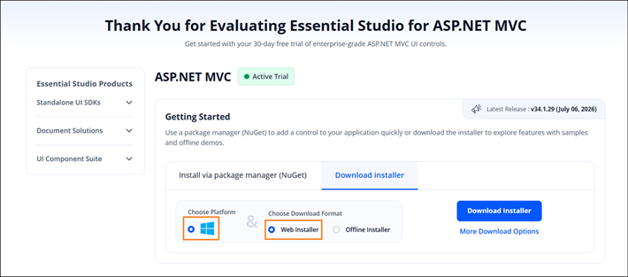
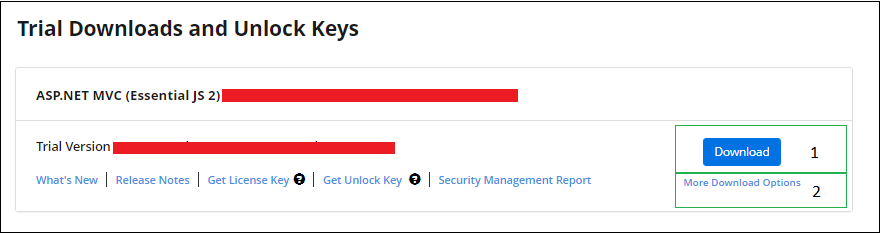
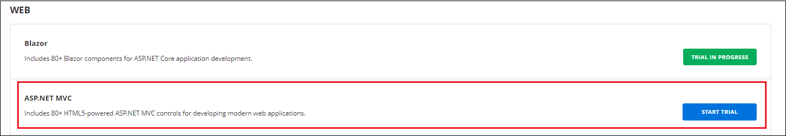
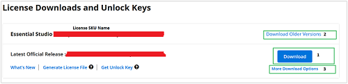

# Downloading Syncfusion&reg; ASP.NET MVC EJ2 Web Installer

The Syncfusion&reg; ASP.NET MVC - EJ2 Installer can be downloaded from the [Syncfusion](https://www.syncfusion.com/aspnet-mvc-ui-controls) website. You can either download the licensed installer or try our trial installer depending on your license. This guide covers the following options:

* Trial Installer
* Licensed Installer

**Prerequisites**

* A registered Syncfusion&reg; account. To create one, see the [Syncfusion downloads page](https://www.syncfusion.com/downloads).
* A Windows machine with administrator privileges (required when running the installer).
* A valid Syncfusion&reg; account, or a Syncfusion&reg; unlock key for the target version.

## Download the Trial Version

The 30-day trial can be downloaded in two ways:

* Download Free Trial Setup
* Start Trials if using components through [NuGet.org](https://www.nuget.org/packages?q=syncfusion)

### Download Free Trial Setup

1. Evaluate the 30-day free trial by visiting the [Download Free Trial](https://www.syncfusion.com/downloads) page and selecting the ASP.NET MVC platform.

2. After completing the required form or logging in with your registered Syncfusion&reg; account, download the ASP.NET MVC EJ2 trial installer from the confirmation page (see the screenshot below).

    

3. With a trial license, only the latest version's trial installer can be downloaded.

4. After downloading, the Syncfusion&reg; ASP.NET MVC - EJ2 trial installer can be unlocked using either the trial unlock key or the Syncfusion&reg; registered login credentials. For more information on generating an unlock key, see [this article](https://www.syncfusion.com/kb/8069/how-to-generate-unlock-key-for-essentials-studio-products).

5. Before the trial expires, you can download the trial installer at any time from your registered account's [Trials & Downloads](https://www.syncfusion.com/account/manage-trials/downloads) page (see the screenshot below).

6. Click **Download** (element 1 in the screenshot above) to get the Syncfusion&reg; Essential Studio&reg; ASP.NET MVC - EJ2 web installer.

    

### Start Trials if Using Components Through NuGet.org

If you have already obtained Syncfusion&reg; components through [NuGet.org](https://www.nuget.org/packages?q=syncfusion), initiate an evaluation as follows:

1. Start your 30-day free trial for ASP.NET MVC - EJ2 from the [Start Trial](https://www.syncfusion.com/account/manage-trials/start-trials) page in your account.

    

2. To access this page, you must sign up or log in with your Syncfusion&reg; account.

3. Begin your trial by selecting the ASP.NET MVC - EJ2 product.

   N> If you've already used the trial products and they haven't expired, you won't be able to start the trial for the same product again.

4. After you've started the trial, go to the [Trials & Downloads](https://www.syncfusion.com/account/manage-trials/downloads) page to get the latest version trial installer. You can generate the [unlock key](https://www.syncfusion.com/kb/8069/how-to-generate-unlock-key-for-essentials-studio-products) and [license key](https://ej2.syncfusion.com/aspnetmvc/documentation/licensing/how-to-generate) at any time before the trial period expires (see the screenshot below).

    

5. You can find your current active trial products on the [Trials & Downloads](https://www.syncfusion.com/account/manage-trials/downloads) page.

## Download the License Version

1. Syncfusion&reg; licensed products are available on the [License & Downloads](https://www.syncfusion.com/account/downloads) page under your registered Syncfusion&reg; account.

2. You can view all the licenses (both active and expired) associated with your account.

3. Click **Download** (element 1 in the screenshot below) to download the respective product's installer.

4. The most recent version of the installer is downloaded from this page.

5. To download older version installers, go to [Downloads - Older Versions](https://www.syncfusion.com/account/downloads/studio) (element 2 in the screenshot below).

6. Download other platform / add-on installers by selecting **More Download Options** (element 3 in the screenshot below).

    

7. Before the license expires, you can download the installer at any time from your registered account's [License & Downloads](https://www.syncfusion.com/account/downloads) page (see the screenshot below).

   

8. After downloading, the Syncfusion&reg; ASP.NET MVC EJ2 web installer can be unlocked using your Syncfusion&reg; registered login credentials.

   N> For Syncfusion&reg; trial and licensed products, there is no separate web installer. Based on your account license, the Syncfusion&reg; trial or licensed product will be installed via the web installer.

For step-by-step installation guidelines, refer to the [Web installer](https://ej2.syncfusion.com/aspnetmvc/documentation/installation/web-installer/how-to-install) documentation.

## Troubleshooting

| Issue | Possible Cause | Suggested Fix |
| --- | --- | --- |
| The web installer is not listed under **Downloads**. | The signed-in account does not own a license, or the product filter is set to a different platform. | Confirm the account owns an ASP.NET MVC license, then filter the list to the ASP.NET MVC / Web platform. |
| Installer fails with "Another installation is in progress." | Another MSI installation is currently running. | End the running `msiexec.exe` process in Task Manager, or wait for the other install to finish. See [Common Installation Errors](https://ej2.syncfusion.com/aspnetmvc/documentation/installation/common-installation-errors). |
| "Controlled folder access seems to be enabled" alert. | Windows Controlled folder access is blocking the install/samples location. | See the [Unable to install due to controlled folder access](https://ej2.syncfusion.com/aspnetmvc/documentation/installation/common-installation-errors#unable-to-install-due-to-controlled-folder-access) section. |
| License warning appears after install. | The unlock key was not applied, or the trial expired. | Re-run the installer and sign in with the licensed account. See [Common Installation Errors](https://ej2.syncfusion.com/aspnetmvc/documentation/installation/common-installation-errors). |