# Installing Syncfusion&reg; ASP.NET MVC EJ2 Web Installer

This guide explains how to install the Syncfusion&reg; Essential&reg; Studio ASP.NET MVC - EJ2 **web installer** on Windows, and how to uninstall it.

**Prerequisites**

* A Windows machine with administrator privileges.
* An active internet connection (the web installer downloads the selected products at install time).
* A downloaded copy of the Syncfusion&reg; Essential Studio&reg; Web Installer for ASP.NET MVC - EJ2. See [Downloading Syncfusion web installer](https://ej2.syncfusion.com/aspnetmvc/documentation/installation/web-installer/how-to-download).
* A valid Syncfusion&reg; account (for the login step) or a Syncfusion&reg; unlock key.

## Overview

For the Essential Studio&reg; ASP.NET MVC - EJ2 product, Syncfusion&reg; offers a Web Installer. This installer alleviates the burden of downloading a larger installer. You can simply download and run the online installer, which is smaller in size and will download and install the Essential Studio&reg; products you have chosen. You can get the most recent version of Essential Studio&reg; Web Installer from the [Syncfusion account downloads page](https://www.syncfusion.com/account/downloads/latest-version).

## Installation

The steps below show how to install the Essential Studio&reg; ASP.NET MVC - EJ2 Web Installer.

1. Open the Syncfusion&reg; Essential Studio&reg; ASP.NET MVC - EJ2 Web Installer file from the downloaded location by double-clicking it. The Installer Wizard automatically opens and extracts the package.

    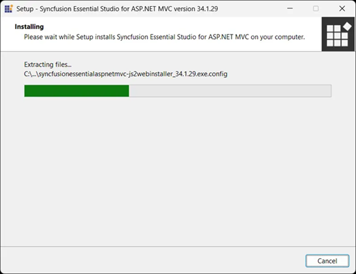

    > **Note:** The installer wizard extracts the `syncfusionessentialaspnetmvc-js2webinstaller_<version>.exe` dialog, which displays the package's unzip operation.

2. The Syncfusion&reg; ASP.NET MVC - EJ2 Web Installer's welcome wizard is displayed. Click **Next**.

    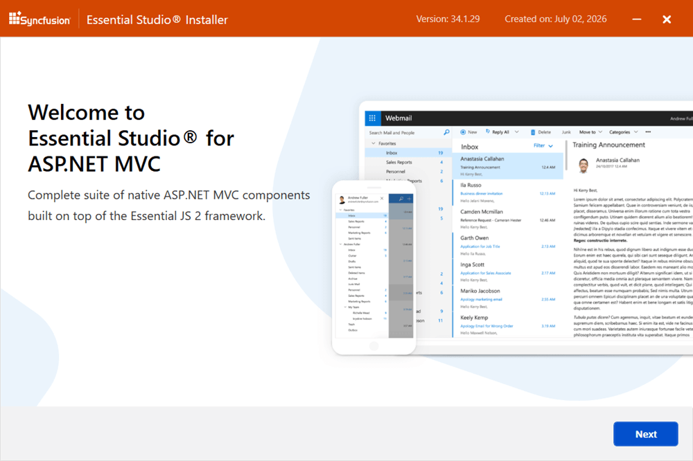

3. The Platform Selection Wizard appears. From the **Available** tab, select the products to install. To install all products, select the **Install All** check box.

    **Available**

    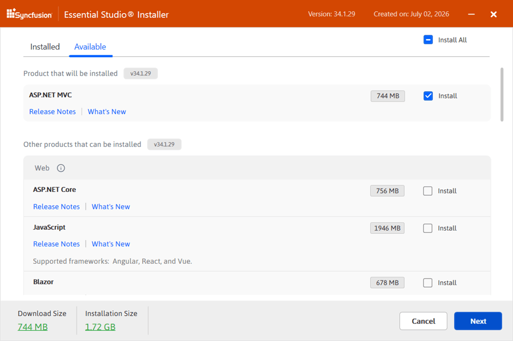

    If you have multiple products installed in the same version, they appear under the **Installed** tab. You can also select which products to uninstall from the same version. Click **Next**.

    **Installed**

    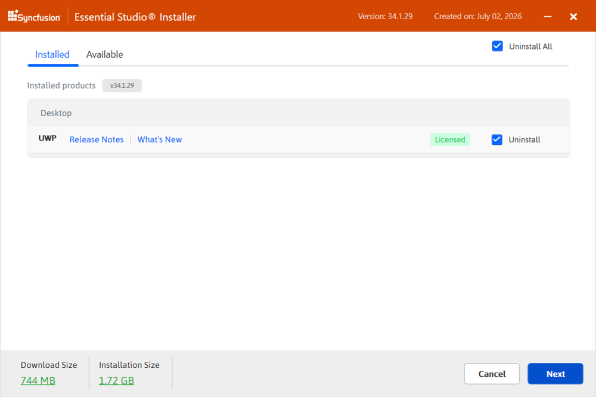

    > **Important:** If the required software for the selected product is not already installed, the **Additional Software Required** alert appears. You can continue the installation and install the necessary software later.

    **Required Software**

    

4. If previous versions for the selected products are installed, the **Uninstall Previous Version** wizard is displayed. You can view the list of previously installed versions for the products you have chosen. To remove all versions, check the **Uninstall All** check box. Click **Next**.

    

    > **Note:** From the 2021 Volume 1 release, Syncfusion&reg; provides the option to uninstall the previous versions from 18.1 onward while installing the new version.

5. A pop-up is displayed to confirm the uninstall of the selected previous versions. Click **Continue** to proceed.

    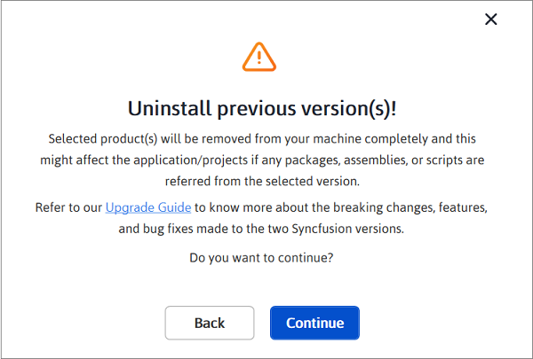

6. The Confirmation Wizard appears with the list of products to be installed and uninstalled. You can view and modify the list of products that will be installed and uninstalled from this page.

    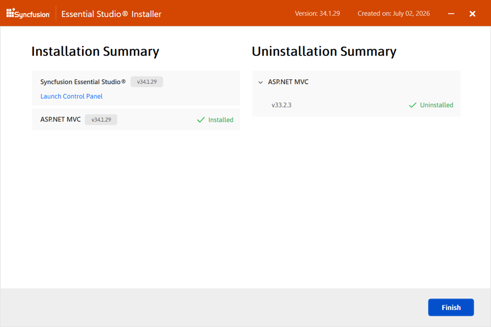

    > **Note:** By clicking the **Download Size** and **Installation Size** links, you can determine the approximate size of the download and installation.

7. The Configuration Wizard appears. You can change the **Download**, **Install**, and **Demos** locations from here. You can also change the Additional Settings on a product-by-product basis. Click **Next** to install with the default settings.

   

   **Additional Settings**

   * Select the **Install Demos** check box to install Syncfusion&reg; samples, or leave the check box unchecked if you do not want to install samples.
   * Select the **Configure Syncfusion&reg; Extensions controls in Visual Studio** check box to configure the Syncfusion&reg; Extensions in Visual Studio. Clear this check box if you do not want to configure the extensions.
   * Check the **Create Desktop Shortcut** check box to add a desktop shortcut for Syncfusion&reg; Control Panel.
   * Check the **Create Start Menu Shortcut** check box to add a shortcut to the start menu for Syncfusion&reg; Control Panel.

8. After reading the License Terms and Conditions, check the **I agree to the License Terms and Privacy Policy** check box. Click **Next**.

9. The Login Wizard appears. Enter your Syncfusion&reg; email address and password. If you do not already have a Syncfusion&reg; account, you can create one by clicking **Create an Account**. If you have forgotten your password, click **Forgot Password** to create a new one. Click **Install**.

    

    > **Important:** The products you have chosen will be installed based on your Syncfusion&reg; license (Trial or Licensed).

10. The download and installation / uninstallation progress is displayed as shown below.

    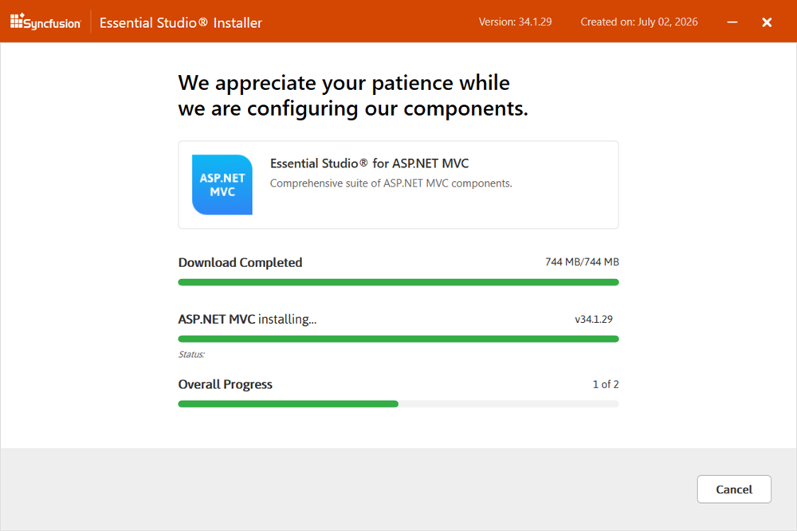

11. When the installation is finished, the **Summary** wizard appears. Here you can see the list of products that have been installed successfully and those that have failed. To close the Summary wizard, click **Finish**.

    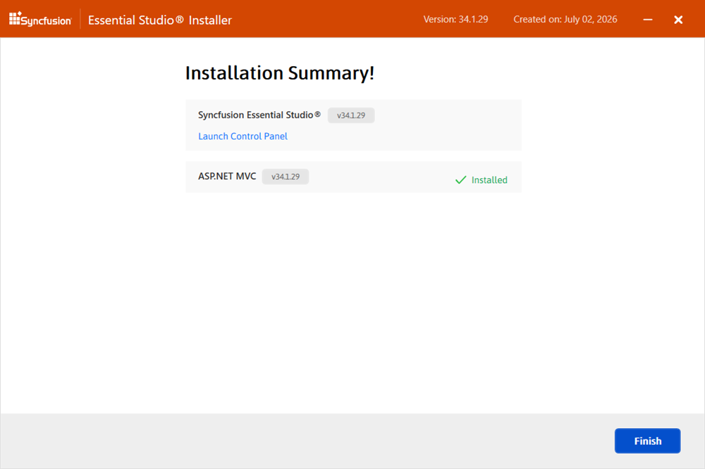

    * To open the Syncfusion&reg; Control Panel, click **Launch Control Panel**.

12. After installation, there are two Syncfusion&reg; Control Panel entries, as shown below. The **Essential Studio&reg;** entry manages all Syncfusion&reg; products installed in the same version, while the **Product** entry only uninstall the specific product setup.

    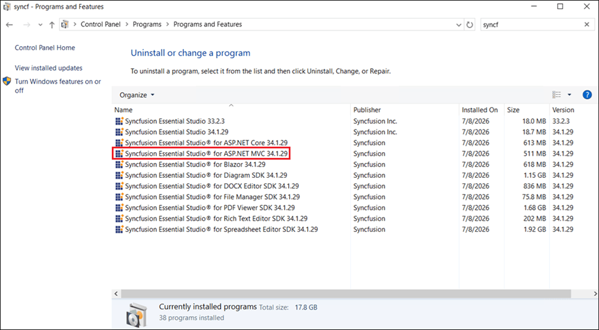

## Uninstallation

The Syncfusion&reg; ASP.NET MVC - EJ2 installer can be uninstalled in two ways:

* Uninstall the ASP.NET MVC - EJ2 installer using the Syncfusion&reg; ASP.NET MVC - EJ2 web installer.
* Uninstall the ASP.NET MVC - EJ2 installer from the Windows Control Panel.

Follow either one of the options below to uninstall the Syncfusion&reg; Essential Studio&reg; ASP.NET MVC - EJ2 installer.

### Option 1: Uninstall the ASP.NET MVC - EJ2 Using the Web Installer

Syncfusion&reg; provides the option to uninstall products of the same version directly from the Web Installer application. Select the products to be uninstalled from the list, and the Web Installer will uninstall them one by one.

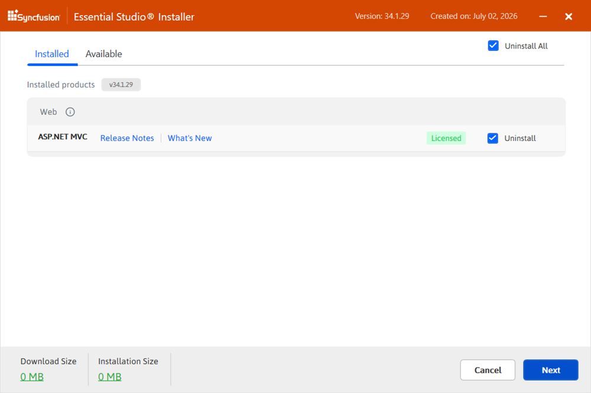

### Option 2: Uninstall the ASP.NET MVC - EJ2 from the Windows Control Panel

You can uninstall all the installed products by selecting the **Syncfusion&reg; Essential Studio&reg; {version}** entry (element 1 in the below screenshot) from the Windows control panel, or you can uninstall the ASP.NET MVC - EJ2 alone by selecting the **Syncfusion&reg; Essential Studio&reg; for ASP.NET MVC {version}** entry (element 2 in the below screenshot) from the Windows control panel.

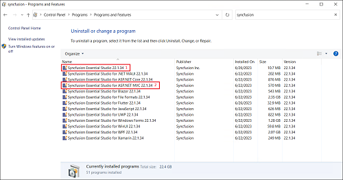

> **Note:** If the **Syncfusion&reg; Essential Studio&reg; for ASP.NET MVC - EJ2 {version}** entry is selected from the Windows control panel, only the Syncfusion&reg; Essential Studio&reg; ASP.NET MVC - EJ2 product is removed, and the default MSI uninstallation window is displayed.

1. The Syncfusion&reg; ASP.NET MVC - EJ2 Web Installer's welcome wizard is displayed. Click **Next**.

    

2. The Platform Selection Wizard appears. From the **Installed** tab, select the products to be uninstalled. To select all the products, check the **Uninstall All** check box. Click **Next**.

    **Installed**

    

    You can also select the products to be installed from the **Available** tab. Click **Next**.

    **Available**

    

3. If any other products are selected for installation, the Uninstall Previous Version wizard is displayed with the previous version(s) installed for the selected products. You can view the list of installed previous versions for the selected products. To select all versions, check the **Uninstall All** check box. Click **Next**.

    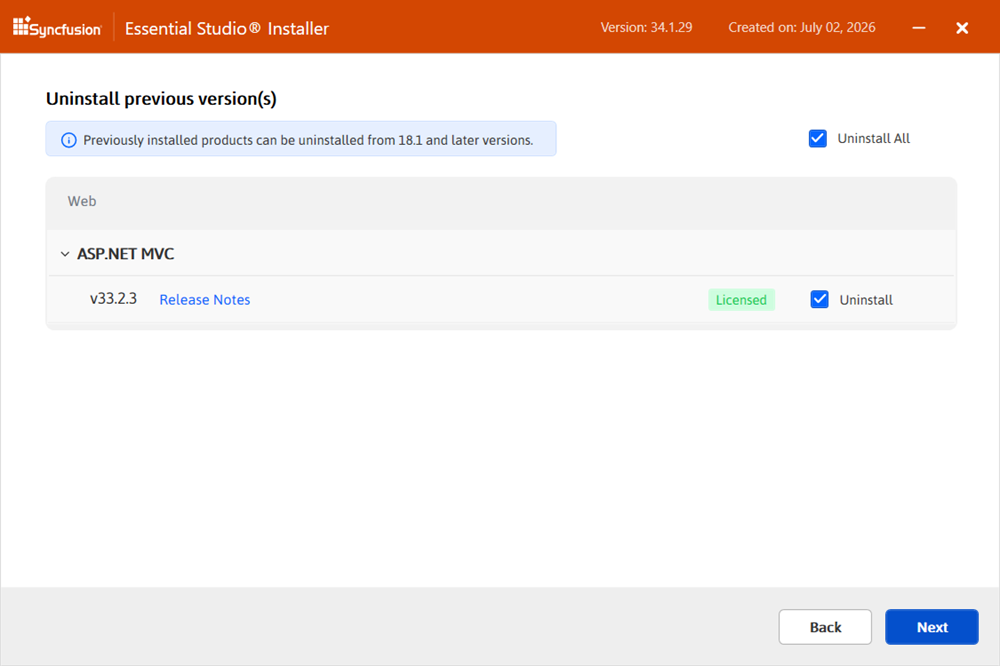

4. A pop-up is displayed to confirm the uninstall of the selected previous versions.

    

5. The Confirmation Wizard appears with the list of products to be installed and uninstalled. You can view and modify the list of products that will be installed and uninstalled from this page.

    

    > **Note:** By clicking the **Download Size** and **Installation Size** links, you can determine the approximate size of the download and installation.

6. The Configuration Wizard appears. You can change the **Download**, **Install**, and **Demos** locations from here. You can also change the Additional Settings on a product-by-product basis. Click **Next** to install with the default settings.

    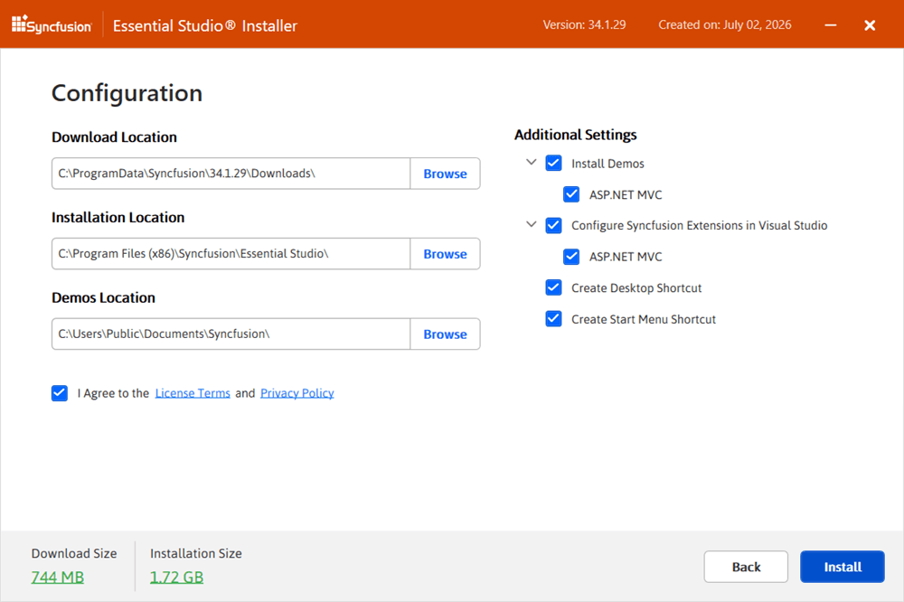

7. After reading the License Terms and Conditions, check the **I agree to the License Terms and Privacy Policy** check box. Click **Next**.

8. The Login Wizard appears. Enter your Syncfusion&reg; email address and password. If you do not already have a Syncfusion&reg; account, you can create one by clicking **Create an Account**. If you have forgotten your password, click **Forgot Password** to create a new one. Click **Install**.

    

    > **Important:** The products you have chosen will be installed based on your Syncfusion&reg; license (Trial or Licensed).

9. The download, installation, and uninstallation progress is shown.

    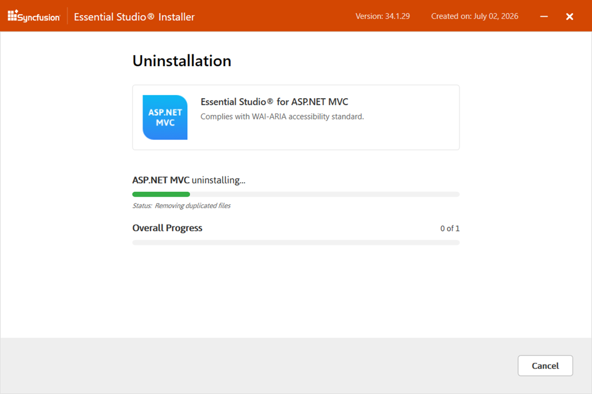

10. When the installation is finished, the **Summary** wizard appears. Here you can see the list of products that have been successfully and unsuccessfully installed or uninstalled. To close the Summary wizard, click **Finish**.

    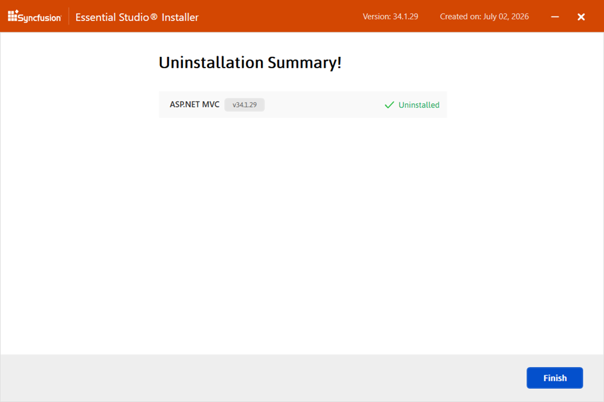

    * To open the Syncfusion&reg; Control Panel, click **Launch Control Panel**.

## Troubleshooting

| Issue | Possible Cause | Suggested Fix |
| --- | --- | --- |
| Installer fails with "Another installation is in progress." | Another MSI installation is currently running. | End the running `msiexec.exe` process in Task Manager, or wait for the other install to finish. See [Common Installation Errors](https://ej2.syncfusion.com/aspnetmvc/documentation/installation/common-installation-errors). |
| "Additional Software Required" alert blocks install. | A prerequisite such as the .NET Framework or Visual Studio is missing. | Install the listed prerequisite and re-run the Web Installer, or continue and install the prerequisite later. |
| Installer cannot download products during install. | No internet connection, or a firewall is blocking the download. | Verify your connection and allow the installer through your firewall or proxy. |
| License warning appears after install. | The unlock key was not applied, or the trial expired. | Re-run the installer and sign in with the licensed account. See [Common Installation Errors](https://ej2.syncfusion.com/aspnetmvc/documentation/installation/common-installation-errors). |
| Old version is still listed in the Control Panel after upgrade. | The previous version was not selected for uninstall during the install. | Re-run the installer and choose **Uninstall** for the old version, or remove it from **Apps & features** in Windows Settings. |

For additional help, see [Common Installation Errors](https://ej2.syncfusion.com/aspnetmvc/documentation/installation/common-installation-errors).