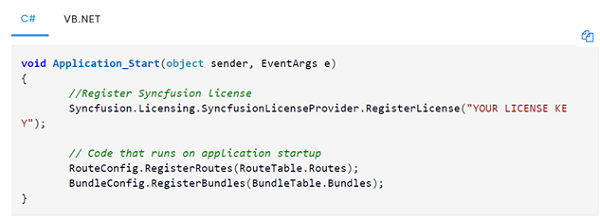

# Register Syncfusion® License key in ASP .NET MVC EJ2 application

License key should be registered if your project uses Syncfusion&reg; ASP .NET MVC - EJ2 packages referenced from [NuGet.org](https://www.nuget.org/packages?q=syncfusion) or the Syncfusion&reg; installer.

## ASP . NET MVC

Register the license key in the Application_Start method of **Global.asax.cs** or **Global.asax.vb**.

