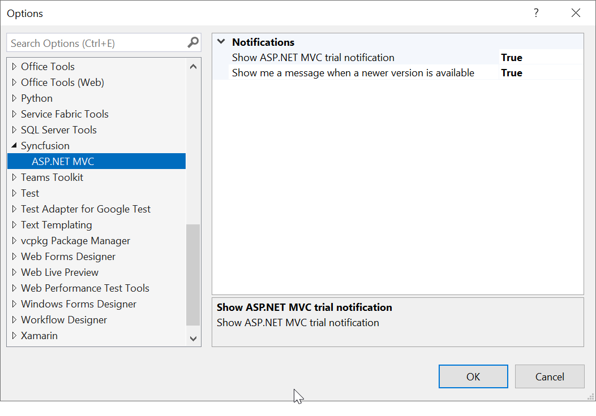
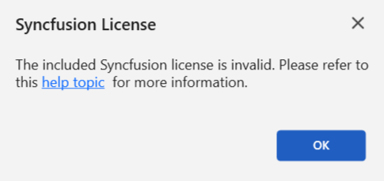

# Syncfusion&reg; Notifications

Syncfusion&reg; enhances the user experience in ASP.NET MVC applications through notification messages. These notifications cover various aspects, including alerts for trial applications when utilizing Syncfusion&reg; trial assemblies, updates regarding the availability of the latest Syncfusion&reg; NuGet package, and notifications regarding newer releases of Essential Studio&reg; By keeping users informed, Syncfusion&reg; ensures that developers stay updated with Syncfusion&reg; latest features and enhancements.

N> The Syncfusion&reg; Notification feature is available from Essential Studio&reg; v22.1.34.

## Notification Configuration

The Syncfusion&reg; Options page allows you to configure notification settings. Customise trial and newer version notifications with a simple true or false toggle.

It can be accessed by clicking **Tools -> Options -> Syncfusion&reg; -> ASP.NET MVC**

## Notification Types

**1. Syncfusion&reg; Trial Application Notification**

When you utilize Syncfusion&reg; trial assemblies in your ASP.NET MVC application, you will receive a notification stating, **This application uses a trial Syncfusion&reg; license.** This notification encourages you to obtain a valid license key, enabling you to fully explore and experience the extensive features and capabilities offered by Syncfusion.

**2. Newer Syncfusion&reg; NuGet Package Notification**

If you have installed lower versions of Syncfusion&reg; NuGet packages in your application, you will be notified about the availability of higher versions of Syncfusion&reg; NuGet packages on nuget.org. This empowers you to easily identify opportunities to upgrade and gain access to new features, performance enhancements, and bug fixes.

**3. Newer Essential Studio&reg; Build Notification**

If you use older versions of Syncfusion&reg; assemblies or NuGet packages from **Essential Studio&reg; ASP.NET MVC - EJ2,** Syncfusion&reg; will notify you about new releases for the latest Essential Studio&reg; build. Updating to the newest version ensures access to recent features, enhancements, and important updates, maximizing the capabilities of Syncfusion&reg; in your ASP.NET MVC development projects.

**4. Invalid License Key Notification**

If you have mistakenly used an incorrect license key or used a license from another version or platform in your ASP.NET MVC application, Syncfusion&reg; will display a notification message stating, **The provided Syncfusion&reg; license key is invalid.** This message serves as a reminder to obtain a valid license key and ensure proper licensing for Syncfusion&reg; components.

  

