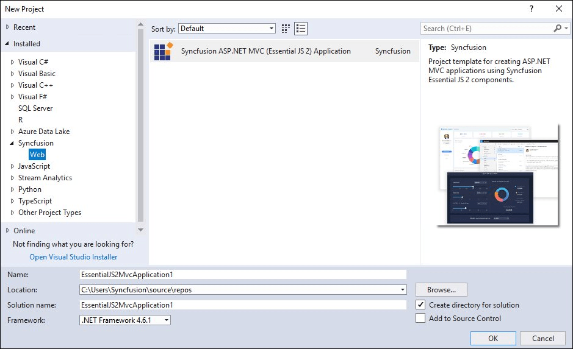
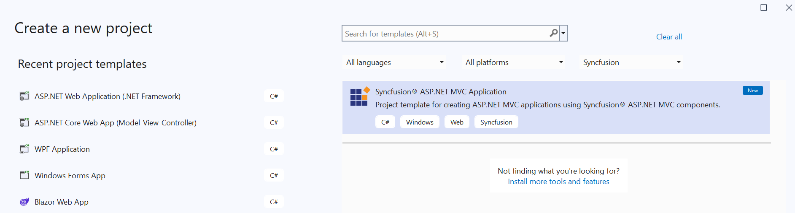
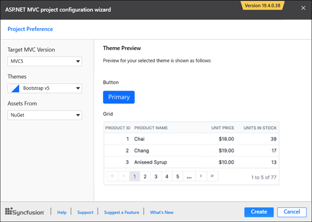
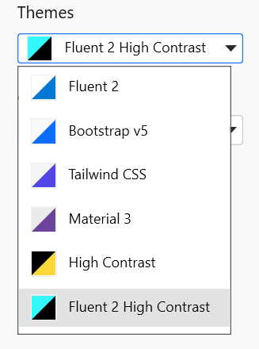
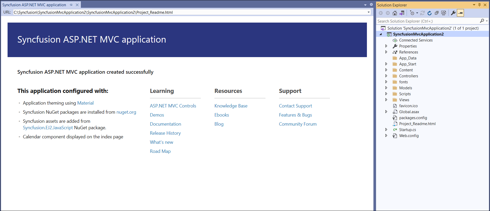
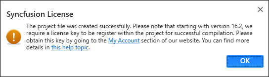

# Visual Studio extensions

## Create project

Syncfusion provides the **Visual Studio Project Templates** for the Syncfusion ASP.NET MVC platform to create the Syncfusion ASP.NET MVC Web Application with the Essential JS 2 components.

> The Syncfusion ASP.NET MVC (Essential JS 2) project templates are available from v16.2.0.41.

Use the following steps to create the **Syncfusion ASP.NET MVC (Essential JS 2) Web Application** through the **Visual Studio Project Template.**

> Before use the Syncfusion ASP.NET MVC Project Template, check whether the **ASP.NET MVC Extensions - Syncfusion** installed or not in Visual Studio Extension Manager by clicking on the Tools -> Extensions and Updates -> Installed for Visual Studio 2017 or lower and for Visual Studio 2019 by clicking on the Extensions -> Manage Extensions -> Installed. If this extension not installed, please install the extension by follow the steps from the [download and installation](https://ej2.syncfusion.com/aspnetmvc/documentation/visual-studio-integration/VS2019-Extensions/download-and-installation/) help topic.

1. To create the Syncfusion ASP.NET MVC (Essential JS 2) project, follow either one of the options below:

    **Option 1:**

    Click **Syncfusion Menu** and choose **Essential Studio for ASP.NET MVC (EJ2) > Create New Syncfusion Project…** in **Visual Studio 2019 earlier**.

    

    > From Visual Studio 2019, Syncfusion menu is available under Extension in Visual Studio menu.

    

    **Option 2:**

    Choose **File > New > Project** and navigate to **Syncfusion > Web > Syncfusion ASP.NET MVC (Essential JS 2) Application** in **Visual Studio 2019 earlier**.

    

    > From Visual Studio 2019, Syncfusion ASP.NET MVC will be shown like below in solution explores.

    

2. Name the **Project**, choose the **destination location**, and set the .NET Framework of the project, and then click **OK**. The Project Configuration Wizard appears.

    

    **Project configurations**

    **Target MVC Version**: Select the version of ASP.NET MVC Project, either MVC5 or MVC4.

    **Theme Selection**: Choose the required Theme. The Theme Preview section shows the controls preview with selected theme before creating the Syncfusion project.

    

    **Assets From**: : Load the Syncfusion Essential JS 2 assets to ASP.NET MVC Project, either NuGet, CDN, or Installed Location.

    > Installed location option will be available only when the Syncfusion Essential JavaScript 2 setup has been installed.

3. Click **Create**, the Syncfusion ASP.NET MVC (Essential JS 2) Application will be created.

    

4. The required Syncfusion NuGet packages, Scripts, and CSS have been added to the project.

    

    

5. Then, the Syncfusion licensing registration required message box will be shown, if you installed the trial setup or NuGet packages since Syncfusion introduced the licensing system from 2018 Volume 2 (v16.2.0.41) Essential Studio release. Navigate to the [help topic](https://help.syncfusion.com/common/essential-studio/licensing/license-key#how-to-generate-syncfusion-license-key), which is shown in the licensing message box to generate and register the Syncfusion license key to your project. Refer to this [blog](https://blog.syncfusion.com/post/whats-new-in-2018-volume-2-licensing-changes-in-the-1620x-version-of-essential-studio.aspx) post to learn more about the licensing changes introduced in Essential Studio.

    
