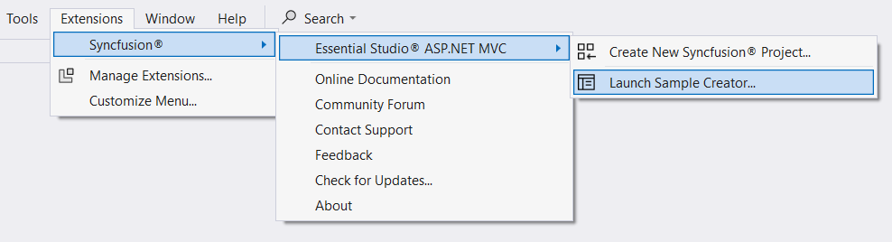
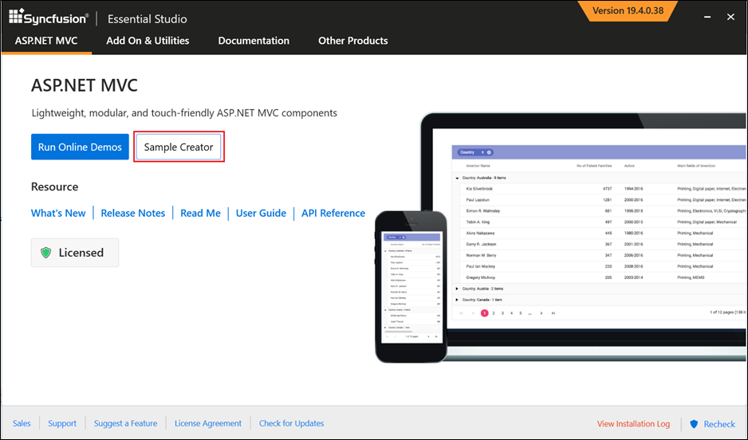
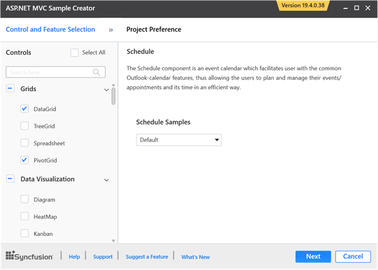
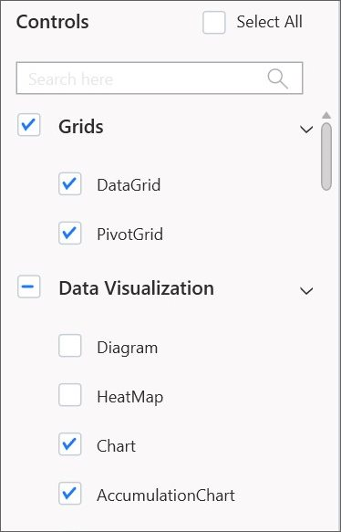
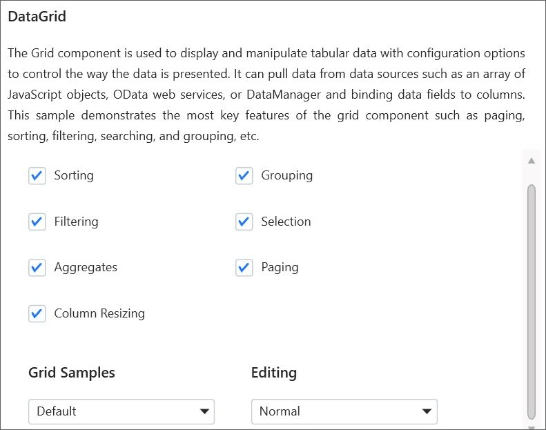
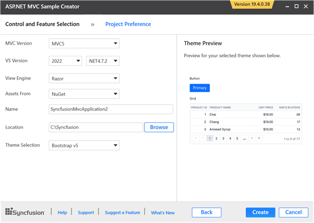
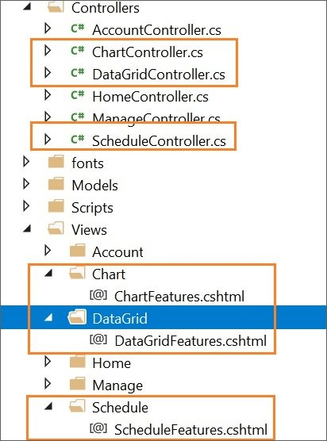
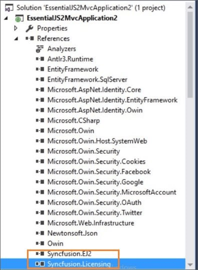

# Create Sample

The Syncfusion Sample Creator is a tool that lets you make Syncfusion ASP.NET MVC (Essential JS 2) projects with sample code for required Syncfusion component features and Syncfusion control configuration.

> The Syncfusion ASP.NET MVC (Essential JS 2) Sample Creator utility is available from v16.3.0.17.

Use the following steps to create the Syncfusion ASP.NET MVC (Essential JS 2) Application through the Sample Creator utility:

1. Follow one of the options below to launch the ASP.NET MVC (Essential JS 2) Sample Creator application:

    **Option 1:** Click **Syncfusion Menu** and choose **Essential Studio for ASP.NET MVC (EJ2) > Launch Sample Creator…** in **Visual Studio**.

    

    **Option 2:**

    Launch the Syncfusion ASP.NET MVC (Essential JS 2) Control Panel. Select the Sample Creator button to launch the ASP.NET MVC (Essential JS 2) Sample Creator application. Refer to the following screenshot for more information.

    

2. Syncfusion controls and features are listed in the ASP.NET MVC (Essential JS 2) Sample Creator.

    

    **Controls Selection**: Choose the required controls. The controls are grouped with Syncfusion products.

    

    **Feature Selection**: Based on the controls, the feature is enabled to choose the features of the corresponding controls.

    

## Project Configuration

1. You can configure the project with the following details:

    * **MVC Version**: Choose the required MVC Version.

    * **VS Version**: Choose the Visual Studio version and Framework.

    * **View Engine**: By default, Syncfusion supports only Razor view engine for ASP.NET MVC projects.

    * **Assets From**: Choose the Syncfusion Essential JS 2 assets to ASP.NET MVC Project, either NuGet, CDN or Installed Location.

    > Installed location option will be available only when the Syncfusion Essential JavaScript 2 setup has been installed.

    * **Name**: Name your Syncfusion ASP.NET MVC (Essential JS 2) Application.

    * **Location**: Choose the target location of your project.

    * **Theme Selection**: Choose the required theme. This section shows the controls preview before creating the Syncfusion project.

    

2. Click **Create** button. After creating the project, open the project by clicking **Yes**. If you click **No**, the corresponding location of the project will be opened. Refer to the following screenshot for more information.

    

3. The new Syncfusion ASP.NET MVC (Essential JS 2) project is created with the resources.

    * Added the required Controllers and View files in the project.

        

    * Included the required Syncfusion ASP.NET MVC (Essential JS 2) scripts and theme files.

        

    * The required Syncfusion assemblies are added for selected controls under Project Reference.

        
