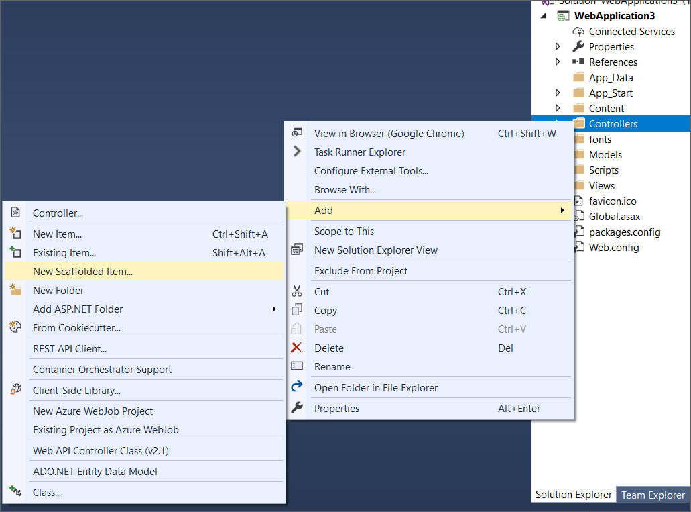
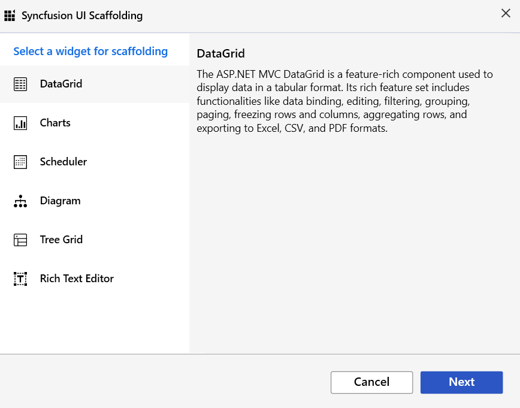
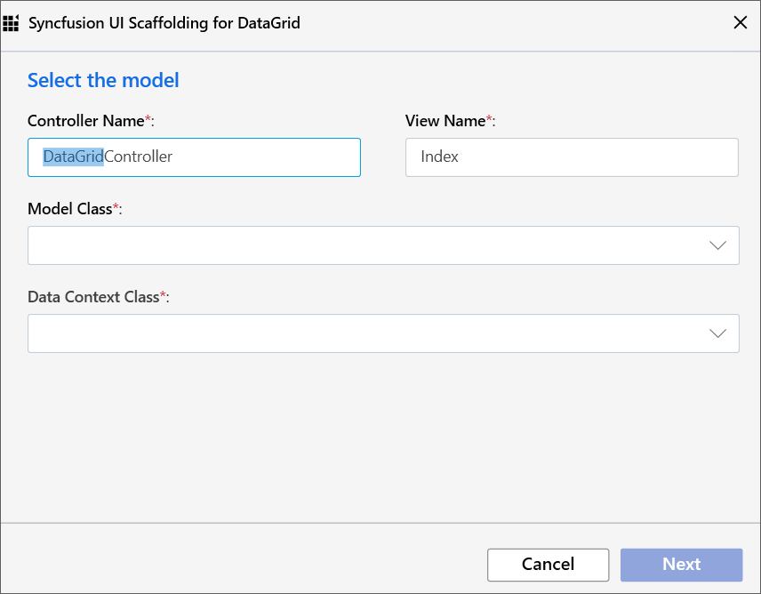
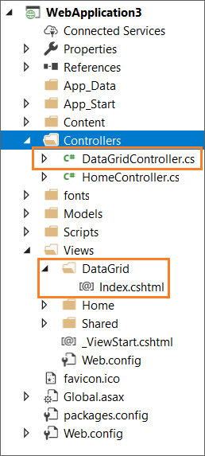

# Scaffolding

Syncfusion provides **Visual Studio Scaffolding**for Syncfusion ASP.NET MVC platform to quickly add code that interacts with data models and reduce the amount of time to develop with data operation in your project. Scaffolding provides an easier way to create Views and Controller action methods for Syncfusion ASP.NET MVC DataGrid, Charts, and Scheduler controls.

> The Syncfusion ASP.NET MVC UI Scaffolder is available from v16.4.0.40.

The following steps explain you how to add a scaffolded item to your ASP.NET MVC Web application.

> Before use, the Syncfusion ASP.NET MVC Scaffolding, check whether the **ASP.NET MVC Extensions - Syncfusion** installed or not in Visual Studio Extension Manager by clicking on the Tools -> Extensions and Updates -> Installed for Visual Studio 2017 or lower and for Visual Studio 2019 by clicking on the Extensions -> Manage Extensions -> Installed. If this extension not installed, please install the extension by follow the steps from the [download and installation](https://ej2.syncfusion.com/aspnetmvc/documentation/visual-studio-integration/VS2019-Extensions/download-and-installation/) help topic.

1. Right-click the **Controllers** folder in the Solution Explorer, click **Add**, and then select **New Scaffolded Item**.

    

2. In the **Add Scaffold** dialog, select **Syncfusion ASP.NET MVC UI Scaffolder**, and then click **‘Add’**.

    

3. In the Syncfusion UI Scaffolding dialog, select the desired control to perform scaffolding, and then click **Next**.

    

4. Selected control model dialogue will be launched in the Syncfusion UI Scaffolder. Enter the **Controller Name** and **View Name** as application requirements, and then select the required **Model Class** of the active project and its relevant **Data Context Class**, and then click **Next**.

    

5. Selected control feature dialogue will be launched in the Syncfusion UI Scaffolder. Select the required features, update the required data field, and then click **Add**.

    

6. The **Controller** and the corresponding **View** files are now generated with the selected features of Syncfusion control code snippet.

    

7. If you installed the trial setup or NuGet packages from nuget.org you have to register the Syncfusion license key to your project since Syncfusion introduced the licensing system from 2018 Volume 2 (v16.2.0.41) Essential Studio release. Navigate to the [help topic](https://help.syncfusion.com/common/essential-studio/licensing/license-key#how-to-generate-syncfusion-license-key) to generate and register the Syncfusion license key to your project. Refer to this [blog](https://blog.syncfusion.com/post/Whats-New-in-2018-Volume-2-Licensing-Changes-in-the-1620x-Version-of-Essential-Studio.aspx?_ga=2.11237684.1233358434.1587355730-230058891.1567654773) post for understanding the licensing changes introduced in Essential Studio.

> Ensure that at least one Entity Framework model exists, and the application has been compiled once. If no Entity Framework model exist in your application, refer to this [documentation](https://docs.microsoft.com/en-us/aspnet/mvc/overview/getting-started/database-first-development/creating-the-web-application#generate-the-models) to generate the Entity Framework model. After the model file has been added, ensure that the required DBContext and properties have been added. Now, build the application, and try scaffolding. If any changes have been done in the model properties, rebuild the application once before perform scaffolding.

Refer to the following UG links to render Syncfusion control after performed scaffolding.

MVC4: [Configure Essential JS 2 using Syncfusion.EJ2.MVC4 package](https://ej2.syncfusion.com/aspnetmvc/documentation/getting-started/visual-studio-2017/#configure-essential-js-2-in-the-application-1)

MVC5: [Configure Essential JS 2 using Syncfusion.EJ2.MVC5 package](https://ej2.syncfusion.com/aspnetmvc/documentation/getting-started/visual-studio-2017/#configure-essential-js-2-in-the-application)
