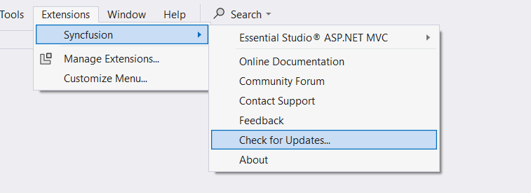
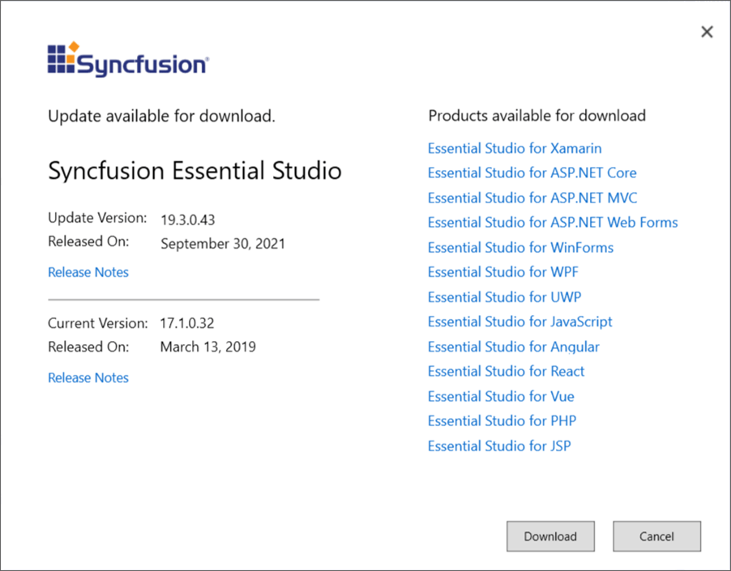

# Check for Updates in ASP.NET MVC Application

Syncfusion provides the check for update extensions to find latest version of essential release was available, if it was available then provide option update most recent version of the Essential Studio release. So that, you always get the latest features, fixes, and improvements by installing the latest version.

> The Syncfusion Check for updates is available from v17.1.0.32.

You can check updates availability in Visual Studio, and then install the update version if required.

1. Choose **Extensions->Syncfusion -> Check for Updates…** in the Visual Studio menu.

    

    > In Visual Studio 2017 or lower, you can see the Syncfusion menu directly in the Visual Studio menu..

    

2. When there is an update, **Update** dialog box opens.

    

3. You can download the Syncfusion Essential Studio from the Syncfusion website by selecting **Download**.