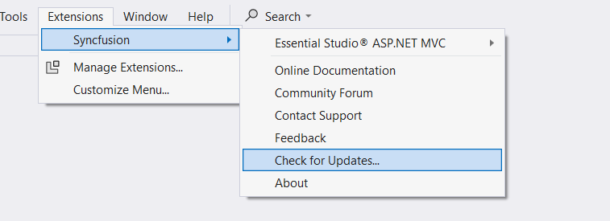

# Check for Updates in ASP.NET MVC Application

Syncfusion® provides the Check for Updates extension to find the latest version of the Essential Studio release. If it is available, the extension then provides the option to update to the most recent version of the Essential Studio® release. Installing the latest version ensures you consistently receive the newest features, fixes, and enhancements.

N> The Syncfusion® Check for Updates is available from v17.1.0.32.

You can check for update availability in Visual Studio, and then install the updated version if required.

1. Choose **Extensions > Syncfusion® > Check for Updates…** in the Visual Studio menu.

    

     > In Visual Studio 2017 or lower, this menu is available under **Tools > Syncfusion® > Check for Updates…**.

2. When there is an update, the **Update** dialog box opens.

    

3. You can download the Syncfusion Essential Studio® from the Syncfusion website by selecting **Download**.