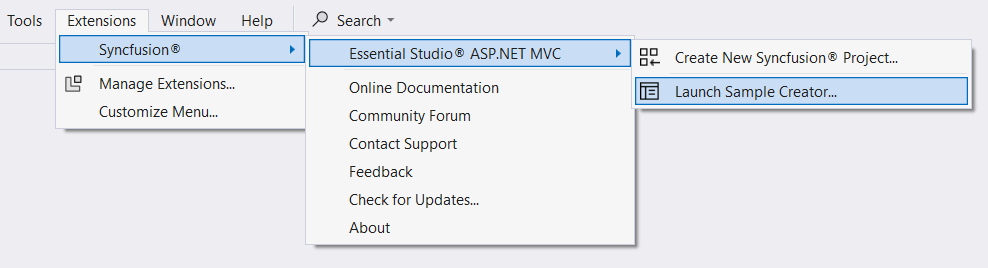
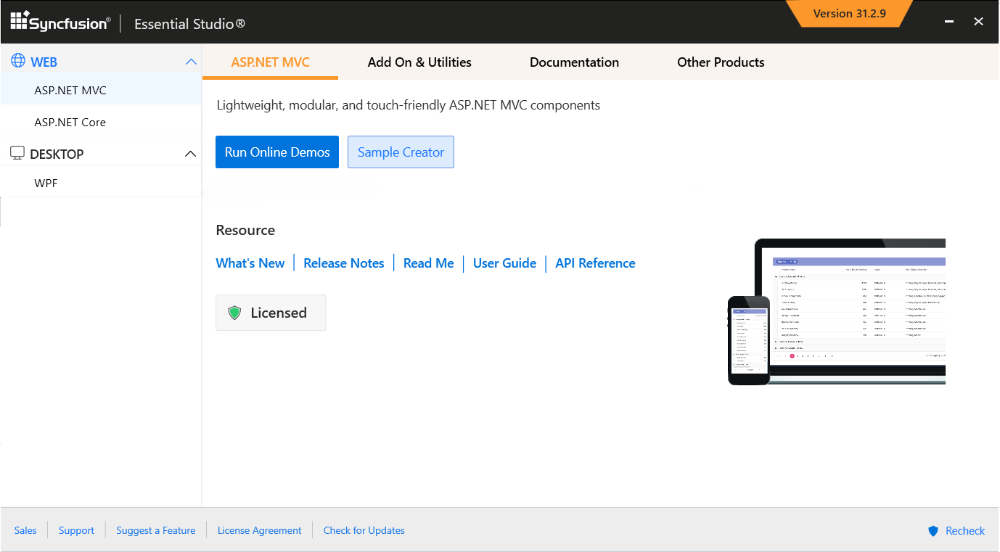
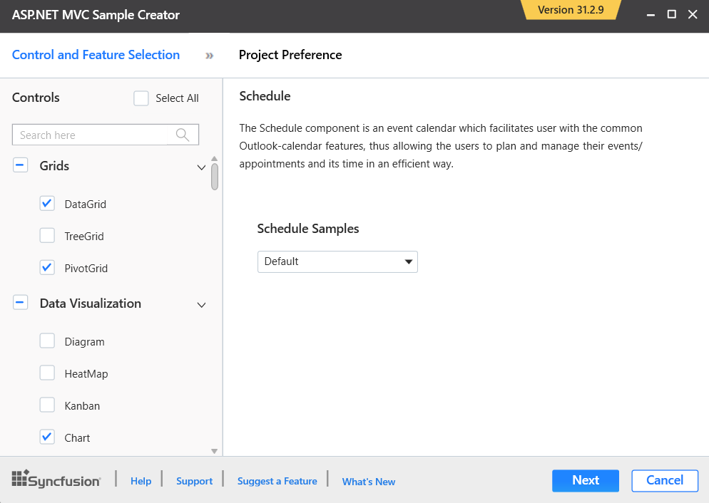
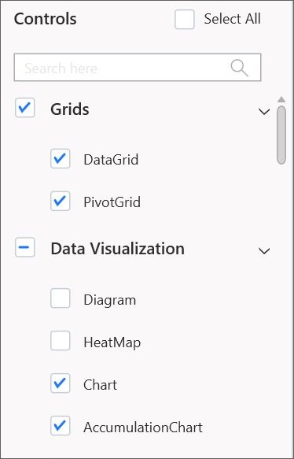
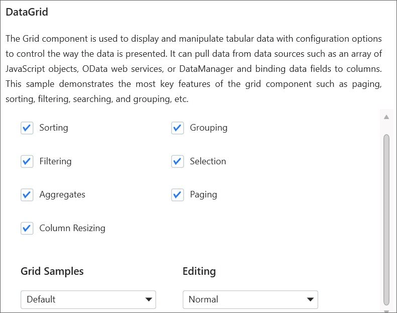
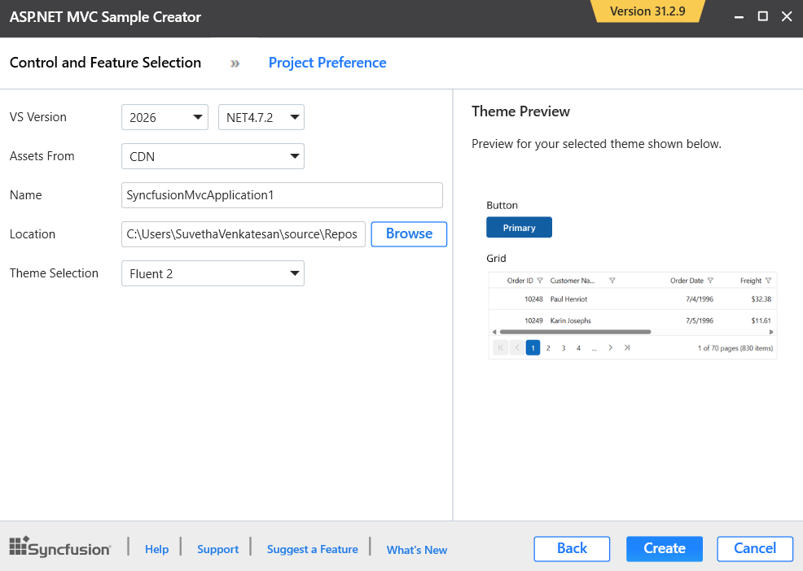
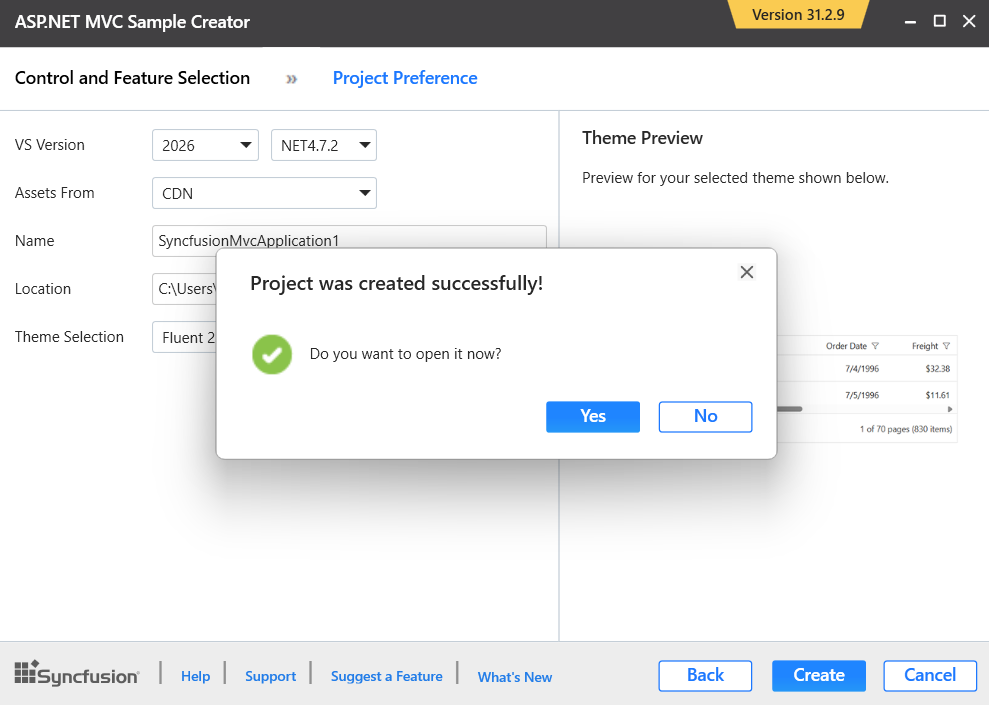
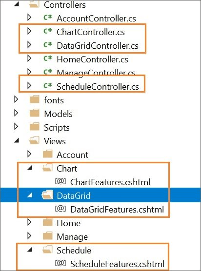
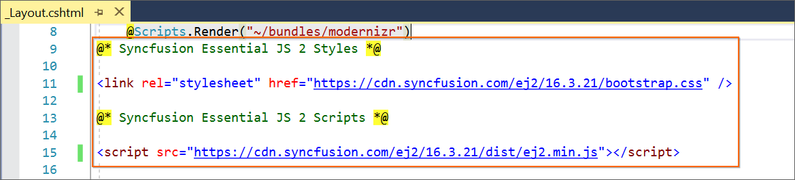
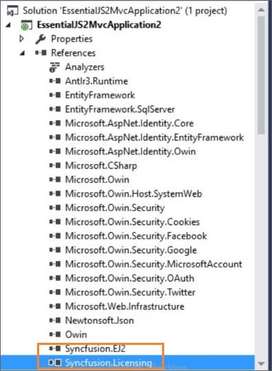

# Creating Syncfusion® ASP.NET MVC application

The Syncfusion&reg; Sample Creator is a tool that lets you make Syncfusion&reg; ASP.NET MVC (Essential&reg; JS 2) projects with sample code for required Syncfusion&reg; component features and Syncfusion&reg; control configuration.

> The Syncfusion&reg; ASP.NET MVC (Essential&reg; JS 2) Sample Creator utility is available from v16.3.0.17.

Use the following steps to create the Syncfusion&reg; ASP.NET MVC (Essential&reg; JS 2) Application through the Sample Creator utility:

1. Follow one of the options below to launch the ASP.NET MVC (Essential&reg; JS 2) Sample Creator application:

    **Option 1:** Click **Extensions > Syncfusion&reg;** and choose **Essential Studio&reg; ASP.NET MVC > Launch Sample Creator…** in **Visual Studio**.

    

    **Option 2:**

    Launch the Syncfusion&reg; ASP.NET MVC Control Panel. Select the Sample Creator button to launch the ASP.NET MVC Sample Creator application. Refer to the following screenshot for more information.

    

2. Syncfusion&reg; controls and features are listed in the ASP.NET MVC Sample Creator.

    

    **Controls Selection**: Choose the required controls. The controls are grouped with Syncfusion&reg; products.

    

    **Feature Selection**: Based on the controls, the feature is enabled to choose the features of the corresponding controls.

    

## Project Configuration

1. You can configure the project with the following details:

    * **VS Version**: Choose the Visual Studio version and Framework.

    * **Assets From**: Choose the Syncfusion&reg; Essential&reg; JS 2 assets to ASP.NET MVC Project, either NuGet, CDN or Installed Location.

    > Installed location option will be available only when the Syncfusion&reg; Essential&reg; JavaScript 2 setup has been installed.

    * **Name**: Name your Syncfusion&reg; ASP.NET MVC (Essential&reg; JS 2) Application.

    * **Location**: Choose the target location of your project.

    * **Theme Selection**: Choose the required theme. This section shows the controls preview before creating the Syncfusion&reg; project.

    

2. Click **Create** button. After creating the project, open the project by clicking **Yes**. If you click **No**, the corresponding location of the project will be opened. Refer to the following screenshot for more information.

    

3. The new Syncfusion&reg; ASP.NET MVC (Essential&reg; JS 2) project is created with the resources.

    * Added the required Controllers and View files in the project.

        

    * Included the required Syncfusion&reg; ASP.NET MVC (Essential&reg; JS 2) scripts and theme files.

        

    * The required Syncfusion&reg; assemblies are added for selected controls under Project Reference.

        
