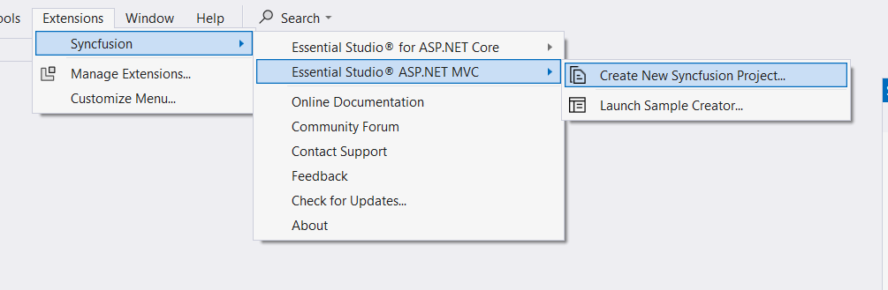

# Visual Studio Integration

## Overview

The Syncfusion ASP.NET MVC (Essential JS 2) Visual Studio Extensions can be accessed through the Syncfusion Menu to create and configure the project with Syncfusion references in Visual Studio.

> Syncfusion Extension is published in the Visual Studio Marketplace. We provided Separate ASP.NET Core (Essential JS 2) Extension support for Visual Studio 2022 and Visual Studio 2019 or lower. Please refer below Visual Marketplace link.

[Visual Studio 2022](https://marketplace.visualstudio.com/items?itemName=SyncfusionInc.ASPNETMVCVSExtensions)

[Visual Studio 2019 or lower](https://marketplace.visualstudio.com/items?itemName=SyncfusionInc.ASPNETMVCExtensions)

## IMPORTANT

The Syncfusion ASP.NET MVC (Essential JS 2) menu option is available from v17.1.0.32.
Syncfusion provides the following supports in Visual Studio:

[Project Template](./visual-studio-extensions/create-project): Creates the Syncfusion ASP.NET MVC (Essential JS 2) application by adding the required Essential JS 2 components.

[Convert Project](./visual-studio-extensions/convert-project): Converts an existing ASP.NET MVC application into a Syncfusion ASP.NET MVC (Essential JS 2) application by adding the required Syncfusion assemblies and resource files.

[Upgrade Project](./visual-studio-extensions/upgrade-project): Upgrades the existing Syncfusion ASP.NET MVC (Essential JS 2) application from one Essential Studio version to another version.

[Creator Sample](./visual-studio-extensions/create-sample): Creates the Syncfusion ASP.NET MVC (Essential JS2) application with the sample code of required controls and features.

### No project selected in Visual Studio

### Selected Microsoft ASP.NET MVC application in Visual Studio

### Selected Syncfusion ASP.NET MVC (Essential JS2) application in Visual Studio

> In Visual Studio 2017 or lower, you can see the Syncfusion menu directly in the Visual Studio menu.