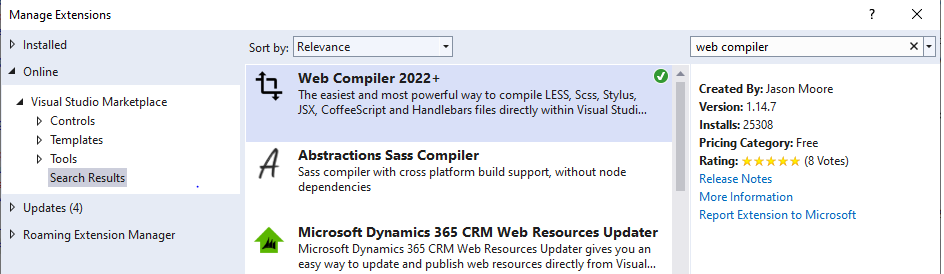
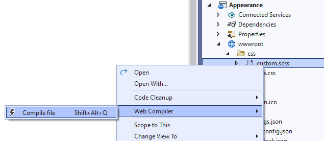
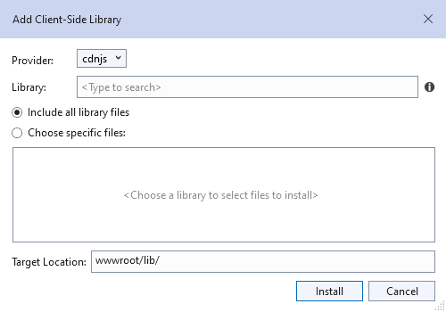
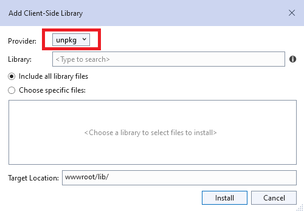
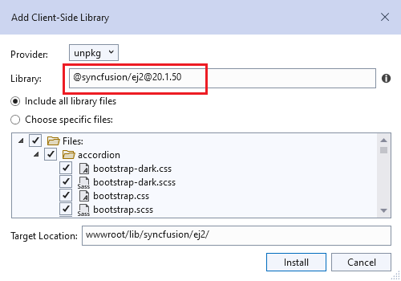
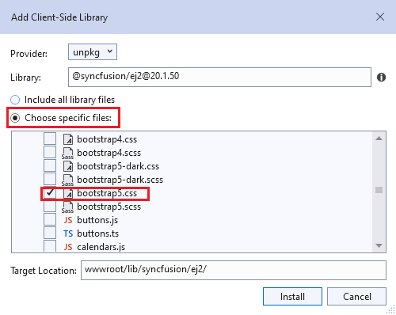
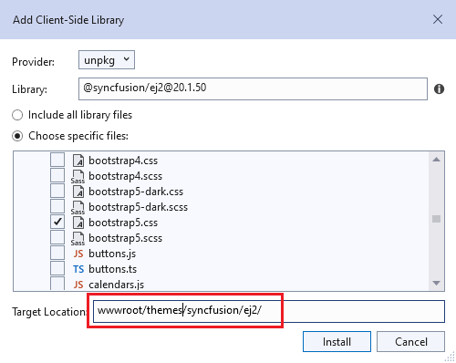

# Syncfusion ASP.NET Core Themes

The following list of themes are included in the Syncfusion ASP.NET Core controls library.

|Theme |Style Sheet Name|
|--------|--------|
|Bootstrap 5 | bootstrap5.css |
|Bootstrap 5 Dark | bootstrap5-dark.css |
|Bootstrap 4 | bootstrap4.css |
|Bootstrap 3 | bootstrap.css |
|Bootstrap 3 Dark | bootstrap-dark.css |
|Google’s Material | material.css |
|Google’s Material-Dark | material-dark.css |
|Tailwind CSS | tailwind.css |
|Tailwind CSS Dark | tailwind-dark.css |
|Fluent | fluent.css |
|Fluent Dark | fluent-dark.css |
|Microsoft Office Fabric | fabric.css |
|Microsoft Office Fabric Dark | fabric-dark.css |
|High Contrast | highcontrast.css |

The Syncfusion ASP.NET Core Bootstrap Theme is designed based on Bootstrap v3, whereas the Bootstrap4 theme is designed based on Bootstrap v4. Syncfusion ASP.NET Core themes provide support for the Fusion Theme that can only be downloaded from [ThemeStudio](https://ej2.syncfusion.com/themestudio/?theme=fusion).

## Reference themes in ASP.NET Core application

Syncfusion ASP.NET Core themes can be used in your ASP.NET Core application by referencing the style sheet. Refer the ASP.NET Core Styles Sheet inside the `<head>` element of `~/Pages/Shared/_Layout.cshtml` layout page.

Using the below approaches the themes can be referenced in the ASP.NET Core application,

1. [CDN](#cdn-reference) - Used to reference complete css via static web assets.
2. [CRG](https://ej2.syncfusion.com/aspnetcore/documentation/common/custom-resource-generator/) - Used to generate resources only for the selected (used) components.
3. [Theme Studio](https://ej2.syncfusion.com/aspnetcore/documentation/appearance/theme-studio/) - Used to customize and generate themes only for the selected (used) components.
4. [NPM Packages](#npm-packages) - Used to customize the existing themes and bundle stylesheet's in an application.
5. [LibMan](#libman) - Used to downloads popular libraries and frameworks from a file system or a content delivery network (CDN) in an application.

## CDN Reference

Instead of using a local resource on your server, you can use a cloud CDN to refer the theme style sheets. CDN Stands for "Content Delivery Network". A CDN is a group of servers distributed in different locations. While CDN are often used to host websites, they are commonly used to provide other types of downloadable data as well. Examples include software programs, images, videos, and streaming media.

Syncfusion ASP.NET Core Themes are available in the CDN. Make sure that the version in the URLs matches the version of the Syncfusion Essential JS 2 ASP.NET Core Package you are using.




<head>
    <link href="https://cdn.syncfusion.com/ej2/{{ site.ej2version }}/bootstrap5.css" rel="stylesheet"/>
</head>




| Theme Name | CDN Reference |
|--- | --- |
| Bootstrap 5 | https://cdn.syncfusion.com/ej2/{{ site.ej2version }}/bootstrap5.css |
| Bootstrap 5 Dark| https://cdn.syncfusion.com/ej2/{{ site.ej2version }}/bootstrap5-dark.css |
| Bootstrap 4 | https://cdn.syncfusion.com/ej2/{{ site.ej2version }}/bootstrap4.css |
| Bootstrap 3 | https://cdn.syncfusion.com/ej2/{{ site.ej2version }}/bootstrap.css |
| Bootstrap 3 Dark| https://cdn.syncfusion.com/ej2/{{ site.ej2version }}/bootstrap-dark.css |
| Google’s Material | https://cdn.syncfusion.com/ej2/{{ site.ej2version }}/material.css |
| Google’s Material Dark | https://cdn.syncfusion.com/ej2/{{ site.ej2version }}/material-dark.css |
| Tailwind CSS | https://cdn.syncfusion.com/ej2/{{ site.ej2version }}/tailwind.css |
| Tailwind Dark CSS | https://cdn.syncfusion.com/ej2/{{ site.ej2version }}/tailwind-dark.css |
| Fluent | https://cdn.syncfusion.com/ej2/{{ site.ej2version }}/fluent.css |
| Fluent Dark | https://cdn.syncfusion.com/ej2/{{ site.ej2version }}/fluent-dark.css |
| Microsoft Office Fabric  | https://cdn.syncfusion.com/ej2/{{ site.ej2version }}/fabric.css |
| Microsoft Office Fabric Dark | https://cdn.syncfusion.com/ej2/{{ site.ej2version }}/fabric-dark.css |
| High Contrast  | https://cdn.syncfusion.com/ej2/{{ site.ej2version }}/highcontrast.css |

### Individual control CDN Reference

The primary goal of individual control CDN is to optimize the loading time and memory of the website/app in the production stage. The order of individual control package loading should be in line with its dependency graph. The CDN of the Dependency Packages should be included manually before the intended individual control package CDN.

| controls | CDN Reference |
| --- | --- |
| Styles reference for individual control | https://cdn.syncfusion.com/ej2/{{ site.ej2version }}/{PACKAGE-NAME}/styles/{THEME-NAME}.css |

The following table demonstrates the list of individual Syncfusion ASP.NET Core control CDN reference and its dependency packages.

<table>
<tr>
<th>Controls</th>
<th>Styles</th>
</tr>
<tr>
<td><a href="https://ej2.syncfusion.com/aspnetcore/documentation/accordion/getting-started">Accordion</a></td>
<td>

<a href="https://cdn.syncfusion.com/ej2/{{ site.ej2version }}/ej2-navigations/styles/fluent.css">https://cdn.syncfusion.com/ej2/{{ site.ej2version }}/ej2-navigations/styles/fluent.css</a>

</td>
</tr>
<tr>
<td><a href="https://ej2.syncfusion.com/aspnetcore/documentation/accumulation-chart/getting-started">Accumulation Chart, </a> <a href="https://ej2.syncfusion.com/aspnetcore/documentation/smithchart/getting-started">Smith Chart, </a><a href="https://ej2.syncfusion.com/aspnetcore/documentation/chart/getting-started">Chart</a></td>
<td>No Style Sheet Packages</td>
</tr>
<tr>
<td><a href="https://ej2.syncfusion.com/aspnetcore/documentation/avatar/getting-started">Avatar, </a><a href="https://ej2.syncfusion.com/aspnetcore/documentation/card/getting-started">Card, </a> <a href="https://ej2.syncfusion.com/aspnetcore/documentation/dashboard-layout/getting-started">Dashboard Layout, </a> <a href="https://ej2.syncfusion.com/aspnetcore/documentation/splitter/getting-started">Splitter</a></td>
<td>

<a href="https://cdn.syncfusion.com/ej2/{{ site.ej2version }}/ej2-base/styles/fluent.css">https://cdn.syncfusion.com/ej2/{{ site.ej2version }}/ej2-base/styles/fluent.css</a> 
<a href="https://cdn.syncfusion.com/ej2/{{ site.ej2version }}/ej2-layouts/styles/fluent.css">https://cdn.syncfusion.com/ej2/{{ site.ej2version }}/ej2-layouts/styles/fluent.css</a>

</td>
</tr>
<tr>
<td><a href="https://ej2.syncfusion.com/aspnetcore/documentation/badge/getting-started-asp-core">Badge</a></td>
<td>

<a href="https://cdn.syncfusion.com/ej2/{{ site.ej2version }}/ej2-notifications/styles/fluent.css">https://cdn.syncfusion.com/ej2/{{ site.ej2version }}/ej2-notifications/styles/fluent.css</a>

</td>
</tr>
<tr>
<td><a href="https://ej2.syncfusion.com/aspnetcore/documentation/barcode/getting-started">Barcode</a></td>
<td>

<a href="https://cdn.syncfusion.com/ej2/{{ site.ej2version }}/ej2-barcode-generator/styles/fluent.css">https://cdn.syncfusion.com/ej2/{{ site.ej2version }}/ej2-barcode-generator/styles/fluent.css</a>

</td>
</tr>
<tr>
<td><a href="https://ej2.syncfusion.com/aspnetcore/documentation/bullet-chart/getting-started">Bullet Chart</a>,  <a href="https://ej2.syncfusion.com/aspnetcore/documentation/sparkline/getting-started">Sparkline</a></td>
<td>No Style Sheet Packages</td>
</tr>
<tr>
<td><a href="https://ej2.syncfusion.com/aspnetcore/documentation/button/getting-started">Button, </a><a href="https://ej2.syncfusion.com/aspnetcore/documentation/check-box/getting-started">CheckBox, </a> <a href="https://ej2.syncfusion.com/aspnetcore/documentation/chips/getting-started">Chips, </a><a href="https://ej2.syncfusion.com/aspnetcore/documentation/radio-button/getting-started">Radio Button, </a> <a href="https://ej2.syncfusion.com/aspnetcore/documentation/switch/getting-started">Switch</a></td>
<td>

<a href="https://cdn.syncfusion.com/ej2/{{ site.ej2version }}/ej2-base/styles/fluent.css">https://cdn.syncfusion.com/ej2/{{ site.ej2version }}/ej2-base/styles/fluent.css</a> 
<a href="https://cdn.syncfusion.com/ej2/{{ site.ej2version }}/ej2-buttons/styles/fluent.css">https://cdn.syncfusion.com/ej2/{{ site.ej2version }}/ej2-buttons/styles/fluent.css</a>

</td>
</tr>
<tr>
<td><a href="https://ej2.syncfusion.com/aspnetcore/documentation/button-group/getting-started">ButtonGroup</a></td>
<td>

<a href="https://cdn.syncfusion.com/ej2/{{ site.ej2version }}/ej2-buttons/styles/fluent.css">https://cdn.syncfusion.com/ej2/{{ site.ej2version }}/ej2-buttons/styles/fluent.css</a> 
<a href="https://cdn.syncfusion.com/ej2/{{ site.ej2version }}/ej2-splitbuttons/styles/fluent.css">https://cdn.syncfusion.com/ej2/{{ site.ej2version }}/ej2-splitbuttons/styles/fluent.css</a>

</td>
</tr>
<tr>
<td><a href="https://ej2.syncfusion.com/aspnetcore/documentation/calendar/getting-started">Calendar</a></td>
<td>

<a href="https://cdn.syncfusion.com/ej2/{{ site.ej2version }}/ej2-base/styles/material.css">https://cdn.syncfusion.com/ej2/{{ site.ej2version }}/ej2-base/styles/material.css</a> 
<a href="https://cdn.syncfusion.com/ej2/{{ site.ej2version }}/ej2-calendars/styles/fluent.css">https://cdn.syncfusion.com/ej2/{{ site.ej2version }}/ej2-calendars/styles/fluent.css</a> 
<a href="https://cdn.syncfusion.com/ej2/{{ site.ej2version }}/ej2-buttons/styles/fluent.css">https://cdn.syncfusion.com/ej2/{{ site.ej2version }}/ej2-buttons/styles/fluent.css</a>

</td>
</tr>
<tr>
<td><a href="https://ej2.syncfusion.com/aspnetcore/documentation/carousel/getting-started">Carousel,</a> <a href="https://ej2.syncfusion.com/aspnetcore/documentation/sidebar/getting-started">Sidebar</a></td>
<td>

<a href="https://cdn.syncfusion.com/ej2/{{ site.ej2version }}/ej2-base/styles/fluent.css">https://cdn.syncfusion.com/ej2/{{ site.ej2version }}/ej2-base/styles/fluent.css</a> 
<a href="https://cdn.syncfusion.com/ej2/{{ site.ej2version }}/ej2-buttons/styles/fluent.css">https://cdn.syncfusion.com/ej2/{{ site.ej2version }}/ej2-buttons/styles/fluent.css</a> 
<a href="https://cdn.syncfusion.com/ej2/{{ site.ej2version }}/ej2-navigations/styles/fluent.css">https://cdn.syncfusion.com/ej2/{{ site.ej2version }}/ej2-navigations/styles/fluent.css</a>

</td>
</tr>
<tr>
<td><a href="https://ej2.syncfusion.com/aspnetcore/documentation/circular-gauge/getting-started">Circular Gauge</a></td>
<td>No Style Sheet Packages</td>
</tr>
<tr>
<td><a href="https://ej2.syncfusion.com/aspnetcore/documentation/color-picker/getting-started">Color Picker</a></td>
<td>

<a href="https://cdn.syncfusion.com/ej2/{{ site.ej2version }}/ej2-base/styles/fluent.css">https://cdn.syncfusion.com/ej2/{{ site.ej2version }}/ej2-base/styles/fluent.css</a> 
<a href="https://cdn.syncfusion.com/ej2/{{ site.ej2version }}/ej2-buttons/styles/fluent.css">https://cdn.syncfusion.com/ej2/{{ site.ej2version }}/ej2-buttons/styles/fluent.css</a> 
<a href="https://cdn.syncfusion.com/ej2/{{ site.ej2version }}/ej2-popups/styles/fluent.css">https://cdn.syncfusion.com/ej2/{{ site.ej2version }}/ej2-popups/styles/fluent.css</a> 
<a href="https://cdn.syncfusion.com/ej2/{{ site.ej2version }}/ej2-splitbuttons/styles/fluent.css">https://cdn.syncfusion.com/ej2/{{ site.ej2version }}/ej2-splitbuttons/styles/fluent.css</a> 
<a href="https://cdn.syncfusion.com/ej2/{{ site.ej2version }}/ej2-inputs/styles/fluent.css">https://cdn.syncfusion.com/ej2/{{ site.ej2version }}/ej2-inputs/styles/fluent.css</a>

</td>
</tr>
<tr>
<td><a href="https://ej2.syncfusion.com/aspnetcore/documentation/breadcrumb/getting-started">Breadcrumb, </a> <a href="https://ej2.syncfusion.com/aspnetcore/documentation/context-menu/getting-started">Context Menu, </a> <a href="https://ej2.syncfusion.com/aspnetcore/documentation/menu/getting-started">Menu</a></td>
<td>

<a href="https://cdn.syncfusion.com/ej2/{{ site.ej2version }}/ej2-base/styles/fluent.css">https://cdn.syncfusion.com/ej2/{{ site.ej2version }}/ej2-base/styles/fluent.css</a> 
<a href="https://cdn.syncfusion.com/ej2/{{ site.ej2version }}/ej2-lists/styles/fluent.css">https://cdn.syncfusion.com/ej2/{{ site.ej2version }}/ej2-lists/styles/fluent.css</a> 
<a href="https://cdn.syncfusion.com/ej2/{{ site.ej2version }}/ej2-popups/styles/fluent.css">https://cdn.syncfusion.com/ej2/{{ site.ej2version }}/ej2-popups/styles/fluent.css</a> 
<a href="https://cdn.syncfusion.com/ej2/{{ site.ej2version }}/ej2-navigations/styles/fluent.css">https://cdn.syncfusion.com/ej2/{{ site.ej2version }}/ej2-navigations/styles/fluent.css</a>

</td>
</tr>
<tr>
<td><a hre="https://ej2.syncfusion.com/aspnetcore/documentation/datepicker/getting-started">DatePicker</a></td>
<td>

<a href="https://cdn.syncfusion.com/ej2/{{ site.ej2version }}/ej2-base/styles/fluent.css">https://cdn.syncfusion.com/ej2/{{ site.ej2version }}/ej2-base/styles/fluent.css</a> 
<a href="https://cdn.syncfusion.com/ej2/{{ site.ej2version }}/ej2-inputs/styles/fluent.css">https://cdn.syncfusion.com/ej2/{{ site.ej2version }}/ej2-inputs/styles/fluent.css</a> 
<a href="https://cdn.syncfusion.com/ej2/{{ site.ej2version }}/ej2-popups/styles/fluent.css">https://cdn.syncfusion.com/ej2/{{ site.ej2version }}/ej2-popups/styles/fluent.css</a> 
<a href="https://cdn.syncfusion.com/ej2/{{ site.ej2version }}/ej2-calendars/styles/fluent.css">https://cdn.syncfusion.com/ej2/{{ site.ej2version }}/ej2-calendars/styles/fluent.css</a>

</td>
</tr>
<tr>
<td><a href="https://ej2.syncfusion.com/aspnetcore/documentation/daterangepicker/getting-started">DateRangePicker</a></td>
<td>

<a href="https://cdn.syncfusion.com/ej2/{{ site.ej2version }}/ej2-base/styles/fluent.css">https://cdn.syncfusion.com/ej2/{{ site.ej2version }}/ej2-base/styles/fluent.css</a> 
<a href="https://cdn.syncfusion.com/ej2/{{ site.ej2version }}/ej2-buttons/styles/fluent.css">https://cdn.syncfusion.com/ej2/{{ site.ej2version }}/ej2-buttons/styles/fluent.css</a> 
<a href="https://cdn.syncfusion.com/ej2/{{ site.ej2version }}/ej2-lists/styles/fluent.css">https://cdn.syncfusion.com/ej2/{{ site.ej2version }}/ej2-lists/styles/fluent.css</a> 
<a href="https://cdn.syncfusion.com/ej2/{{ site.ej2version }}/ej2-inputs/styles/fluent.css">https://cdn.syncfusion.com/ej2/{{ site.ej2version }}/ej2-inputs/styles/fluent.css</a> 
<a href="https://cdn.syncfusion.com/ej2/{{ site.ej2version }}/ej2-popups/styles/fluent.css">https://cdn.syncfusion.com/ej2/{{ site.ej2version }}/ej2-popups/styles/fluent.css</a> 
<a href="https://cdn.syncfusion.com/ej2/{{ site.ej2version }}/ej2-calendars/styles/fluent.css">https://cdn.syncfusion.com/ej2/{{ site.ej2version }}/ej2-calendars/styles/fluent.css</a>

</td>
</tr>
<tr>
<td><a href="https://ej2.syncfusion.com/aspnetcore/documentation/datetimepicker/getting-started">DateTimePicker</a>,  <a href="https://ej2.syncfusion.com/aspnetcore/documentation/timepicker/getting-started">TimePicker</a></td>
<td>

<a href="https://cdn.syncfusion.com/ej2/{{ site.ej2version }}/ej2-base/styles/fluent.css">https://cdn.syncfusion.com/ej2/{{ site.ej2version }}/ej2-base/styles/fluent.css</a> 
<a href="https://cdn.syncfusion.com/ej2/{{ site.ej2version }}/ej2-buttons/styles/fluent.css">https://cdn.syncfusion.com/ej2/{{ site.ej2version }}/ej2-buttons/styles/fluent.css</a> 
<a href="https://cdn.syncfusion.com/ej2/{{ site.ej2version }}/ej2-lists/styles/fluent.css">https://cdn.syncfusion.com/ej2/{{ site.ej2version }}/ej2-lists/styles/fluent.css</a> 
<a href="https://cdn.syncfusion.com/ej2/{{ site.ej2version }}/ej2-inputs/styles/fluent.css">https://cdn.syncfusion.com/ej2/{{ site.ej2version }}/ej2-inputs/styles/fluent.css</a> 
<a href="https://cdn.syncfusion.com/ej2/{{ site.ej2version }}/ej2-popups/styles/fluent.css">https://cdn.syncfusion.com/ej2/{{ site.ej2version }}/ej2-popups/styles/fluent.css</a> 
<a href="https://cdn.syncfusion.com/ej2/{{ site.ej2version }}/ej2-calendars/styles/fluent.css">https://cdn.syncfusion.com/ej2/{{ site.ej2version }}/ej2-calendars/styles/fluent.css</a>

</td>
</tr>
<tr>
<td><a href="https://ej2.syncfusion.com/aspnetcore/documentation/diagram/getting-started">Diagram</a></td>
<td>

<a href="https://cdn.syncfusion.com/ej2/{{ site.ej2version }}/ej2-base/styles/fluent.css">https://cdn.syncfusion.com/ej2/{{ site.ej2version }}/ej2-base/styles/fluent.css</a> 
<a href="https://cdn.syncfusion.com/ej2/{{ site.ej2version }}/ej2-buttons/styles/fluent.css">https://cdn.syncfusion.com/ej2/{{ site.ej2version }}/ej2-buttons/styles/fluent.css</a> 
<a href="https://cdn.syncfusion.com/ej2/{{ site.ej2version }}/ej2-inputs/styles/fluent.css">https://cdn.syncfusion.com/ej2/{{ site.ej2version }}/ej2-inputs/styles/fluent.css</a> 
<a href="https://cdn.syncfusion.com/ej2/{{ site.ej2version }}/ej2-popups/styles/fluent.css">https://cdn.syncfusion.com/ej2/{{ site.ej2version }}/ej2-popups/styles/fluent.css</a> 
<a href="https://cdn.syncfusion.com/ej2/{{ site.ej2version }}/ej2-navigations/styles/fluent.css">https://cdn.syncfusion.com/ej2/{{ site.ej2version }}/ej2-navigations/styles/fluent.css</a> 
<a href="https://cdn.syncfusion.com/ej2/{{ site.ej2version }}/ej2-diagrams/styles/fluent.css">https://cdn.syncfusion.com/ej2/{{ site.ej2version }}/ej2-diagrams/styles/fluent.css</a>

</td>
</tr>
<tr>
<td><a href="https://ej2.syncfusion.com/aspnetcore/documentation/dialog/getting-started">Dialog</a></td>
<td>

<a href="https://cdn.syncfusion.com/ej2/{{ site.ej2version }}/ej2-base/styles/fluent.css">https://cdn.syncfusion.com/ej2/{{ site.ej2version }}/ej2-base/styles/fluent.css</a> 
<a href="https://cdn.syncfusion.com/ej2/{{ site.ej2version }}/ej2-buttons/styles/fluent.css">https://cdn.syncfusion.com/ej2/{{ site.ej2version }}/ej2-buttons/styles/fluent.css</a> 
<a href="https://cdn.syncfusion.com/ej2/{{ site.ej2version }}/ej2-popups/styles/fluent.css">https://cdn.syncfusion.com/ej2/{{ site.ej2version }}/ej2-popups/styles/fluent.css</a>

</td>
</tr>
<tr>
<td><a href="https://ej2.syncfusion.com/aspnetcore/documentation/drop-down-list/getting-started">Auto Complete, </a> <a href="https://ej2.syncfusion.com/aspnetcore/documentation/drop-down-list/getting-started">DropDownList, </a> <a href="https://ej2.syncfusion.com/aspnetcore/documentation/multi-select/getting-started">MultiSelect, </a> <a href="https://ej2.syncfusion.com/aspnetcore/documentation/combo-box/getting-started">ComboBox</a></td>
<td>

<a href="https://cdn.syncfusion.com/ej2/{{ site.ej2version }}/ej2-base/styles/fluent.css">https://cdn.syncfusion.com/ej2/{{ site.ej2version }}/ej2-base/styles/fluent.css</a> 
<a href="https://cdn.syncfusion.com/ej2/{{ site.ej2version }}/ej2-buttons/styles/fluent.css">https://cdn.syncfusion.com/ej2/{{ site.ej2version }}/ej2-buttons/styles/fluent.css</a> 
<a href="https://cdn.syncfusion.com/ej2/{{ site.ej2version }}/ej2-inputs/styles/fluent.css">https://cdn.syncfusion.com/ej2/{{ site.ej2version }}/ej2-inputs/styles/fluent.css</a> 
<a href="https://cdn.syncfusion.com/ej2/{{ site.ej2version }}/ej2-popups/styles/fluent.css">https://cdn.syncfusion.com/ej2/{{ site.ej2version }}/ej2-popups/styles/fluent.css</a> 
<a href="https://cdn.syncfusion.com/ej2/{{ site.ej2version }}/ej2-dropdowns/styles/fluent.css">https://cdn.syncfusion.com/ej2/{{ site.ej2version }}/ej2-dropdowns/styles/fluent.css</a>

</td>
</tr>
<tr>
<td><a href="https://ej2.syncfusion.com/aspnetcore/documentation/drop-down-tree/getting-started">DropDownTree</a></td>
<td>

<a href="https://cdn.syncfusion.com/ej2/{{ site.ej2version }}/ej2-base/styles/fluent.css">https://cdn.syncfusion.com/ej2/{{ site.ej2version }}/ej2-base/styles/fluent.css</a> 
<a href="https://cdn.syncfusion.com/ej2/{{ site.ej2version }}/ej2-inputs/styles/fluent.css">https://cdn.syncfusion.com/ej2/{{ site.ej2version }}/ej2-inputs/styles/fluent.css</a> 
<a href="https://cdn.syncfusion.com/ej2/{{ site.ej2version }}/ej2-popups/styles/fluent.css">https://cdn.syncfusion.com/ej2/{{ site.ej2version }}/ej2-popups/styles/fluent.css</a> 
<a href="https://cdn.syncfusion.com/ej2/{{ site.ej2version }}/ej2-navigations/styles/fluent.css">https://cdn.syncfusion.com/ej2/{{ site.ej2version }}/ej2-navigations/styles/fluent.css</a> 
<a href="https://cdn.syncfusion.com/ej2/{{ site.ej2version }}/ej2-dropdowns/styles/fluent.css">https://cdn.syncfusion.com/ej2/{{ site.ej2version }}/ej2-dropdowns/styles/fluent.css</a>

</td>
</tr>
<tr>
<td><a href="https://ej2.syncfusion.com/aspnetcore/documentation/file-manager/getting-started">File Manager</a></td>
<td>

<a href="https://cdn.syncfusion.com/ej2/{{ site.ej2version }}/ej2-base/styles/fluent.css">https://cdn.syncfusion.com/ej2/{{ site.ej2version }}/ej2-base/styles/fluent.css</a> 
<a href="https://cdn.syncfusion.com/ej2/{{ site.ej2version }}/ej2-inputs/styles/fluent.css">https://cdn.syncfusion.com/ej2/{{ site.ej2version }}/ej2-inputs/styles/fluent.css</a> 
<a href="https://cdn.syncfusion.com/ej2/{{ site.ej2version }}/ej2-popups/styles/fluent.css">https://cdn.syncfusion.com/ej2/{{ site.ej2version }}/ej2-popups/styles/fluent.css</a> 
<a href="https://cdn.syncfusion.com/ej2/{{ site.ej2version }}/ej2-buttons/styles/fluent.css">https://cdn.syncfusion.com/ej2/{{ site.ej2version }}/ej2-buttons/styles/fluent.css</a> 
<a href="https://cdn.syncfusion.com/ej2/{{ site.ej2version }}/ej2-splitbuttons/styles/fluent.css">https://cdn.syncfusion.com/ej2/{{ site.ej2version }}/ej2-splitbuttons/styles/fluent.css</a> 
<a href="https://cdn.syncfusion.com/ej2/{{ site.ej2version }}/ej2-navigations/styles/fluent.css">https://cdn.syncfusion.com/ej2/{{ site.ej2version }}/ej2-navigations/styles/fluent.css</a> 
<a href="https://cdn.syncfusion.com/ej2/{{ site.ej2version }}/ej2-layouts/styles/fluent.css">https://cdn.syncfusion.com/ej2/{{ site.ej2version }}/ej2-layouts/styles/fluent.css</a> 
<a href="https://cdn.syncfusion.com/ej2/{{ site.ej2version }}/ej2-grids/styles/fluent.css">https://cdn.syncfusion.com/ej2/{{ site.ej2version }}/ej2-grids/styles/fluent.css</a> 
<a href="https://cdn.syncfusion.com/ej2/{{ site.ej2version }}/ej2-filemanager/styles/fluent.css">https://cdn.syncfusion.com/ej2/{{ site.ej2version }}/ej2-filemanager/styles/fluent.css</a>

</td>
</tr>
<tr>
<td><a href="https://ej2.syncfusion.com/aspnetcore/documentation/grid/getting-started-core">Grid</a></td>
<td>

<a href="https://cdn.syncfusion.com/ej2/{{ site.ej2version }}/ej2-base/styles/fluent.css">https://cdn.syncfusion.com/ej2/{{ site.ej2version }}/ej2-base/styles/fluent.css</a> 
<a href="https://cdn.syncfusion.com/ej2/{{ site.ej2version }}/ej2-grids/styles/fluent.css">https://cdn.syncfusion.com/ej2/{{ site.ej2version }}/ej2-grids/styles/fluent.css</a> 
<a href="https://cdn.syncfusion.com/ej2/{{ site.ej2version }}/ej2-buttons/styles/fluent.css">https://cdn.syncfusion.com/ej2/{{ site.ej2version }}/ej2-buttons/styles/fluent.css</a> 
<a href="https://cdn.syncfusion.com/ej2/{{ site.ej2version }}/ej2-popups/styles/fluent.css">https://cdn.syncfusion.com/ej2/{{ site.ej2version }}/ej2-popups/styles/fluent.css</a> 
<a href="https://cdn.syncfusion.com/ej2/{{ site.ej2version }}/ej2-navigations/styles/fluent.css">https://cdn.syncfusion.com/ej2/{{ site.ej2version }}/ej2-navigations/styles/fluent.css</a> 
<a href="https://cdn.syncfusion.com/ej2/{{ site.ej2version }}/ej2-dropdowns/styles/fluent.css">https://cdn.syncfusion.com/ej2/{{ site.ej2version }}/ej2-dropdowns/styles/fluent.css</a> 
<a href="https://cdn.syncfusion.com/ej2/{{ site.ej2version }}/ej2-inputs/styles/fluent.css">https://cdn.syncfusion.com/ej2/{{ site.ej2version }}/ej2-inputs/styles/fluent.css</a> 
<a href="https://cdn.syncfusion.com/ej2/{{ site.ej2version }}/ej2-calendars/styles/fluent.css">https://cdn.syncfusion.com/ej2/{{ site.ej2version }}/ej2-calendars/styles/fluent.css</a>

</td>
</tr>
<tr>
<td><a href="https://ej2.syncfusion.com/aspnetcore/documentation/heatmap/getting-started">HeatMap</a>,  <a href="https://ej2.syncfusion.com/aspnetcore/documentation/progress-bar/getting-started">ProgressBar</a></td>
<td>No Style Sheet Packages</td>
</tr>
<tr>
<td><a href="https://ej2.syncfusion.com/aspnetcore/documentation/rich-text-editor/getting-started">RichTextEditor</a></td>
<td>

<a href="https://cdn.syncfusion.com/ej2/{{ site.ej2version }}/ej2-base/styles/fluent.css">https://cdn.syncfusion.com/ej2/{{ site.ej2version }}/ej2-base/styles/fluent.css</a> 
<a href="https://cdn.syncfusion.com/ej2/{{ site.ej2version }}/ej2-buttons/styles/fluent.css">https://cdn.syncfusion.com/ej2/{{ site.ej2version }}/ej2-buttons/styles/fluent.css</a> 
<a href="https://cdn.syncfusion.com/ej2/{{ site.ej2version }}/ej2-inputs/styles/fluent.css">https://cdn.syncfusion.com/ej2/{{ site.ej2version }}/ej2-inputs/styles/fluent.css</a> 
<a href="https://cdn.syncfusion.com/ej2/{{ site.ej2version }}/ej2-lists/styles/fluent.css">https://cdn.syncfusion.com/ej2/{{ site.ej2version }}/ej2-lists/styles/fluent.css</a> 
<a href="https://cdn.syncfusion.com/ej2/{{ site.ej2version }}/ej2-navigations/styles/fluent.css">https://cdn.syncfusion.com/ej2/{{ site.ej2version }}/ej2-navigations/styles/fluent.css</a> 
<a href="https://cdn.syncfusion.com/ej2/{{ site.ej2version }}/ej2-popups/styles/fluent.css">https://cdn.syncfusion.com/ej2/{{ site.ej2version }}/ej2-popups/styles/fluent.css</a> 
<a href="https://cdn.syncfusion.com/ej2/{{ site.ej2version }}/ej2-splitbuttons/styles/fluent.css">https://cdn.syncfusion.com/ej2/{{ site.ej2version }}/ej2-splitbuttons/styles/fluent.css</a> 
<a href="https://cdn.syncfusion.com/ej2/{{ site.ej2version }}/ej2-richtexteditor/styles/fluent.css">https://cdn.syncfusion.com/ej2/{{ site.ej2version }}/ej2-richtexteditor/styles/fluent.css</a>

</td>
</tr>
<tr>
<td><a href="https://ej2.syncfusion.com/aspnetcore/documentation/signature/getting-started">Signature, </a><a href="https://ej2.syncfusion.com/aspnetcore/documentation/textbox/getting-started">TextBox, </a> <a href="https://ej2.syncfusion.com/aspnetcore/documentation/maskedtextbox/getting-started">Masked TextBox, </a> <a href="https://ej2.syncfusion.com/aspnetcore/documentation/numerictextbox/getting-started">NumericTextBox</a></td>
<td>

<a href="https://cdn.syncfusion.com/ej2/{{ site.ej2version }}/ej2-base/styles/fluent.css">https://cdn.syncfusion.com/ej2/{{ site.ej2version }}/ej2-base/styles/fluent.css</a> 
<a href="https://cdn.syncfusion.com/ej2/{{ site.ej2version }}/ej2-inputs/styles/fluent.css">https://cdn.syncfusion.com/ej2/{{ site.ej2version }}/ej2-inputs/styles/fluent.css</a>

</td>
</tr>
<tr>
<td><a href="https://ej2.syncfusion.com/aspnetcore/documentation/drop-down-button/getting-started">DropDownButton, </a> <a href="https://ej2.syncfusion.com/aspnetcore/documentation/split-button/getting-started">SplitButton, </a> <a href="https://ej2.syncfusion.com/aspnetcore/documentation/progress-button/getting-started">ProgressButton</a></td>
<td>

<a href="https://cdn.syncfusion.com/ej2/{{ site.ej2version }}/ej2-base/styles/fluent.css">https://cdn.syncfusion.com/ej2/{{ site.ej2version }}/ej2-base/styles/fluent.css</a> 
<a href="https://cdn.syncfusion.com/ej2/{{ site.ej2version }}/ej2-buttons/styles/fluent.css">https://cdn.syncfusion.com/ej2/{{ site.ej2version }}/ej2-buttons/styles/fluent.css</a> 
<a href="https://cdn.syncfusion.com/ej2/{{ site.ej2version }}/ej2-popups/styles/fluent.css">https://cdn.syncfusion.com/ej2/{{ site.ej2version }}/ej2-popups/styles/fluent.css</a> 
<a href="https://cdn.syncfusion.com/ej2/{{ site.ej2version }}/ej2-splitbuttons/styles/fluent.css">https://cdn.syncfusion.com/ej2/{{ site.ej2version }}/ej2-splitbuttons/styles/fluent.css</a>

</td>
</tr>
<tr>
<td><a href="https://ej2.syncfusion.com/aspnetcore/documentation/tab/getting-started">Tabs</a>, <a href="https://ej2.syncfusion.com/aspnetcore/documentation/toolbar/getting-started">Toolbar</a></td>
<td>

<a href="https://cdn.syncfusion.com/ej2/{{ site.ej2version }}/ej2-base/styles/fluent.css">https://cdn.syncfusion.com/ej2/{{ site.ej2version }}/ej2-base/styles/fluent.css</a> 
<a href="https://cdn.syncfusion.com/ej2/{{ site.ej2version }}/ej2-buttons/styles/fluent.css">https://cdn.syncfusion.com/ej2/{{ site.ej2version }}/ej2-buttons/styles/fluent.css</a> 
<a href="https://cdn.syncfusion.com/ej2/{{ site.ej2version }}/ej2-popups/styles/fluent.css">https://cdn.syncfusion.com/ej2/{{ site.ej2version }}/ej2-popups/styles/fluent.css</a> 
<a href="https://cdn.syncfusion.com/ej2/{{ site.ej2version }}/ej2-navigations/styles/fluent.css">https://cdn.syncfusion.com/ej2/{{ site.ej2version }}/ej2-navigations/styles/fluent.css</a>

</td>
</tr>
<tr>
<td><a href="https://ej2.syncfusion.com/aspnetcore/documentation/toast/getting-started">Toast</a></td>
<td>

<a href="https://cdn.syncfusion.com/ej2/{{ site.ej2version }}/ej2-base/styles/fluent.css">https://cdn.syncfusion.com/ej2/{{ site.ej2version }}/ej2-base/styles/fluent.css</a> 
<a href="https://cdn.syncfusion.com/ej2/{{ site.ej2version }}/ej2-buttons/styles/fluent.css">https://cdn.syncfusion.com/ej2/{{ site.ej2version }}/ej2-buttons/styles/fluent.css</a> 
<a href="https://cdn.syncfusion.com/ej2/{{ site.ej2version }}/ej2-popups/styles/fluent.css">https://cdn.syncfusion.com/ej2/{{ site.ej2version }}/ej2-popups/styles/fluent.css</a> 
<a href="https://cdn.syncfusion.com/ej2/{{ site.ej2version }}/ej2-notifications/styles/fluent.css">https://cdn.syncfusion.com/ej2/{{ site.ej2version }}/ej2-notifications/styles/fluent.css</a>

</td>
</tr>
<tr>
<td><a href="https://ej2.syncfusion.com/aspnetcore/documentation/treeview/getting-started">TreeView</a></td>
<td>

<a href="https://cdn.syncfusion.com/ej2/{{ site.ej2version }}/ej2-base/styles/fluent.css">https://cdn.syncfusion.com/ej2/{{ site.ej2version }}/ej2-base/styles/fluent.css</a> 
<a href="https://cdn.syncfusion.com/ej2/{{ site.ej2version }}/ej2-buttons/styles/fluent.css">https://cdn.syncfusion.com/ej2/{{ site.ej2version }}/ej2-buttons/styles/fluent.css</a> 
<a href="https://cdn.syncfusion.com/ej2/{{ site.ej2version }}/ej2-inputs/styles/fluent.css">https://cdn.syncfusion.com/ej2/{{ site.ej2version }}/ej2-inputs/styles/fluent.css</a> 
<a href="https://cdn.syncfusion.com/ej2/{{ site.ej2version }}/ej2-navigations/styles/fluent.css">https://cdn.syncfusion.com/ej2/{{ site.ej2version }}/ej2-navigations/styles/fluent.css</a>

</td>
</tr>
<tr>
<td><a href="https://ej2.syncfusion.com/aspnetcore/documentation/tooltip/getting-started">ToolTip</a></td>
<td>

<a href="https://cdn.syncfusion.com/ej2/{{ site.ej2version }}/ej2-base/styles/fluent.css">https://cdn.syncfusion.com/ej2/{{ site.ej2version }}/ej2-base/styles/fluent.css</a> 
<a href="https://cdn.syncfusion.com/ej2/{{ site.ej2version }}/ej2-popups/styles/fluent.css">https://cdn.syncfusion.com/ej2/{{ site.ej2version }}/ej2-popups/styles/fluent.css</a>

</td>
</tr>
<tr>
<td><a href="https://ej2.syncfusion.com/aspnetcore/documentation/tree-grid/getting-started-core">TreeGrid</a></td>
<td>

<a href="https://cdn.syncfusion.com/ej2/{{ site.ej2version }}/ej2-base/styles/fluent.css">https://cdn.syncfusion.com/ej2/{{ site.ej2version }}/ej2-base/styles/fluent.css</a> 
<a href="https://cdn.syncfusion.com/ej2/{{ site.ej2version }}/ej2-grids/styles/fluent.css">https://cdn.syncfusion.com/ej2/{{ site.ej2version }}/ej2-grids/styles/fluent.css</a> 
<a href="https://cdn.syncfusion.com/ej2/{{ site.ej2version }}/ej2-treegrid/styles/fluent.css">https://cdn.syncfusion.com/ej2/{{ site.ej2version }}/ej2-treegrid/styles/fluent.css</a> 
<a href="https://cdn.syncfusion.com/ej2/{{ site.ej2version }}/ej2-buttons/styles/fluent.css">https://cdn.syncfusion.com/ej2/{{ site.ej2version }}/ej2-buttons/styles/fluent.css</a> 
<a href="https://cdn.syncfusion.com/ej2/{{ site.ej2version }}/ej2-popups/styles/fluent.css">https://cdn.syncfusion.com/ej2/{{ site.ej2version }}/ej2-popups/styles/fluent.css</a> 
<a href="https://cdn.syncfusion.com/ej2/{{ site.ej2version }}/ej2-navigations/styles/fluent.css">https://cdn.syncfusion.com/ej2/{{ site.ej2version }}/ej2-navigations/styles/fluent.css</a> 
<a href="https://cdn.syncfusion.com/ej2/{{ site.ej2version }}/ej2-dropdowns/styles/fluent.css">https://cdn.syncfusion.com/ej2/{{ site.ej2version }}/ej2-dropdowns/styles/fluent.css</a> 
<a href="https://cdn.syncfusion.com/ej2/{{ site.ej2version }}/ej2-lists/styles/fluent.css">https://cdn.syncfusion.com/ej2/{{ site.ej2version }}/ej2-lists/styles/fluent.css</a> 
<a href="https://cdn.syncfusion.com/ej2/{{ site.ej2version }}/ej2-inputs/styles/fluent.css">https://cdn.syncfusion.com/ej2/{{ site.ej2version }}/ej2-inputs/styles/fluent.css</a> 
<a href="https://cdn.syncfusion.com/ej2/{{ site.ej2version }}/ej2-calendars/styles/fluent.css">https://cdn.syncfusion.com/ej2/{{ site.ej2version }}/ej2-calendars/styles/fluent.css</a> 
<a href="https://cdn.syncfusion.com/ej2/{{ site.ej2version }}/ej2-splitbuttons/styles/fluent.css">https://cdn.syncfusion.com/ej2/{{ site.ej2version }}/ej2-splitbuttons/styles/fluent.css</a>

</td>
</tr>
<tr>
<td><a href="https://ej2.syncfusion.com/aspnetcore/documentation/treemap/getting-started">TreeMap</a></td>
<td>No Style Sheet Packages</td>
</tr>
<tr>
<td><a href="https://ej2.syncfusion.com/aspnetcore/documentation/uploader/getting-started">Uploader</a></td>
<td>

<a href="https://cdn.syncfusion.com/ej2/{{ site.ej2version }}/ej2-base/styles/fluent.css">https://cdn.syncfusion.com/ej2/{{ site.ej2version }}/ej2-base/styles/fluent.css</a> 
<a href="https://cdn.syncfusion.com/ej2/{{ site.ej2version }}/ej2-buttons/styles/fluent.css">https://cdn.syncfusion.com/ej2/{{ site.ej2version }}/ej2-buttons/styles/fluent.css</a> 
<a href="https://cdn.syncfusion.com/ej2/{{ site.ej2version }}/ej2-inputs/styles/fluent.css">https://cdn.syncfusion.com/ej2/{{ site.ej2version }}/ej2-inputs/styles/fluent.css</a>

</td>
</tr>
<tr>
<td><a href="https://ej2.syncfusion.com/aspnetcore/documentation/kanban/getting-started">Kanban</a></td>
<td>

<a href="https://cdn.syncfusion.com/ej2/{{ site.ej2version }}/ej2-base/styles/fluent.css">https://cdn.syncfusion.com/ej2/{{ site.ej2version }}/ej2-base/styles/fluent.css</a> 
<a href="https://cdn.syncfusion.com/ej2/{{ site.ej2version }}/ej2-buttons/styles/fluent.css">https://cdn.syncfusion.com/ej2/{{ site.ej2version }}/ej2-buttons/styles/fluent.css</a> 
<a href="https://cdn.syncfusion.com/ej2/{{ site.ej2version }}/ej2-inputs/styles/fluent.css">https://cdn.syncfusion.com/ej2/{{ site.ej2version }}/ej2-inputs/styles/fluent.css</a>
<a href="https://cdn.syncfusion.com/ej2/{{ site.ej2version }}/ej2-popups/styles/fluent.css">https://cdn.syncfusion.com/ej2/{{ site.ej2version }}/ej2-popups/styles/fluent.css</a> 
<a href="https://cdn.syncfusion.com/ej2/{{ site.ej2version }}/ej2-layouts/styles/fluent.css">https://cdn.syncfusion.com/ej2/{{ site.ej2version }}/ej2-layouts/styles/fluent.css</a> 
<a href="https://cdn.syncfusion.com/ej2/{{ site.ej2version }}/ej2-navigations/styles/fluent.css">https://cdn.syncfusion.com/ej2/{{ site.ej2version }}/ej2-navigations/styles/fluent.css</a> 
<a href="https://cdn.syncfusion.com/ej2/{{ site.ej2version }}/ej2-kanban/styles/fluent.css">https://cdn.syncfusion.com/ej2/{{ site.ej2version }}/ej2-kanban/styles/fluent.css</a>

</td>
</tr>
<tr>
<td><a href="https://ej2.syncfusion.com/aspnetcore/documentation/linear-gauge/getting-started">Linear Gauge</a></td>
<td>No Style Sheet Packages</td>
</tr>
<tr>
<td><a href="https://ej2.syncfusion.com/aspnetcore/documentation/list-box/getting-started-core">ListBox</a></td>
<td>

<a href="https://cdn.syncfusion.com/ej2/{{ site.ej2version }}/ej2-base/styles/fluent.css">https://cdn.syncfusion.com/ej2/{{ site.ej2version }}/ej2-base/styles/fluent.css</a> 
<a href="https://cdn.syncfusion.com/ej2/{{ site.ej2version }}/ej2-inputs/styles/fluent.css">https://cdn.syncfusion.com/ej2/{{ site.ej2version }}/ej2-inputs/styles/fluent.css</a> 
<a href="https://cdn.syncfusion.com/ej2/{{ site.ej2version }}/ej2-lists/styles/fluent.css">https://cdn.syncfusion.com/ej2/{{ site.ej2version }}/ej2-lists/styles/fluent.css</a> 
<a href="https://cdn.syncfusion.com/ej2/{{ site.ej2version }}/ej2-popups/styles/fluent.css">https://cdn.syncfusion.com/ej2/{{ site.ej2version }}/ej2-popups/styles/fluent.css</a> 
<a href="https://cdn.syncfusion.com/ej2/{{ site.ej2version }}/ej2-dropdowns/styles/fluent.css">https://cdn.syncfusion.com/ej2/{{ site.ej2version }}/ej2-dropdowns/styles/fluent.css</a>

</td>
</tr>
<tr>
<td><a href="https://ej2.syncfusion.com/aspnetcore/documentation/listview/getting-started">ListView</a></td>
<td>

<a href="https://cdn.syncfusion.com/ej2/{{ site.ej2version }}/ej2-base/styles/fluent.css">https://cdn.syncfusion.com/ej2/{{ site.ej2version }}/ej2-base/styles/fluent.css</a> 
<a href="https://cdn.syncfusion.com/ej2/{{ site.ej2version }}/ej2-buttons/styles/fluent.css">https://cdn.syncfusion.com/ej2/{{ site.ej2version }}/ej2-buttons/styles/fluent.css</a> 
<a href="https://cdn.syncfusion.com/ej2/{{ site.ej2version }}/ej2-lists/styles/fluent.css">https://cdn.syncfusion.com/ej2/{{ site.ej2version }}/ej2-lists/styles/fluent.css</a>

</td>
</tr>
<tr>
<td><a href="https://ej2.syncfusion.com/aspnetcore/documentation/maps/getting-started">Maps</a></td>
<td>No Style Sheet Packages</td>
</tr>
<tr>
<td><a href="https://ej2.syncfusion.com/aspnetcore/documentation/pivot-table/getting-started">Pivot Table</a></td>
<td>

<a href="https://cdn.syncfusion.com/ej2/{{ site.ej2version }}/ej2-base/styles/fluent.css">https://cdn.syncfusion.com/ej2/{{ site.ej2version }}/ej2-base/styles/fluent.css</a> 
<a href="https://cdn.syncfusion.com/ej2/{{ site.ej2version }}/ej2-buttons/styles/fluent.css">https://cdn.syncfusion.com/ej2/{{ site.ej2version }}/ej2-buttons/styles/fluent.css</a> 
<a href="https://cdn.syncfusion.com/ej2/{{ site.ej2version }}/ej2-calendars/styles/fluent.css">https://cdn.syncfusion.com/ej2/{{ site.ej2version }}/ej2-calendars/styles/fluent.css</a> 
<a href="https://cdn.syncfusion.com/ej2/{{ site.ej2version }}/ej2-dropdowns/styles/fluent.css">https://cdn.syncfusion.com/ej2/{{ site.ej2version }}/ej2-dropdowns/styles/fluent.css</a> 
<a href="https://cdn.syncfusion.com/ej2/{{ site.ej2version }}/ej2-grids/styles/fluent.css">https://cdn.syncfusion.com/ej2/{{ site.ej2version }}/ej2-grids/styles/fluent.css</a> 
<a href="https://cdn.syncfusion.com/ej2/{{ site.ej2version }}/ej2-inputs/styles/fluent.css">https://cdn.syncfusion.com/ej2/{{ site.ej2version }}/ej2-inputs/styles/fluent.css</a> 
<a href="https://cdn.syncfusion.com/ej2/{{ site.ej2version }}/ej2-lists/styles/fluent.css">https://cdn.syncfusion.com/ej2/{{ site.ej2version }}/ej2-lists/styles/fluent.css</a> 
<a href="https://cdn.syncfusion.com/ej2/{{ site.ej2version }}/ej2-navigations/styles/fluent.css">https://cdn.syncfusion.com/ej2/{{ site.ej2version }}/ej2-navigations/styles/fluent.css</a> 
<a href="https://cdn.syncfusion.com/ej2/{{ site.ej2version }}/ej2-popups/styles/fluent.css">https://cdn.syncfusion.com/ej2/{{ site.ej2version }}/ej2-popups/styles/fluent.css</a> 
<a href="https://cdn.syncfusion.com/ej2/{{ site.ej2version }}/ej2-pivotview/styles/fluent.css">https://cdn.syncfusion.com/ej2/{{ site.ej2version }}/ej2-pivotview/styles/fluent.css</a>

</td>
</tr>
<tr>
<td><a href="https://ej2.syncfusion.com/aspnetcore/documentation/query-builder/getting-started">QueryBuilder</a></td>
<td>

<a href="https://cdn.syncfusion.com/ej2/{{ site.ej2version }}/ej2-base/styles/fluent.css">https://cdn.syncfusion.com/ej2/{{ site.ej2version }}/ej2-base/styles/fluent.css</a> 
<a href="https://cdn.syncfusion.com/ej2/{{ site.ej2version }}/ej2-buttons/styles/fluent.css">https://cdn.syncfusion.com/ej2/{{ site.ej2version }}/ej2-buttons/styles/fluent.css</a> 
<a href="https://cdn.syncfusion.com/ej2/{{ site.ej2version }}/ej2-splitbuttons/styles/fluent.css">https://cdn.syncfusion.com/ej2/{{ site.ej2version }}/ej2-splitbuttons/styles/fluent.css</a> 
<a href="https://cdn.syncfusion.com/ej2/{{ site.ej2version }}/ej2-dropdowns/styles/fluent.css">https://cdn.syncfusion.com/ej2/{{ site.ej2version }}/ej2-dropdowns/styles/fluent.css</a> 
<a href="https://cdn.syncfusion.com/ej2/{{ site.ej2version }}/ej2-inputs/styles/fluent.css">https://cdn.syncfusion.com/ej2/{{ site.ej2version }}/ej2-inputs/styles/fluent.css</a> 
<a href="https://cdn.syncfusion.com/ej2/{{ site.ej2version }}/ej2-calendars/styles/fluent.css">https://cdn.syncfusion.com/ej2/{{ site.ej2version }}/ej2-calendars/styles/fluent.css</a> 
<a href="https://cdn.syncfusion.com/ej2/{{ site.ej2version }}/ej2-popups/styles/fluent.css">https://cdn.syncfusion.com/ej2/{{ site.ej2version }}/ej2-popups/styles/fluent.css</a> 
<a href="https://cdn.syncfusion.com/ej2/{{ site.ej2version }}/ej2-querybuilder/styles/fluent.css">https://cdn.syncfusion.com/ej2/{{ site.ej2version }}/ej2-querybuilder/styles/fluent.css</a>

</td>
</tr>
<tr>
<td><a href="https://ej2.syncfusion.com/aspnetcore/documentation/range-navigator/getting-started">Range Navigator</a></td>
<td>No Style Sheet Packages</td>
</tr>
<tr>
<td><a href="https://ej2.syncfusion.com/aspnetcore/documentation/range-slider/getting-started">Range Slider</a></td>
<td>

<a href="https://cdn.syncfusion.com/ej2/{{ site.ej2version }}/ej2-base/styles/fluent.css">https://cdn.syncfusion.com/ej2/{{ site.ej2version }}/ej2-base/styles/fluent.css</a> 
<a href="https://cdn.syncfusion.com/ej2/{{ site.ej2version }}/ej2-buttons/styles/fluent.css">https://cdn.syncfusion.com/ej2/{{ site.ej2version }}/ej2-buttons/styles/fluent.css</a> 
<a href="https://cdn.syncfusion.com/ej2/{{ site.ej2version }}/ej2-inputs/styles/fluent.css">https://cdn.syncfusion.com/ej2/{{ site.ej2version }}/ej2-inputs/styles/fluent.css</a> 
<a href="https://cdn.syncfusion.com/ej2/{{ site.ej2version }}/ej2-popups/styles/fluent.css">https://cdn.syncfusion.com/ej2/{{ site.ej2version }}/ej2-popups/styles/fluent.css</a>

</td>
</tr>
<tr>
<td><a href="https://helpej2.syncfusion.com/aspnetcore/documentation/in-place-editor/getting-started">In-place Editor</a></td>
<td>

<a href="https://cdn.syncfusion.com/ej2/{{ site.ej2version }}/ej2-base/styles/fluent.css">https://cdn.syncfusion.com/ej2/{{ site.ej2version }}/ej2-base/styles/fluent.css</a> 
<a href="https://cdn.syncfusion.com/ej2/{{ site.ej2version }}/ej2-buttons/styles/fluent.css">https://cdn.syncfusion.com/ej2/{{ site.ej2version }}/ej2-buttons/styles/fluent.css</a> 
<a href="https://cdn.syncfusion.com/ej2/{{ site.ej2version }}/ej2-inputs/styles/fluent.css">https://cdn.syncfusion.com/ej2/{{ site.ej2version }}/ej2-inputs/styles/fluent.css</a> 
<a href="https://cdn.syncfusion.com/ej2/{{ site.ej2version }}/ej2-popups/styles/fluent.css">https://cdn.syncfusion.com/ej2/{{ site.ej2version }}/ej2-popups/styles/fluent.css</a> 
<a href="https://cdn.syncfusion.com/ej2/{{ site.ej2version }}/ej2-dropdowns/styles/fluent.css">https://cdn.syncfusion.com/ej2/{{ site.ej2version }}/ej2-dropdowns/styles/fluent.css</a> 
<a href="https://cdn.syncfusion.com/ej2/{{ site.ej2version }}/ej2-calendars/styles/fluent.css">https://cdn.syncfusion.com/ej2/{{ site.ej2version }}/ej2-calendars/styles/fluent.css</a> 
<a href="https://cdn.syncfusion.com/ej2/{{ site.ej2version }}/ej2-richtexteditor/styles/fluent.css">https://cdn.syncfusion.com/ej2/{{ site.ej2version }}/ej2-richtexteditor/styles/fluent.css</a> 
<a href="https://cdn.syncfusion.com/ej2/{{ site.ej2version }}/ej2-inplace-editor/styles/fluent.css">https://cdn.syncfusion.com/ej2/{{ site.ej2version }}/ej2-inplace-editor/styles/fluent.css</a>

</td>
</tr>
<tr>
<td><a href="https://ej2.syncfusion.com/aspnetcore/documentation/schedule/getting-started">Schedule</a></td>
<td>

<a href="https://cdn.syncfusion.com/ej2/{{ site.ej2version }}/ej2-base/styles/fluent.css">https://cdn.syncfusion.com/ej2/{{ site.ej2version }}/ej2-base/styles/fluent.css</a> 
<a href="https://cdn.syncfusion.com/ej2/{{ site.ej2version }}/ej2-buttons/styles/fluent.css">https://cdn.syncfusion.com/ej2/{{ site.ej2version }}/ej2-buttons/styles/fluent.css</a> 
<a href="https://cdn.syncfusion.com/ej2/{{ site.ej2version }}/ej2-calendars/styles/fluent.css">https://cdn.syncfusion.com/ej2/{{ site.ej2version }}/ej2-calendars/styles/fluent.css</a> 
<a href="https://cdn.syncfusion.com/ej2/{{ site.ej2version }}/ej2-dropdowns/styles/fluent.css">https://cdn.syncfusion.com/ej2/{{ site.ej2version }}/ej2-dropdowns/styles/fluent.css</a> 
<a href="https://cdn.syncfusion.com/ej2/{{ site.ej2version }}/ej2-inputs/styles/fluent.css">https://cdn.syncfusion.com/ej2/{{ site.ej2version }}/ej2-inputs/styles/fluent.css</a> 
<a href="https://cdn.syncfusion.com/ej2/{{ site.ej2version }}/ej2-navigations/styles/fluent.css">https://cdn.syncfusion.com/ej2/{{ site.ej2version }}/ej2-navigations/styles/fluent.css</a> 
<a href="https://cdn.syncfusion.com/ej2/{{ site.ej2version }}/ej2-popups/styles/fluent.css">https://cdn.syncfusion.com/ej2/{{ site.ej2version }}/ej2-popups/styles/fluent.css</a> 
<a href="https://cdn.syncfusion.com/ej2/{{ site.ej2version }}/ej2-schedule/styles/fluent.css">https://cdn.syncfusion.com/ej2/{{ site.ej2version }}/ej2-schedule/styles/fluent.css</a>

</td>
</tr>
<tr>
<td><a href="https://ej2.syncfusion.com/aspnetcore/documentation/stock-chart/getting-started">Stock Chart</a></td>
<td>

<a href="https://cdn.syncfusion.com/ej2/{{ site.ej2version }}/ej2-base/styles/fluent.css">https://cdn.syncfusion.com/ej2/{{ site.ej2version }}/ej2-base/styles/fluent.css</a> 
<a href="https://cdn.syncfusion.com/ej2/{{ site.ej2version }}/ej2-buttons/styles/fluent.css">https://cdn.syncfusion.com/ej2/{{ site.ej2version }}/ej2-buttons/styles/fluent.css</a> 
<a href="https://cdn.syncfusion.com/ej2/{{ site.ej2version }}/ej2-calendars/styles/fluent.css">https://cdn.syncfusion.com/ej2/{{ site.ej2version }}/ej2-calendars/styles/fluent.css</a> 
<a href="https://cdn.syncfusion.com/ej2/{{ site.ej2version }}/ej2-inputs/styles/fluent.css">https://cdn.syncfusion.com/ej2/{{ site.ej2version }}/ej2-inputs/styles/fluent.css</a> 
<a href="https://cdn.syncfusion.com/ej2/{{ site.ej2version }}/ej2-splitbuttons/styles/fluent.css">https://cdn.syncfusion.com/ej2/{{ site.ej2version }}/ej2-splitbuttons/styles/fluent.css</a> 
<a href="https://cdn.syncfusion.com/ej2/{{ site.ej2version }}/ej2-navigations/styles/fluent.css">https://cdn.syncfusion.com/ej2/{{ site.ej2version }}/ej2-navigations/styles/fluent.css</a> 
<a href="https://cdn.syncfusion.com/ej2/{{ site.ej2version }}/ej2-popups/styles/fluent.css">https://cdn.syncfusion.com/ej2/{{ site.ej2version }}/ej2-popups/styles/fluent.css</a>

</td>
</tr>
<tr>
<td><a href="https://ej2.syncfusion.com/aspnetcore/documentation/document-editor/getting-started-core">Document Editor</a></td>
<td>

<a href="https://cdn.syncfusion.com/ej2/{{ site.ej2version }}/ej2-base/styles/fluent.css">https://cdn.syncfusion.com/ej2/{{ site.ej2version }}/ej2-base/styles/fluent.css</a> 
<a href="https://cdn.syncfusion.com/ej2/{{ site.ej2version }}/ej2-buttons/styles/fluent.css">https://cdn.syncfusion.com/ej2/{{ site.ej2version }}/ej2-buttons/styles/fluent.css</a> 
<a href="https://cdn.syncfusion.com/ej2/{{ site.ej2version }}/ej2-dropdowns/styles/fluent.css">https://cdn.syncfusion.com/ej2/{{ site.ej2version }}/ej2-dropdowns/styles/fluent.css</a> 
<a href="https://cdn.syncfusion.com/ej2/{{ site.ej2version }}/ej2-inputs/styles/fluent.css">https://cdn.syncfusion.com/ej2/{{ site.ej2version }}/ej2-inputs/styles/fluent.css</a> 
<a href="https://cdn.syncfusion.com/ej2/{{ site.ej2version }}/ej2-lists/styles/fluent.css">https://cdn.syncfusion.com/ej2/{{ site.ej2version }}/ej2-lists/styles/fluent.css</a> 
<a href="https://cdn.syncfusion.com/ej2/{{ site.ej2version }}/ej2-navigations/styles/fluent.css">https://cdn.syncfusion.com/ej2/{{ site.ej2version }}/ej2-navigations/styles/fluent.css</a> 
<a href="https://cdn.syncfusion.com/ej2/{{ site.ej2version }}/ej2-popups/styles/fluent.css">https://cdn.syncfusion.com/ej2/{{ site.ej2version }}/ej2-popups/styles/fluent.css</a> 
<a href="https://cdn.syncfusion.com/ej2/{{ site.ej2version }}/ej2-documenteditor/styles/fluent.css">https://cdn.syncfusion.com/ej2/{{ site.ej2version }}/ej2-documenteditor/styles/fluent.css</a>

</td>
</tr>
<tr>
<td><a href="https://ej2.syncfusion.com/aspnetcore/documentation/gantt/getting-started">Gantt</a></td>
<td>

<a href="https://cdn.syncfusion.com/ej2/{{ site.ej2version }}/ej2-base/styles/fluent.css">https://cdn.syncfusion.com/ej2/{{ site.ej2version }}/ej2-base/styles/fluent.css</a> 
<a href="https://cdn.syncfusion.com/ej2/{{ site.ej2version }}/ej2-inputs/styles/fluent.css">https://cdn.syncfusion.com/ej2/{{ site.ej2version }}/ej2-inputs/styles/fluent.css</a> 
<a href="https://cdn.syncfusion.com/ej2/{{ site.ej2version }}/ej2-popups/styles/fluent.css">https://cdn.syncfusion.com/ej2/{{ site.ej2version }}/ej2-popups/styles/fluent.css</a> 
<a href="https://cdn.syncfusion.com/ej2/{{ site.ej2version }}/ej2-buttons/styles/fluent.css">https://cdn.syncfusion.com/ej2/{{ site.ej2version }}/ej2-buttons/styles/fluent.css</a> 
<a href="https://cdn.syncfusion.com/ej2/{{ site.ej2version }}/ej2-dropdowns/styles/fluent.css">https://cdn.syncfusion.com/ej2/{{ site.ej2version }}/ej2-dropdowns/styles/fluent.css</a> 
<a href="https://cdn.syncfusion.com/ej2/{{ site.ej2version }}/ej2-navigations/styles/fluent.css">https://cdn.syncfusion.com/ej2/{{ site.ej2version }}/ej2-navigations/styles/fluent.css</a> 
<a href="https://cdn.syncfusion.com/ej2/{{ site.ej2version }}/ej2-layouts/styles/fluent.css">https://cdn.syncfusion.com/ej2/{{ site.ej2version }}/ej2-layouts/styles/fluent.css</a> 
<a href="https://cdn.syncfusion.com/ej2/{{ site.ej2version }}/ej2-grids/styles/fluent.css">https://cdn.syncfusion.com/ej2/{{ site.ej2version }}/ej2-grids/styles/fluent.css</a> 
<a href="https://cdn.syncfusion.com/ej2/{{ site.ej2version }}/ej2-calendars/styles/fluent.css">https://cdn.syncfusion.com/ej2/{{ site.ej2version }}/ej2-calendars/styles/fluent.css</a> 
<a href="https://cdn.syncfusion.com/ej2/{{ site.ej2version }}/ej2-treegrid/styles/fluent.css">https://cdn.syncfusion.com/ej2/{{ site.ej2version }}/ej2-treegrid/styles/fluent.css</a> 
<a href="https://cdn.syncfusion.com/ej2/{{ site.ej2version }}/ej2-richtexteditor/styles/fluent.css">https://cdn.syncfusion.com/ej2/{{ site.ej2version }}/ej2-richtexteditor/styles/fluent.css</a> 
<a href="https://cdn.syncfusion.com/ej2/{{ site.ej2version }}/ej2-gantt/styles/fluent.css">https://cdn.syncfusion.com/ej2/{{ site.ej2version }}/ej2-gantt/styles/fluent.css</a>

</td>
</tr>
<tr>
<td><a href="https://ej2.syncfusion.com/aspnetcore/documentation/pdfviewer/getting-started">PDF Viewer</a></td>
<td>

<a href="https://cdn.syncfusion.com/ej2/{{ site.ej2version }}/ej2-base/styles/fluent.css">https://cdn.syncfusion.com/ej2/{{ site.ej2version }}/ej2-base/styles/fluent.css</a> 
<a href="https://cdn.syncfusion.com/ej2/{{ site.ej2version }}/ej2-buttons/styles/fluent.css">https://cdn.syncfusion.com/ej2/{{ site.ej2version }}/ej2-buttons/styles/fluent.css</a> 
<a href="https://cdn.syncfusion.com/ej2/{{ site.ej2version }}/ej2-popups/styles/fluent.css">https://cdn.syncfusion.com/ej2/{{ site.ej2version }}/ej2-popups/styles/fluent.css</a> 
<a href="https://cdn.syncfusion.com/ej2/{{ site.ej2version }}/ej2-buttons/styles/fluent.css">https://cdn.syncfusion.com/ej2/{{ site.ej2version }}/ej2-buttons/styles/fluent.css</a> 
<a href="https://cdn.syncfusion.com/ej2/{{ site.ej2version }}/ej2-dropdowns/styles/fluent.css">https://cdn.syncfusion.com/ej2/{{ site.ej2version }}/ej2-dropdowns/styles/fluent.css</a> 
<a href="https://cdn.syncfusion.com/ej2/{{ site.ej2version }}/ej2-navigations/styles/fluent.css">https://cdn.syncfusion.com/ej2/{{ site.ej2version }}/ej2-navigations/styles/fluent.css</a> 
<a href="https://cdn.syncfusion.com/ej2/{{ site.ej2version }}/ej2-lists/styles/fluent.css">https://cdn.syncfusion.com/ej2/{{ site.ej2version }}/ej2-lists/styles/fluent.css</a> 
<a href="https://cdn.syncfusion.com/ej2/{{ site.ej2version }}/ej2-inputs/styles/fluent.css">https://cdn.syncfusion.com/ej2/{{ site.ej2version }}/ej2-inputs/styles/fluent.css</a> 
<a href="https://cdn.syncfusion.com/ej2/{{ site.ej2version }}/ej2-splitbuttons/styles/fluent.css">https://cdn.syncfusion.com/ej2/{{ site.ej2version }}/ej2-splitbuttons/styles/fluent.css</a> 
<a href="https://cdn.syncfusion.com/ej2/{{ site.ej2version }}/ej2-notifications/styles/fluent.css">https://cdn.syncfusion.com/ej2/{{ site.ej2version }}/ej2-notifications/styles/fluent.css</a> 
<a href="https://cdn.syncfusion.com/ej2/{{ site.ej2version }}/ej2-pdfviewer/styles/fluent.css">https://cdn.syncfusion.com/ej2/{{ site.ej2version }}/ej2-pdfviewer/styles/fluent.css</a>

</td>
</tr>
</table>

## NPM Packages

NPM is a node package manager. It is basically used for managing dependencies of various server-side dependencies. You can manage server-side dependencies manually. It is a command-line program for dealing with said repository that aids in package installation, version management, and dependency management. It is an online repository for the publishing of open-source `Node.js` projects.

You can add the theme for the ASP.NET Core applications through **npm packages** using the **SCSS** files by following the below process.

* Install Web Compiler to use `SCSS` files in ASP.NET Core applications.

* To install Web Compiler, open Visual Studio and click the **Manage Extensions** in the toolbar.

 

* Open Command Prompt from the application root directory and run the following command to install the Syncfusion `node_modules` in this application.




npm install @syncfusion/ej2




* Create a `custom.scss` file inside `~/wwwroot/css` location and provide the variables to override as shown below.




  $primary: blue !default;
@import 'ej2/fabric.scss';




* Right-click the `SCSS` file and click the Web Compiler to compile the file.

 

* The `compilerconfig.json` file is created. Then, provide the location of the compiled CSS file and include a path as shown in the following code snippet.




[
  {
    "outputFile": "wwwroot/css/custom.css",
    "inputFile": "wwwroot/css/custom.scss",
    "useNodeSass": true,
    "options": {
      "includePath": "node_modules/@syncfusion"
    }
  }
]




* The SCSS file has been compiled to the CSS file. Then, add this CSS file to the `<head>` element of the **~/Pages/Shared/_Layout.cshtml** page.




<head>
    ...
    <!-- Syncfusion ASP.NET Core controls styles -->
    <link rel="stylesheet" href="~/css/custom.css" />
</head>




* Run the application and see the fabric themes from installed npm packages were applied.

> [View sample in GitHub](https://github.com/SyncfusionExamples/asp-net-core-css-customization-using-webcompiler-)

## LibMan

Library Manager ([LibMan](https://docs.microsoft.com/en-us/aspnet/core/client-side/libman/libman-vs?view=aspnetcore-6.0)) is a client-side library acquisition tool that is simple to use. LibMan is a program that downloads popular libraries and frameworks from a file system or a content delivery network (CDN).

LibMan offers the following advantages,

1. Only the library files you need are downloaded.
2. Additional tooling, such as Node.js, npm, and WebPack, isn't necessary to acquire a subset of files in a library.
3. Files can be placed in a specific location without resorting to build tasks or manual file copying.

### Client-Side Library dialog

1.Right-click the project folder where the files should be added. Select **Add** -> **Client-Side Library**. Then Add Client-Side Library dialog appears like below.

2.Select the **unpkg** in the provider dropdown to get the Syncfusion control themes.

3.you can refer the combined control styles by using `@syncfusion/ej2@{{ site.ej2version }}` in the library textbox.

4.you can able to choose specific files or include all library files like below.

For example, Choose specific files and the bootstrap5 theme is selected in the dialog.

5.By using the target location textbox, you can specify the location of where files will be stored in the application.

For example, Modified the default location `wwwroot/lib/syncfusion/ej2/` to  `wwwroot/themes/syncfusion/ej2/`.

6.Click the install button then `libman.json` file is added to the root application with the following content.




{
  "version": "1.0",
  "defaultProvider": "unpkg",
  "libraries": [
    {
      "library": "@syncfusion/ej2@{{ site.ej2version }}",
      "destination": "wwwroot/themes/syncfusion/ej2/",
      "files": [
        "bootstrap5.css"
      ]
    }
  ]
}




> If you use individual control styles, you should install their dependent controls styles.

7.you can refer to the theme sheet which was downloaded from the client-side library in the `<head>` element of the **~/Pages/Shared/_Layout.cshtml** file.




<head>
  ...
  <link href="~/themes/syncfusion/ej2/bootstrap5.css" rel="stylesheet" />
</head>




8.Run the application and see the bootstrap5 themes downloaded from LibMan were applied.

> [View sample in GitHub](https://github.com/SyncfusionExamples/asp-net-core-libman)

## Change theme dynamically

In the ASP.NET Core application, the application theme can be changed dynamically by changing its style sheet reference in code.

1. Modify the **~/Pages/Shared/_Layout.cshtml** page with the below code to implement a theme change dynamically using the dropdown by its id value in javascript function in the application.




@model IndexModel
<!DOCTYPE html>
<html lang="en">
<head>
    ...
    <!-- Syncfusion ASP.NET Core controls styles -->
    <link id="cssfile" rel="stylesheet" href="https://cdn.syncfusion.com/ej2/{{ site.ej2version }}/bootstrap5.css" />
</head>
<body>
<header>
    ...
    

        <ejs-dropdownlist id="theme" dataSource="@Model.Themes" index="1" change="onThemeChange" placeholder="Themes" floatLabelType="Always">
        <e-dropdownlist-fields text="Text" value="ID"></e-dropdownlist-fields>
        </ejs-dropdownlist>
    

</header>




2. Add the following code for dropdown data on the **~/Pages/Index.cshtml.cs** model page.




public List<ThemeDetails> Themes = new List<ThemeDetails>() {
    new ThemeDetails(){ ID = "material", Text = "Material" },
    new ThemeDetails(){ ID = "bootstrap", Text = "Bootstrap" },
    new ThemeDetails(){ ID = "fabric", Text = "Fabric" },
    new ThemeDetails(){ ID = "bootstrap4", Text = "Bootstrap 4" },
    new ThemeDetails(){ ID = "tailwind", Text = "TailWind"},
    new ThemeDetails(){ ID = "tailwind-dark", Text = "TailWind Dark" },
    new ThemeDetails(){ ID = "material-dark", Text = "Material Dark" },
    new ThemeDetails(){ ID = "bootstrap-dark", Text = "Bootstrap Dark" },
    new ThemeDetails(){ ID = "fabric-dark", Text = "Fabric Dark" },
    new ThemeDetails(){ ID = "highcontrast", Text = "High Contrast" }
};

public class ThemeDetails
{
    public string ID { get; set; }
    public string Text { get; set; }
}




> [View sample in GitHub](https://github.com/SyncfusionExamples/asp-net-core-theme-switcher)
