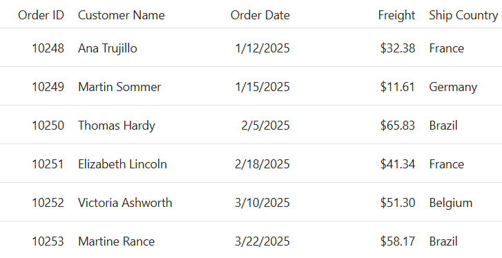

# Getting Started with ASP.NET Core Grid Control using Individual NuGet

This section briefly explains how to include the [ASP.NET Core Grid](https://www.syncfusion.com/aspnet-core-ui-controls/grid) control in your ASP.NET Core Razor Pages application using individual Syncfusion&reg; NuGet packages.

> Using individual NuGet packages instead of the unified `Syncfusion.EJ2.AspNet.Core` package gives you finer control over dependencies and reduces the overall footprint of your application by including only the packages required for the controls you use.

## Prerequisites

[System requirements for ASP.NET Core controls](https://ej2.syncfusion.com/aspnetcore/documentation/system-requirements)

## Create ASP.NET Core Razor Pages project

* [Create a Project using Microsoft Templates](https://learn.microsoft.com/en-us/aspnet/core/tutorials/razor-pages/razor-pages-start?view=aspnetcore-10.0&tabs=visual-studio#create-a-razor-pages-web-app)

* [Create a Project using Syncfusion&reg; ASP.NET Core Extension](https://ej2.syncfusion.com/aspnetcore/documentation/visual-studio-integration/create-project)





## Create an ASP.NET Core Razor Pages project using Visual Studio

1. Start **Visual Studio** and select **Create a new project**.

2. In the **Create a new project** window, choose **ASP.NET Core Web App (Razor Pages)** → **Next**.

3. In the **Configure your new project** dialog, specify the **project name** as `RazorPagesGrid` (and optionally change the location/folder).

4. Click `Next`.

5. In the **Additional information** dialog:
   * Select **.NET 10.0**.
   * Verify that **Do not use top-level statements** is **unchecked**.

6. Click `Create`.

## Install individual NuGet packages

To integrate the Syncfusion&reg; ASP.NET Core DataGrid control using individual packages, run the following commands in the integrated terminal:




dotnet add package Syncfusion.AspNetCore.Grid --version {{ site.releaseversion }}
dotnet add package Syncfusion.AspNetCore.Themes --version {{ site.releaseversion }}








N> Syncfusion&reg; ASP.NET Core individual NuGet packages are available on [nuget.org](https://www.nuget.org/packages?q=syncfusion.aspnetcore). Refer to the [NuGet packages topic](https://ej2.syncfusion.com/aspnetcore/documentation/nuget-packages) to learn more about installing NuGet packages in various OS environments. The `Syncfusion.AspNetCore.Grid` package has a dependency on `Syncfusion.AspNetCore.Base`, which provides the core tag helper infrastructure and will be installed automatically.

## Add Syncfusion&reg; ASP.NET Core Tag Helper

Open the `~/Pages/_ViewImports.cshtml` file and import the tag helpers from both `Syncfusion.AspNetCore.Base` and `Syncfusion.AspNetCore.Grid`:




@addTagHelper *, Syncfusion.AspNetCore.Base
@addTagHelper *, Syncfusion.AspNetCore.Grid




## Add stylesheet and script resources

When using individual NuGet packages, styles and scripts are served from the package's static web assets under the `_content/` path. Add the following references inside the `<head>` of `~/Pages/Shared/_Layout.cshtml`:




<head>
    ...
    <!-- Syncfusion ASP.NET Core Themes (individual package) -->
    <link rel="stylesheet" href="_content/Syncfusion.AspNetCore.Themes/styles/fluent2.css" />
    <!-- Syncfusion ASP.NET Core controls scripts -->
    
</head>




N> Checkout the [Themes topic](https://ej2.syncfusion.com/aspnetcore/documentation/appearance/theme) to learn about available themes such as `fluent2.css`, `material3.css`, `bootstrap5.css`, and more. Replace the theme file name in the `href` path to switch themes.

N> Checkout the [Adding Script Reference](https://ej2.syncfusion.com/aspnetcore/documentation/common/adding-script-references) topic to learn more about individual script references.

## Register Syncfusion&reg; Script Manager

Register the script manager `<ejs-scripts>` at the end of the `<body>` element in `~/Pages/Shared/_Layout.cshtml`:




<body>
    ...
    <!-- Syncfusion ASP.NET Core Script Manager -->
    <ejs-scripts></ejs-scripts>
</body>




## Add ASP.NET Core DataGrid control

Now, add the Syncfusion&reg; ASP.NET Core DataGrid tag helper in `~/Pages/Index.cshtml`:






public class IndexModel : PageModel
{
    public void OnGet() { }
}

public class Order
{
    public Order() { }
    public Order(int id, string customer, DateTime date, string country, double freight)
    {
        this.OrderID = id;
        this.CustomerID = customer;
        this.OrderDate = date;
        this.ShipCountry = country;
        this.Freight = freight;
    }

    public int? OrderID { get; set; }
    public string CustomerID { get; set; }
    public DateTime? OrderDate { get; set; }
    public string ShipCountry { get; set; }
    public double? Freight { get; set; }
}



Press <kbd>Ctrl</kbd>+<kbd>F5</kbd> (Windows) or <kbd>⌘</kbd>+<kbd>F5</kbd> (macOS) to run the app. The Syncfusion&reg; ASP.NET Core DataGrid control will be rendered in the default web browser.

The output looks like the following:

## See also

* [Individual NuGet packages browse all available Syncfusion&reg; ASP.NET Core packages](https://www.nuget.org/packages?q=syncfusion.aspnetcore)
* [Individual script references view all individual component scripts](https://ej2.syncfusion.com/aspnetcore/documentation/common/adding-script-references#individual-control-script-reference)
