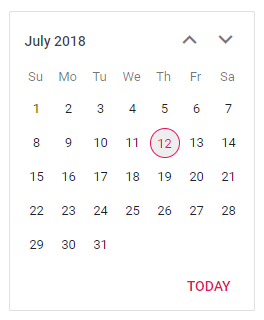

# Getting Started with ASP.NET Core using Razor pages in Visual Studio

This article provides a step-by-step instructions for building ASP.NET Core application with Calendar component using razor pages in Visual Studio.

## Prerequisites

[System requirements for ASP.NET Core components](https://ej2.syncfusion.com/aspnetcore/documentation/system-requirements/)

## Create ASP.NET Core web application with Razor pages

 * [Create a Project using Microsoft Templates](https://docs.microsoft.com/en-us/aspnet/core/tutorials/razor-pages/razor-pages-start?view=aspnetcore-6.0&tabs=visual-studio#create-a-razor-pages-web-app)

 * [Create a Project using Syncfusion ASP.NET Core Extension](https://ej2.syncfusion.com/aspnetcore/documentation/visual-studio-integration/VS2019-Extensions/create-project/)

## Install ASP.NET Core package in the application

Syncfusion ASP.NET Core components are available in [nuget.org.](https://www.nuget.org/packages?q=syncfusion.EJ2) Refer to [NuGet packages topic](https://ej2.syncfusion.com/aspnetcore/documentation/nuget-packages/) to learn more about installing NuGet packages in various OS environments. To add ASP.NET Core components in the application, open the NuGet package manager in Visual Studio (Tools → NuGet Package Manager → Manage NuGet Packages for Solution), search for [Syncfusion.EJ2.AspNet.Core](https://www.nuget.org/packages/Syncfusion.EJ2.AspNet.Core/) and then install it.

> The Syncfusion.EJ2.AspNet.Core NuGet package has dependencies, [Newtonsoft.Json](https://www.nuget.org/packages/Newtonsoft.Json/) for JSON serialization and [Syncfusion.Licensing](https://www.nuget.org/packages/Syncfusion.Licensing/) for validating Syncfusion license key.

## Add Syncfusion ASP.NET Core Tag Helper
Open `~/Views/_ViewImports.cshtml` file and import the `Syncfusion.EJ2` TagHelper.




@addTagHelper *, Syncfusion.EJ2



    
## Add Style Sheet

Checkout the [Themes topic](https://ej2.syncfusion.com/aspnetcore/documentation/appearance/theme/) to learn different ways (CDN, NPM package, and [CRG](https://ej2.syncfusion.com/aspnetcore/documentation/common/custom-resource-generator/)) to refer styles in ASP.NET Core application, and to have the expected appearance for Syncfusion ASP.NET Core components. Here, the theme is referred using CDN inside the `<head>` of `~/Pages/Shared/_Layout.cshtml` file as follows,



    <head>
        ....
        ....

        <!-- Syncfusion Essential JS 2 Styles -->
        <link rel="stylesheet" href="https://cdn.syncfusion.com/ej2/{{ site.ej2version }}/material.css" />

    </head>



## Add Script Reference
In this getting started walk-through, the required scripts are referred using CDN inside the `<head>` of `~/Pages/Shared/_Layout.cshtml` file as follows,



    <head>
        ....
        ....

        <!-- Syncfusion Essential JS 2 Scripts -->
        
    </head>



## Register Syncfusion Script Manager
Open `~/Pages/Shared/_Layout.cshtml` page and register the script manager <ejs-script> at the end of `<body>` in the ASP.NET Core application as follows. 



    <body>
        ....
        ....
        <!-- Syncfusion ScriptManager -->
        <ejs-scripts></ejs-scripts>
    </body>



## Add ASP.NET Core Calendar Component

Now, add the Syncfusion ASP.NET Core Calendar tag helper in `~/Pages/Index.cshtml` page.



    

        <ejs-calendar id="calendar"></ejs-calendar>
    




Press <kbd>Ctrl</kbd>+<kbd>F5</kbd> (Windows) or <kbd>⌘</kbd>+<kbd>F5</kbd> (macOS) to run the app. Then, the Syncfusion ASP.NET Core Calendar component will be rendered in the default web browser.

