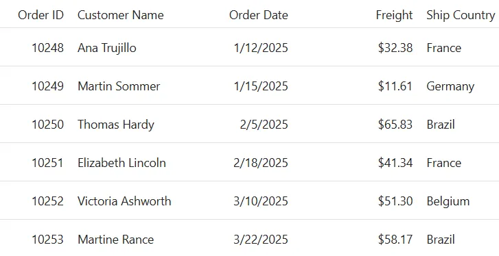

# Getting Started with ASP.NET Core using Razor pages in Visual Studio

This article provides step-by-step instructions for building ASP.NET Core application with [ASP.NET Core DataGrid](https://www.syncfusion.com/aspnet-core-ui-controls/grid) control using razor pages in [Visual Studio](https://visualstudio.microsoft.com/vs/).

## Create an ASP.NET Core Web App with Razor Pages

Create an ASP.NET Core Web App using Visual Studio via [Microsoft Templates](https://learn.microsoft.com/en-us/aspnet/core/tutorials/razor-pages/razor-pages-start?view=aspnetcore-10.0&tabs=visual-studio#create-a-razor-pages-web-app) or the [ASP.NET Core Extension](https://ej2.syncfusion.com/aspnetcore/documentation/visual-studio-integration/create-project). For detailed instructions, refer to the [ASP.NET Core Web App Getting Started](https://ej2.syncfusion.com/aspnetcore/documentation/getting-started/razor-pages) documentation.

## Install the required ASP.NET Core packages

To add **ASP.NET Core DataGrid** control in the app, open the NuGet package manager in Visual Studio (Tools → NuGet Package Manager → Manage NuGet Packages for Solution), search for and install the [Syncfusion.AspNetCore.Grid](https://www.nuget.org/packages/Syncfusion.AspNetCore.Grid/) and [Syncfusion.AspNetCore.Themes](https://www.nuget.org/packages/Syncfusion.AspNetCore.Themes/) packages. All Syncfusion ASP.NET Core packages are available in [nuget.org](https://www.nuget.org/packages?q=syncfusion.EJ2). See the [NuGet packages](https://ej2.syncfusion.com/aspnetcore/documentation/nuget-packages) topic for details.

Alternatively, you can install the same package using the Package Manager Console with the following command.




Install-Package Syncfusion.AspNetCore.Grid -Version {{ site.releaseversion }}
Install-Package Syncfusion.AspNetCore.Themes -Version {{ site.releaseversion }}


 

## Add the ASP.NET Core Tag Helpers

After the package is installed, open the **~/Pages/_ViewImports.cshtml** file and import the `Syncfusion.AspNetCore.Base` and `Syncfusion.AspNetCore.Grid` Tag Helpers.




@addTagHelper *, Syncfusion.AspNetCore.Base
@addTagHelper *, Syncfusion.AspNetCore.Grid




## Add stylesheet and script resources

The theme stylesheet and script can be referenced from [CDN](https://ej2.syncfusion.com/aspnetcore/documentation/appearance/theme#cdn-reference). Include the [stylesheet](https://ej2.syncfusion.com/aspnetcore/documentation/appearance/theme) and [script references](https://ej2.syncfusion.com/aspnetcore/documentation/common/adding-script-references) inside the `<head>` of **~/Pages/Shared/_Layout.cshtml** 




<head>
    ...
    <!-- ASP.NET Core controls styles -->
    <link rel="stylesheet" href="_content/Syncfusion.AspNetCore.Themes/styles/fluent2.css" />
    <!-- ASP.NET Core controls scripts -->
    
</head>




## Register the Script Manager

Open the **~/Pages/Shared/_Layout.cshtml** file and register the script manager `<ejs-scripts>` at the end of the `<body>` element as follows.




<body>
    ...
    <!-- ASP.NET Core Script Manager -->
    <ejs-scripts></ejs-scripts>
</body>




## Add the ASP.NET Core DataGrid control

Add the [ASP.NET Core DataGrid](https://www.syncfusion.com/aspnet-core-ui-controls/grid) control in the **~/Pages/Index.cshtml** file.






public class IndexModel : PageModel
{
    public void OnGet() { }
}

public class Order
{
    public Order() { }
    public Order(int id, string customer, DateTime date, string country, double freight)
    {
        this.OrderID = id;
        this.CustomerID = customer;
        this.OrderDate = date;
        this.ShipCountry = country;
        this.Freight = freight;
    }

    public int? OrderID { get; set; }
    public string CustomerID { get; set; }
    public DateTime? OrderDate { get; set; }
    public string ShipCountry { get; set; }
    public double? Freight { get; set; }
}



## Run the application

Press <kbd>Ctrl</kbd>+<kbd>F5</kbd> (Windows) or <kbd>⌘</kbd>+<kbd>F5</kbd> (macOS) to launch the application. The [ASP.NET Core DataGrid](https://www.syncfusion.com/aspnet-core-ui-controls/grid) control will render in your default web browser.

## See also

1. [Getting Started with ASP.NET Core MVC using Tag Helper](https://ej2.syncfusion.com/aspnetcore/documentation/getting-started/aspnet-core-mvc-taghelper)
2. [Getting Started with ASP.NET Core MVC using HTML Helper](https://ej2.syncfusion.com/aspnetcore/documentation/getting-started/aspnet-core-mvc-htmlhelper)