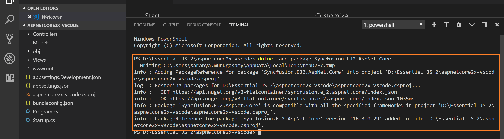
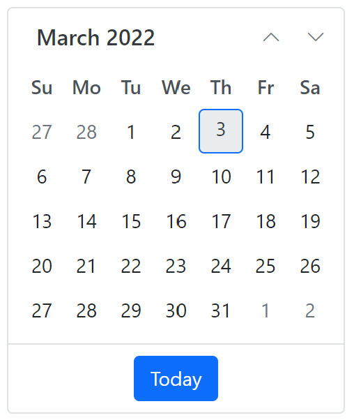

<!-- markdownlint-disable MD024 -->

# Getting Started with Essential JS 2 for ASP.NET Core and Yeoman tool in Visual Studio Code

This article provides a step-by-step introduction to configure Essential JS 2 setup and build a simple ASP.NET Core web application using the [Yeoman tool](http://yeoman.io/#) in [Visual Studio Code](https://code.visualstudio.com/) (VS Code).

> Starting with v16.2.0.x, if you reference to Syncfusion assemblies from trial setup or NuGet feed, you should include a license key in your projects. Refer to this [link](https://help.syncfusion.com/common/essential-studio/licensing/license-key) to learn about registering Syncfusion license key in your ASP.NET Core application to use the components.

## Getting Started with ASP.NET Core

### Prerequisites

The official prerequisites to create and run an ASP.NET Core application on Windows environment are described in the [.NET Core documentation website](https://docs.microsoft.com/en-us/dotnet/core/install/windows?tabs=net60#dependencies).

* [Visual Studio Code](https://code.visualstudio.com/)
* [Node.js](https://nodejs.org/en/)

### Create ASP.NET Core web application

1.Open Command prompt from the desired location and run the following command to install the required npm plugins with global flag.




npm install -g yo generator-aspnet gulp bower





dotnet new webapp -n SyncfusionDemo




> If you are using [dotnet new](https://docs.microsoft.com/en-us/dotnet/core/tools/dotnet-new) command instead of [generator-aspnet](https://www.npmjs.com/package/generator-aspnet) then skip the next two steps.

2.After installing the Yeoman generator successfully, run the following command to invoke a ASP.NET Core project creation wizard.




yo aspnet




3.Select **Web Application Basic [without Membership and Authorization]** option and choose the **Bootstrap (3.3.7)** framework, and then type the web application name for the new application. For example, a new application is created as `EssentialJS2`.

You can navigate the options by using <kbd>top</kbd> and <kbd>bottom</kbd> arrow keys and then press <kbd>Enter</kbd> key to select the option.

4.Now, a new application is created in a new folder with the provided application name. Open the application in the VS Code and Select **View > Integrated Terminal** to open the terminal in VS Code.

### Configure Essential JS 2 in the application

1.Run the following command in the VS Code terminal to add `Syncfusion.EJ2.AspNet.Core` NuGet package in the project.




dotnet add package Syncfusion.EJ2.AspNet.Core




> Refer to [here](https://docs.microsoft.com/en-us/dotnet/core/tools/dotnet-add-package), to learn more details about `dotnet add` command line.

2.Open `~/Views/_ViewImports.cshtml` file and import the `Syncfusion.EJ2` package.




@addTagHelper *, Syncfusion.EJ2




3.Checkout the [Themes topic](https://ej2.syncfusion.com/aspnetcore/documentation/appearance/theme/) to learn different ways ([CDN](https://ej2.syncfusion.com/aspnetcore/documentation/common/adding-script-references#cdn-reference), [NPM package](https://ej2.syncfusion.com/aspnetcore/documentation/common/adding-script-references#node-package-manager-npm), and [CRG](https://ej2.syncfusion.com/aspnetcore/documentation/common/custom-resource-generator/)) to refer styles in ASP.NET Core application, and to have the expected appearance for Syncfusion ASP.NET Core controls. Here, the theme is referred using CDN inside the `<head>` of `~/Views/Shared/_Layout.cshtml` file as follows,




<head>
    ...
    <!-- Syncfusion ASP.NET Core controls styles -->
    <link rel="stylesheet" href="https://cdn.syncfusion.com/ej2/{{ site.ej2version }}/bootstrap5.css" />
</head>




4.In this getting started walk-through, the required scripts are referred using CDN inside the `<head>` of `~/Views/Shared/_Layout.cshtml` file as follows,




<head>
    ...
    <!-- Syncfusion ASP.NET Core controls scripts -->
    
</head>




4.Add the Syncfusion Script Manager at the end of `<body>` element in the `~/Views/Shared/_Layout.cshtml` layout page.




<body>
    ...
    <!-- Syncfusion ScriptManager -->
    <ejs-scripts></ejs-scripts>
</body>




5.Add the Syncfusion ASP.NET Core control in any web page (`cshtml`) in the `Views` folder.

For example, the calendar component is added to the `~/Views/Home/Index.cshtml` page.




    <ejs-calendar id="calendar"></ejs-calendar>




6.Run the application by pressing <kbd>F5</kbd> key. Set `Select Environment` to `.NET Core`, if setting required VS Code.

The Essential JS 2 calendar component will render in the web browser.

