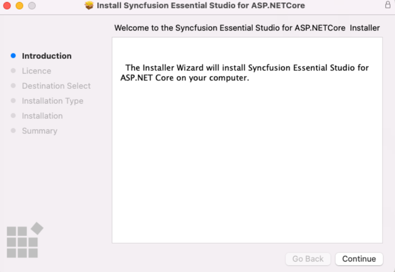
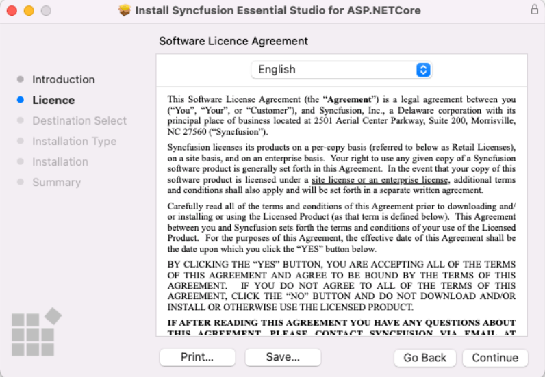
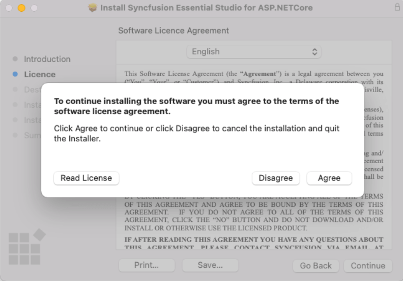
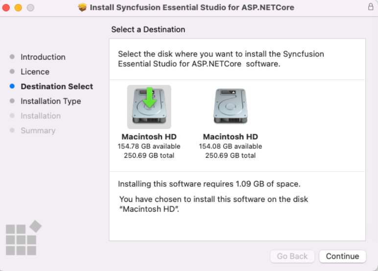
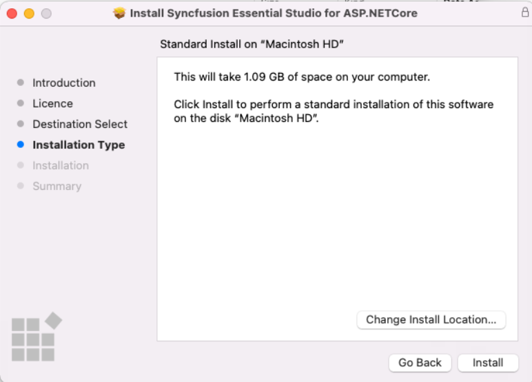
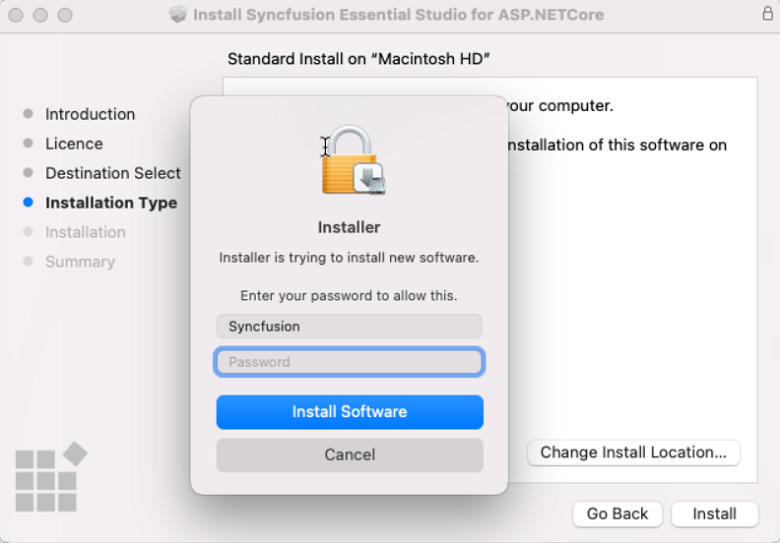
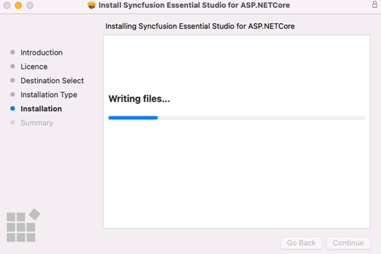
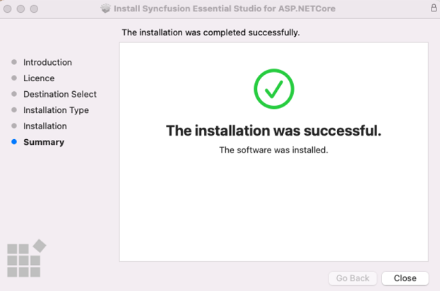

# ASP.NET Core - EJ2 Mac Installation

## How to download ASP.NET Core - EJ2 Mac installer?

1. Essential Studio ASP.NET Core - EJ2 Mac installer can be downloaded from your account’s [download](https://help.syncfusion.com/common/essential-studio/download) section. You can download trial\licensed Mac installer based on your license.

2. In the downloads page, click the "Mac" button and download the required Essential Studio ASP.NET Core - EJ2 Mac installer.

     

## Steps to resolve the warning message in Catalina OS or later

   While running Essential Studio ASP.NET Core - EJ2 Mac Installer on Catalina MacOS or later, the below alert will be displayed.

     
     
   If you receive this alert, follow the below steps for the easiest solution.   

   1.	Right-click the downloaded pkg file.
   2.	Select the "Open With" option and choose "Installer (Default)".
   3.	Installer window will be opened.

## Step-by-Step Installation

The steps below shows how to install the Essential Studio ASP.NET Core - EJ2 Mac installer. 

1. Double-click the Syncfusion Essential Studio ASP.NET Core - EJ2 Mac installer(.pkg) file. The installer Wizard opens. Click Continue.

   
   

2. The Software License Agreement wizard will appear. Click the Continue button.

      
   

3. The License Agreement's Confirmation window will appear. If you have read the Software License Agreement, click **Agree**.

   
   
   N> The Unlock key is not required to install the Mac installer. The Syncfusion Essential Studio ASP.NET Core - EJ2 Mac installer can be used for development purposes without registering the Unlock key.

4. The Destination select wizard will appear. You can choose which disc to install the Syncfusion Essential Studio for ASP.NET Core - EJ2 Mac installer on here.

   

5. The Installation Type wizard will appear. Click Install to begin the standard installation of the Syncfusion Essential Studio ASP.NET Core - EJ2 Mac installer.

   

6. The Authentication window will appear. To begin the installation, enter the Mac machine's password and click **Install Software**.

   

7. The installation process will begin on your machine. 
   
   
   
8. Once the installation is complete, the completed screen will be displayed. To exit the installation wizard, click Close. 

   
   
   By default, Mac installer will install the files in following location.

   **Location:** {Documents}\Syncfusion\ {version}\ {platform}
   
   

