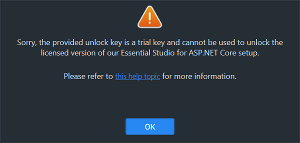
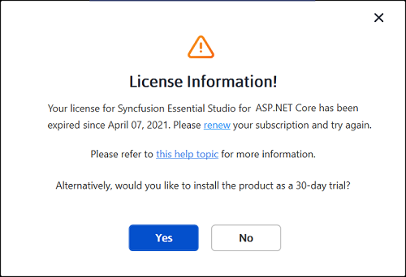
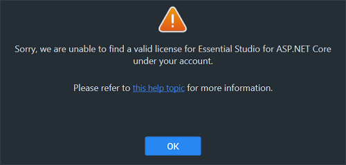
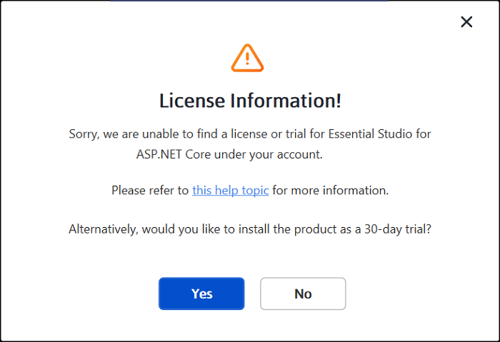
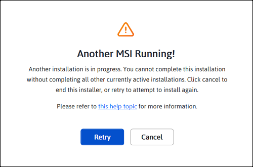
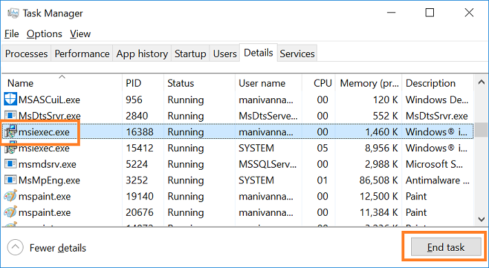
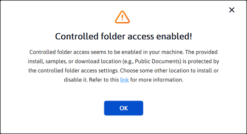

# Common installation errors

This article describes the most common installation errors, as well as the causes and solutions to those errors.

* [Unlocking the license installer using the trial key](https://ej2.syncfusion.com/aspnetcore/documentation/installation/common-installation-errors#unlocking-the-license-installer-using-the-trial-key)

* [License has expired](https://ej2.syncfusion.com/aspnetcore/documentation/installation/common-installation-errors#license-has-expired)

* [Unable to find a valid license or trial](https://ej2.syncfusion.com/aspnetcore/documentation/installation/common-installation-errors#unable-to-find-a-valid-license-or-trial)

* [Unable to install because of another installation](https://ej2.syncfusion.com/aspnetcore/documentation/installation/common-installation-errors#unable-to-install-because-of-another-installation)

* [Unable to install due to controlled folder access](https://ej2.syncfusion.com/aspnetcore/documentation/installation/common-installation-errors#unable-to-install-due-to-controlled-folder-access)

**Prerequisites**

* A Windows machine with administrator privileges.
* The downloaded Syncfusion&reg; ASP.NET Core (EJ2) web or offline installer. See [Downloading Syncfusion offline installer](https://ej2.syncfusion.com/aspnetcore/documentation/installation/offline-installer/how-to-download) or [Downloading Syncfusion web installer](https://ej2.syncfusion.com/aspnetcore/documentation/installation/web-installer/how-to-download).
* A valid Syncfusion&reg; account (for **Login to Install**) or a Syncfusion&reg; unlock key (for **Use Unlock Key**).
* If **Controlled folder access** is enabled on Windows, see the [Unable to install due to controlled folder access](#unable-to-install-due-to-controlled-folder-access) section below before running the installer.

## Unlocking the license installer using the trial key

**Error Message:** Sorry, the provided unlock key is a trial unlock key and cannot be used to unlock the licensed version of our Essential Studio&reg; for ASP.NET Core installer.

**Applies to:** Licensed (web and offline) installer on Windows.

**Reason**   You are attempting to use a Trial unlock key to unlock the licensed installer.

**Suggested solution**  

1. Only a licensed unlock key can unlock a licensed installer. Use the licensed unlock key when prompted by the installer.
2. To generate the licensed unlock key, refer to [this Knowledge Base article](https://www.syncfusion.com/kb/2326).
3. After obtaining the key, re-run the installer and enter it on the **Unlock Key** screen.

## License has expired

**Error Message:** Your license for Syncfusion&reg; Essential Studio&reg; for ASP.NET Core - EJ2 has been expired since {date}. Renew your subscription and try again.

**Online Installer**

**Applies to:** Online installer on Windows.

**Reason**   This error message will appear if your license has expired.

**Suggested Solution**   You can choose from the options below.

1. Renew your subscription from the [renewals page](https://www.syncfusion.com/account/my-renewals).
2. Get a new license from the [Syncfusion sales page](https://www.syncfusion.com/sales/products).
3. Reach out to the sales team by emailing [sales@syncfusion.com](mailto:sales@syncfusion.com).
4. Extend the 30-day trial period after your trial license has expired.
5. After renewing or purchasing, re-run the installer and enter the new unlock key to apply the license.

## Unable to find a valid license or trial

**Error Message:** Sorry, we are unable to find a valid license or trial for Essential Studio&reg; for ASP.NET Core - EJ2 under your account.

**Offline Installer**

**Online Installer**

**Applies to:** Both online and offline installers on Windows (Syncfusion&reg; Essential&reg; Studio ASP.NET Core, EJ2 platform).

**Reason**   The following are possible causes of this error:

* When your trial period expired.
* When you do not have a license or an active trial.
* You are not the license holder of your license.
* Your account administrator has not yet assigned you a license.

**Suggested solution**  

1. Get a new license from the [Syncfusion sales page](https://www.syncfusion.com/sales/products).
2. Contact your account administrator to verify that a license is assigned to your account.
3. Send an email to [clientrelations@syncfusion.com](mailto:clientrelations@syncfusion.com) to request a license.
4. Reach out to the sales team by emailing [sales@syncfusion.com](mailto:sales@syncfusion.com).

## Unable to install because another installation is in progress

**Error Message:** Another installation is in progress. You cannot start this installation without completing all other currently active installations. Click cancel to end this installer or retry to attempt after currently active installation completed to install again.

**Applies to:** Windows installers (online and offline) using MSI-based setup.

**Reason**   You are trying to install when another installation is already running on your machine.

**Suggested solution**   End the active `msiexec.exe` process through Windows Task Manager, then run the Syncfusion&reg; installer again. If the problem persists, restart the computer and retry.

1. Open the Windows Task Manager.

2. Go to the **Details** tab.

3. Select **msiexec.exe** and click **End Task**.

   

4. If the issue persists, restart the computer and run the Syncfusion&reg; installer again.

## Unable to install due to controlled folder access

**Offline Installer**

**Error Message:** Controlled folder access seems to be enabled in your machine. The provided install or samples location (e.g., Public Documents) is protected by the controlled folder access settings.

**Online Installer**

**Error Message:** Controlled folder access seems to be enabled in your machine. The provided install, samples, or download location (e.g., Public Documents) is protected by the controlled folder access settings.

**Applies to:** Windows installers (online and offline) when installing into protected folders such as Public Documents.

**Reason**   You have enabled controlled folder access on your computer, which prevents the installer from writing to protected directories.

**Suggested solution**   Choose one of the following options.

**Option 1: Allow access or disable Controlled folder access**

1. By default, the Syncfusion&reg; demos are installed in the Public Documents folder.
2. With Controlled folder access enabled, the installer cannot write to the Documents folder. If you need to install the demos there, follow the steps in this [Microsoft support article](https://support.microsoft.com/en-us/windows/allow-an-app-to-access-controlled-folders-b5b6627a-b008-2ca2-7931-7e51e912b034) to either allow the installer access or disable Controlled folder access.
3. You can re-enable Controlled folder access after installing the Syncfusion&reg; setup.

**Option 2: Install to a different directory**

1. If you do not want to disable Controlled folder access, run the installer and choose a non-protected location (for example, `C:\Syncfusion\`) on the install location screen for both the Syncfusion&reg; setup and the samples.
