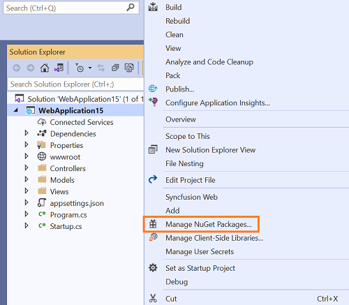
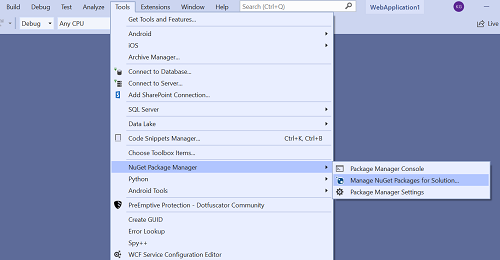
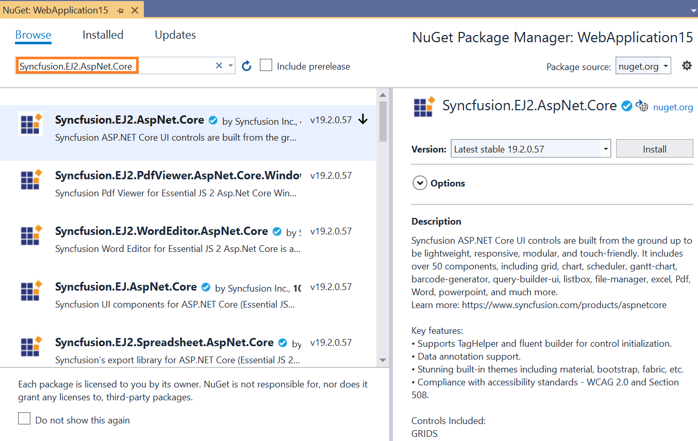
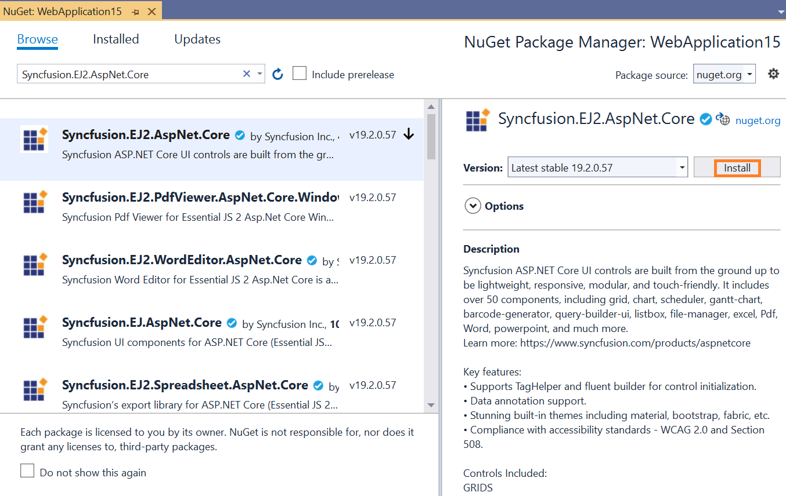
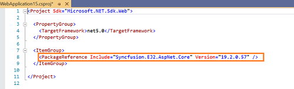
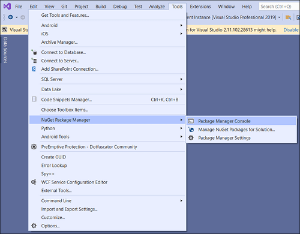
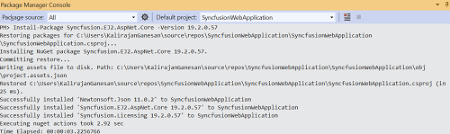

# Install Syncfusion<sup style="font-size:70%">&reg;</sup> ASP.NET Core JS2 NuGet packages

This guide explains how to install the Syncfusion<sup style="font-size:70%">&reg;</sup> ASP.NET Core (EJ2) NuGet packages using the **Package Manager UI**, the **dotnet (.NET) CLI**, or the **Package Manager Console**.

## Overview

**NuGet** is a Package management system for Visual Studio. It makes it easy to add, update and remove external libraries in our application. Syncfusion<sup style="font-size:70%">&reg;</sup> publishes all ASP.NET Core (EJ2) NuGet packages on [nuget.org](https://www.nuget.org/packages?q=Tags%3A%22AspNet.Core%20EJ2%22+syncfusion). The Syncfusion<sup style="font-size:70%">&reg;</sup> ASP.NET Core (EJ2) NuGet packages can be used without installing the Syncfusion<sup style="font-size:70%">&reg;</sup> installer. You can simply reference the Syncfusion<sup style="font-size:70%">&reg;</sup> ASP.NET Core (EJ2) NuGet packages in an ASP.NET Core application to develop with the Syncfusion<sup style="font-size:70%">&reg;</sup> ASP.NET Core (EJ2) components.

N> The `Syncfusion.EJ2.AspNet.Core` NuGet package, which contains all Syncfusion<sup style="font-size:70%">&reg;</sup> ASP.NET Core (EJ2) components in a single package, is available beginning with v16.3.0.21 (Essential Studio<sup style="font-size:70%">&reg;</sup> 2018 Volume 3).

**Prerequisites**

* Visual Studio 2019 or later with the **ASP.NET and web development** workload installed.
* The [.NET SDK](8.0, or later) installed.
* An existing ASP.NET Core web application (or a new one created through **File** → **New** → **Project** → **ASP.NET Core Web App**).

## Installation using the Package Manager UI

The NuGet **Package Manager UI** allows you to search, install, uninstall, and update Syncfusion<sup style="font-size:70%">&reg;</sup> ASP.NET Core (EJ2) NuGet packages in your applications and solutions. You can find and install the Syncfusion<sup style="font-size:70%">&reg;</sup> ASP.NET Core (EJ2) NuGet packages in your Visual Studio ASP.NET Core web application, and this process is easy with the steps below:

1. To open the Manage NuGet packages UI, follow either one of the options below:

    **Option 1:**

    Right-click on the ASP.NET Core web application or solution in the Solution Explorer, and choose **Manage NuGet Packages...**

    

    **Option 2:**

    After opening the ASP.NET Core web application in Visual Studio, go to the **Tools** menu and, after hovering **NuGet Package Manager**, select **Manage NuGet Packages for Solution...**

    

2. The Manage NuGet Packages window will open. Navigate to the **Browse** tab, then search for the Syncfusion<sup style="font-size:70%">&reg;</sup> ASP.NET Core (EJ2) NuGet packages using a term like **`Syncfusion.EJ2.AspNet.Core`**, and select the appropriate Syncfusion<sup style="font-size:70%">&reg;</sup> ASP.NET Core NuGet package for your development.

    N> The [nuget.org](https://api.nuget.org/v3/index.json) package source is selected by default in the **Package source** drop-down. If your Visual Studio does not have nuget.org configured, follow the instructions in the [Microsoft docs](https://docs.microsoft.com/en-us/nuget/tools/package-manager-ui#package-sources) to set up the nuget.org feed URL.

    

3. When you select a package, the right side panel will provide more information about it.

4. By default, the package is selected with the latest version. You can choose the required version and click the **Install** button and accept the license terms. The package will be added to your ASP.NET Core application.

    

5. At this point, your application has all the required Syncfusion<sup style="font-size:70%">&reg;</sup> assemblies, and you will be ready to start building high-performance, responsive apps with [Syncfusion<sup style="font-size:70%">&reg;</sup> ASP.NET Core (EJ2) components](https://www.syncfusion.com/aspnet-core-ui-controls). Also, you can refer to the [ASP.NET Core (EJ2) help documentation](https://ej2.syncfusion.com/aspnetcore/documentation/introduction) for development.

## Installation using the dotnet (.NET) CLI

The [dotnet Command Line Interface (CLI)](https://docs.microsoft.com/en-us/nuget/consume-packages/install-use-packages-dotnet-cli) allows you to add, restore, pack, publish, and manage packages without making any changes to your application files. [dotnet add package](https://docs.microsoft.com/en-us/dotnet/core/tools/dotnet-add-package?tabs=netcore2x) adds a package reference to the application file, then runs [dotnet restore](https://docs.microsoft.com/en-us/dotnet/core/tools/dotnet-restore?tabs=netcore2x) to install the package.

Follow the below instructions to use the `dotnet` CLI to install the Syncfusion<sup style="font-size:70%">&reg;</sup> ASP.NET Core (EJ2) NuGet packages.

1. Open a command prompt and navigate to the directory where your ASP.NET Core web application project file is located.
2. To install a NuGet package, run the following command:

    ```bash
    dotnet add package <PackageName>
    ```

    **For example:**

    ```bash
    dotnet add package Syncfusion.EJ2.AspNet.Core
    ```

    N> If you don't provide a version flag, this command upgrades to the latest version by default. To specify a version, add the `-v` parameter: `dotnet add package Syncfusion.EJ2.AspNet.Core -v 19.2.0.57`.

3. Examine the ASP.NET Core project file after the command has completed to ensure that the Syncfusion<sup style="font-size:70%">&reg;</sup> ASP.NET Core (EJ2) package was installed. To see the added reference, open the `.csproj` file.

    

4. Then run the [dotnet restore](https://docs.microsoft.com/en-us/dotnet/core/tools/dotnet-restore?tabs=netcore2x) command to restore all the packages listed in the application file.

    N> Restoring is done automatically with `dotnet build` and `dotnet run` in .NET Core 2.0 and later.

5. At this point, your application has all the required Syncfusion<sup style="font-size:70%">&reg;</sup> assemblies, and you will be ready to start building high-performance, responsive apps with [Syncfusion<sup style="font-size:70%">&reg;</sup> ASP.NET Core (EJ2) components](https://www.syncfusion.com/aspnet-core-ui-controls). Also, you can refer to the [ASP.NET Core (EJ2) help documentation](https://ej2.syncfusion.com/aspnetcore/documentation/introduction) for development.

## Installation using the Package Manager Console

The **Package Manager Console** saves NuGet package installation time since you don't have to search for the `Syncfusion.EJ2.AspNet.Core` NuGet package you want to install — you can just type the installation command. Follow the instructions below to use the Package Manager Console to reference the Syncfusion<sup style="font-size:70%">&reg;</sup> ASP.NET Core (EJ2) component as a NuGet package in your ASP.NET Core web application.

1. To show the Package Manager Console, open your ASP.NET Core web application in Visual Studio and navigate to **Tools** → **NuGet Package Manager** → **Package Manager Console**.

    

2. The **Package Manager Console** will be shown at the bottom of the screen. You can install the Syncfusion<sup style="font-size:70%">&reg;</sup> ASP.NET Core (EJ2) NuGet packages by entering the following NuGet installation commands.

    **Install the specified Syncfusion<sup style="font-size:70%">&reg;</sup> ASP.NET Core (EJ2) NuGet package**

    The command below installs the Syncfusion<sup style="font-size:70%">&reg;</sup> ASP.NET Core NuGet package in the default ASP.NET Core application:

    ```powershell
    Install-Package <PackageName>
    ```

    **For example:**

    ```powershell
    Install-Package Syncfusion.EJ2.AspNet.Core
    ```

    N> You can find the list of Syncfusion<sup style="font-size:70%">&reg;</sup> ASP.NET Core NuGet packages published on nuget.org from [here](https://www.nuget.org/packages?q=Tags%3A%22AspNet.Core%20EJ2%22+syncfusion).

    **Install the specified Syncfusion<sup style="font-size:70%">&reg;</sup> ASP.NET Core (EJ2) NuGet package in a specified ASP.NET Core application**

    The command below installs the Syncfusion<sup style="font-size:70%">&reg;</sup> ASP.NET Core (EJ2) NuGet package in the given ASP.NET Core application:

    ```powershell
    Install-Package <PackageName> -ProjectName <ProjectName>
    ```

    **For example:**

    ```powershell
    Install-Package Syncfusion.EJ2.AspNet.Core -ProjectName SyncfusionWebApplication
    ```

3. By default, the package will be installed with the latest version. You can specify the required version with the `-Version` flag to install the Syncfusion<sup style="font-size:70%">&reg;</sup> ASP.NET Core (EJ2) NuGet packages at the appropriate version:

    ```powershell
    Install-Package Syncfusion.EJ2.AspNet.Core -Version 19.2.0.57
    ```

    

4. The NuGet package manager console will install the Syncfusion<sup style="font-size:70%">&reg;</sup> ASP.NET Core (EJ2) NuGet package and its dependencies. When the installation is complete, the console will show that your Syncfusion<sup style="font-size:70%">&reg;</sup> ASP.NET Core (EJ2) package has been successfully added to the application.

5. At this point, your application has all the required Syncfusion<sup style="font-size:70%">&reg;</sup> assemblies, and you will be ready to start building high-performance, responsive apps with [Syncfusion<sup style="font-size:70%">&reg;</sup> ASP.NET Core (EJ2) components](https://www.syncfusion.com/aspnet-core-ui-controls). Also, you can refer to the [ASP.NET Core (EJ2) help documentation](https://ej2.syncfusion.com/aspnetcore/documentation/introduction) for development.

## Troubleshooting

| Issue | Possible Cause | Suggested Fix |
| --- | --- | --- |
| `dotnet add package` reports a version compatibility error. | The selected package version does not support your project's target framework. | Use a package version that supports your .NET version (for example, 19.x for .NET 5/6, 17.x for .NET Core 3.1). |
| `Install-Package` fails with "Package not found". | The package source in Visual Studio is not set to nuget.org. | In **Tools** → **NuGet Package Manager** → **Package Manager Settings**, add `https://api.nuget.org/v3/index.json` as a package source. |
| `dotnet restore` fails with a 401/403 error from a private feed. | A private feed is configured but does not have credentials. | Re-run `dotnet restore` after configuring credentials with `dotnet nuget update source` or by editing `NuGet.config`. |
| Syncfusion components do not render in the app. | The Syncfusion resources (CSS / JS / Tag Helpers) are not registered. | See the [Next Steps](#next-steps) section to register Syncfusion in `Program.cs` / `Startup.cs` and add the theme stylesheet. |
| License warning appears after build. | License key has not been registered for this project. | Generate the license key from the [License & Downloads](https://www.syncfusion.com/account/downloads) page and register it. See [Common Installation Errors](https://ej2.syncfusion.com/aspnetcore/documentation/installation/common-installation-errors). |

For additional help, see [Common Installation Errors](https://ej2.syncfusion.com/aspnetcore/documentation/installation/common-installation-errors).

## Related Links

* [Downloading Syncfusion offline installer](https://ej2.syncfusion.com/aspnetcore/documentation/installation/offline-installer/how-to-download)
* [Downloading Syncfusion web installer](https://ej2.syncfusion.com/aspnetcore/documentation/installation/web-installer/how-to-download)
* [Downloading Syncfusion Mac installer](https://ej2.syncfusion.com/aspnetcore/documentation/installation/mac-installer/how-to-download)
* [Downloading Syncfusion Linux installer](https://ej2.syncfusion.com/aspnetcore/documentation/installation/linux-installer/how-to-download)
* [Common Installation Errors](https://ej2.syncfusion.com/aspnetcore/documentation/installation/common-installation-errors)