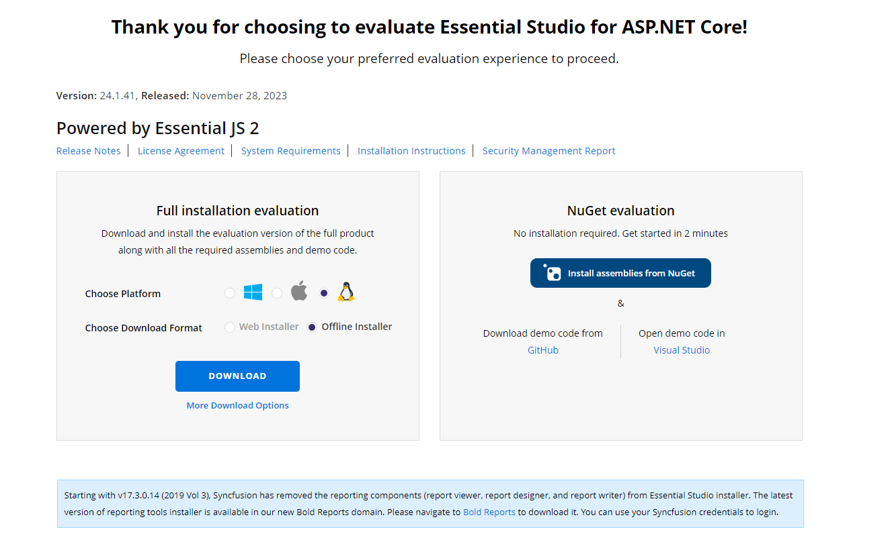
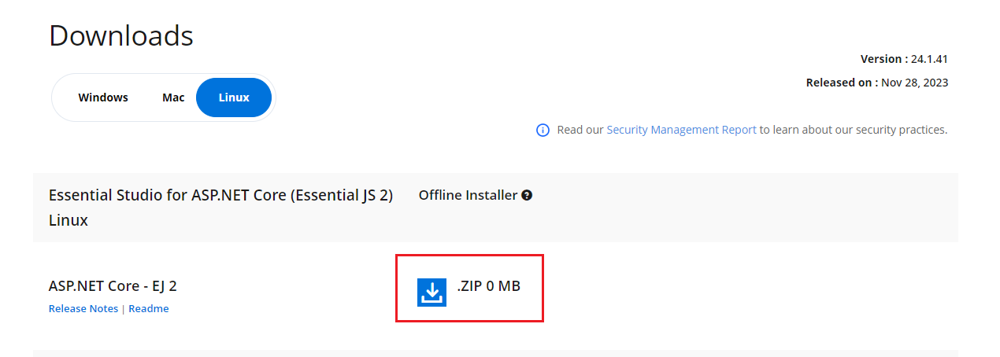
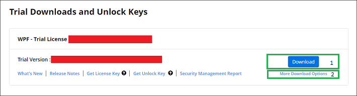

---
layout: post
title: Downloading Syncfusion Essential Studio Linux installer - Syncfusion
description: Learn here about the how to download Syncfusion Essential Studio Linux installer from our syncfusion website with license.
platform: common
documentation: ug
--- 

# Downloading Syncfusion&reg; Essential Studio&reg; Linux Installer

The Syncfusion&reg; Linux installer can be downloaded from the [Syncfusion](https://www.syncfusion.com/) website. You can either download the licensed installer or try our trial installer depending on your license. The Linux installer is provided in `.zip` format and does not require an unlock key to install. This guide covers the following options:

- Trial Installer
- Licensed Installer

**Prerequisites**

* A registered Syncfusion&reg; account. To create one, see the [Syncfusion downloads page](https://www.syncfusion.com/downloads).
* A tool to extract `.zip` files, such as `unzip` on most distributions.
* For ASP.NET Core / .NET Core samples: the .NET SDK installed.

## Download the Trial Version

The 30-day trial can be downloaded in two ways:

* Download Free Trial Setup
* Start Trials if using components through [NuGet.org](https://www.nuget.org/packages?q=syncfusion)

### Download Free Trial Setup

1. Evaluate the 30-day free trial by visiting the [Download Free Trial](https://www.syncfusion.com/downloads) page and selecting the product.

2. After completing the required form or logging in with your registered Syncfusion&reg; account, download the trial installer from the confirmation page (as shown in the screenshot below).

   

3. With a trial license, only the latest version's trial installer can be downloaded.
4. An unlock key is not required to install the Syncfusion&reg; Essential Studio&reg; Linux trial installer.
5. Before the trial expires, you can download the trial installer at any time from your registered account's [Trials & Downloads](https://www.syncfusion.com/account/manage-trials/downloads) page (as shown in the screenshot below).

   

6. Click **More Download Options** (element 2 in the above screenshot) to get the Essential Studio&reg; product offline trial installer, which is available in `.zip` format.

   

### Start Trials if Using Components Through NuGet.org

If you have already obtained Syncfusion&reg; components through [NuGet.org](https://www.nuget.org/packages?q=syncfusion), initiate an evaluation as follows:

1. Start your 30-day free trial from the [Start Trial](https://www.syncfusion.com/account/manage-trials/start-trials) page in your account.

   N> You can generate the license key for your active trial products from the [Trials & Downloads](https://www.syncfusion.com/account/manage-trials/downloads) page. This license key is mandatory to use our trial products in your application. To learn more about license keys, refer to the [licensing overview](https://help.syncfusion.com/common/essential-studio/licensing/overview).

    

2. To access this page, you must sign up or log in with your Syncfusion&reg; account.
3. Begin your trial by selecting the Syncfusion&reg; product.

   N> If you've already used the trial products and they haven't expired, you won't be able to start the trial for the same product again.

4. After you've started the trial, go to the [Trials & Downloads](https://www.syncfusion.com/account/manage-trials/downloads) page to get the latest version trial installer. You can generate the [unlock key](https://www.syncfusion.com/kb/8069/how-to-generate-unlock-key-for-essentials-studio-products) and [license key](https://help.syncfusion.com/common/essential-studio/licensing/how-to-generate) at any time before the trial period expires (as shown in the screenshot below).

   

5. You can find your current active trial products on the [Trials & Downloads](https://www.syncfusion.com/account/manage-trials/downloads) page.

## Download the License Version

1. Syncfusion&reg; licensed products are available on the [License & Downloads](https://www.syncfusion.com/account/downloads) page under your registered Syncfusion&reg; account.
2. You can view all the licenses (both active and expired) associated with your account.
3. Download the Essential Studio&reg; Linux licensed installer by selecting **More Download Options** (element 3 in the screenshot below).

   

4. An unlock key is not required to install the Syncfusion&reg; Essential Studio&reg; Linux licensed installer.

5. For Linux, the `.zip` format is available for download.

   

For step-by-step installation guidelines, refer to the [Essential Studio&reg; Linux installer](https://ej2.syncfusion.com/aspnetcore/documentation/installation/linux-installer/how-to-install) documentation.

## Troubleshooting

| Issue | Possible Cause | Suggested Fix |
| --- | --- | --- |
| The Linux installer is not listed under **More Download Options**. | The signed-in account does not own a license, or the product filter is set to a different platform. | Confirm the account owns a license, then filter the **More Download Options** list to the Linux platform. |
| The downloaded `.zip` fails to extract or is corrupted. | The download was incomplete, or the file was modified by a download manager. | Re-download the installer from the [License & Downloads](https://www.syncfusion.com/account/downloads) page and verify the file size against the value shown on the page. |
| License warning appears after install. | License key was not registered for the trial or licensed product. | Generate the license key from the [Trials & Downloads](https://www.syncfusion.com/account/manage-trials/downloads) or [License & Downloads](https://www.syncfusion.com/account/downloads) page and register it in the project. See [Common Installation Errors](https://ej2.syncfusion.com/aspnetcore/documentation/installation/common-installation-errors). |
