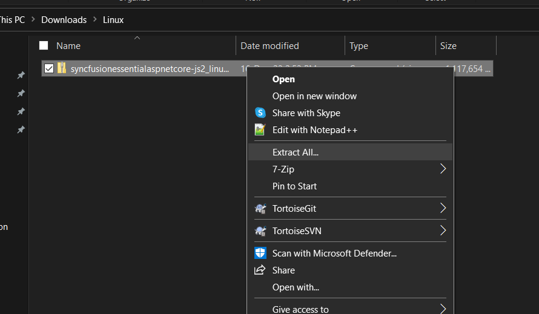
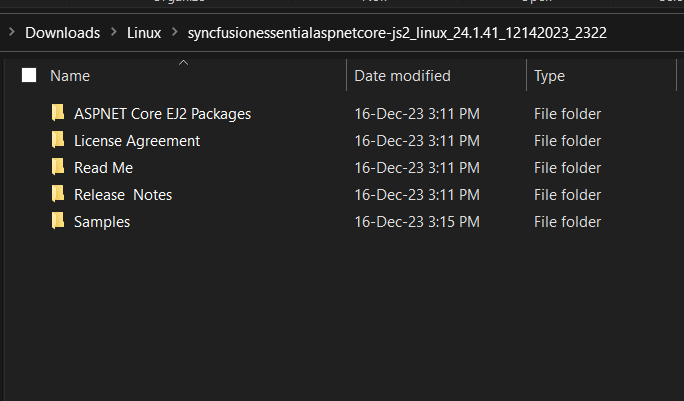

# Installing Syncfusion<sup style="font-size:70%">&reg;</sup> Essential Studio<sup style="font-size:70%">&reg;</sup> Linux Installer

This guide explains how to extract and use the Syncfusion<sup style="font-size:70%">&reg;</sup> Essential<sup style="font-size:70%">&reg;</sup> Studio Linux installer on a Linux machine.

**Prerequisites**

* The downloaded Syncfusion<sup style="font-size:70%">&reg;</sup> Essential Studio<sup style="font-size:70%">&reg;</sup> Linux installer in `.zip` format. See [Downloading Syncfusion Linux installer](https://ej2.syncfusion.com/aspnetcore/documentation/installation/linux-installer/how-to-download).
* A tool to extract `.zip` files, such as `unzip`.
* For running the bundled ASP.NET Core samples: a supported .NET SDK (3.1, 5.0, 6.0, or later).
* For running the bundled JavaScript / Vue / React / Angular samples: a current LTS version of Node.js and npm.

## Step-by-Step Installation

The steps below show how to install the Essential Studio<sup style="font-size:70%">&reg;</sup> Linux installer.

1. Extract the Syncfusion<sup style="font-size:70%">&reg;</sup> Essential Studio<sup style="font-size:70%">&reg;</sup> Linux installer (`.zip`) file. 

   The contents are extracted to the destination directory.

   

2. The Linux installer contains the following folders:

   * **`Samples`** – Demo source for each component (ASP.NET Core, JavaScript, etc.). Open the sample folder and run it locally.
   * **`NuGet`** – NuGet packages for the .NET EJ2 components.
   * **`npm`** – Pre-packaged npm archives for the JavaScript EJ2 packages, useful for offline `npm install` scenarios.

   

   > **Note:** The Unlock key is not required to install or use the Linux installer.

3. You can launch the demo source and use the NuGet packages included in the Linux installer.

4. To deploy or restore the ASP.NET Core samples, run the following command on the Linux machine. Replace `<projectname>` with the name of the sample project file (`.csproj`):

   ```bash
   dotnet restore <projectname> -s ./nuget
   ```

   This restores the NuGet packages from the local `nuget` folder included in the installer.

5. To use the pre-packaged npm archives in an offline JavaScript / Vue / Angular / React project, point npm at the bundled `npm` folder. For example, to install from a local package file:

   ```bash
   npm install ./npm/@syncfusion/ej2-vue-grids-<version>.tgz --save
   ```

## License Key Registration in Samples

After installation, a license key is required to register the demo source that is included in the Linux installer. To learn about the steps for license registration for the ASP.NET Core - EJ2 Linux installer, refer to the following:

* Register the license key in the [`Program.cs`](https://ej2.syncfusion.com/aspnetcore/documentation/licensing/how-to-register-in-an-application#for-aspnet-core-application-using-net-60) file if you created the ASP.NET Core web application with Visual Studio 2022 and .NET 6.0.
* Register the license key in the `Configure` method of [`Startup.cs`](https://ej2.syncfusion.com/aspnetcore/documentation/licensing/how-to-register-in-an-application#for-aspnet-core-application-using-net-50-or-net-31) for .NET 5.0 or .NET 3.1 applications.

> If the sample still shows a license warning after registration, verify that the license key belongs to the same Syncfusion<sup style="font-size:70%">&reg;</sup> account that owns the active subscription, and restart the sample so the new key is picked up.

## Troubleshooting

| Issue | Possible Cause | Suggested Fix |
| --- | --- | --- |
| Sample fails to start with "EACCES: permission denied". | The extracted folder is owned by `root` or another user. | Change ownership of the extracted folder to your user, for example `sudo chown -R $USER:$USER ~/Syncfusion`. |
| `dotnet restore` fails with a NuGet feed error. | The `-s` path is wrong, or the `nuget` folder is not present in the extracted installer. | Verify the `nuget` folder path under the extracted directory and use the correct `-s` argument. |
| Sample displays a license-warning overlay. | The license key has not been registered for this account / project. | Generate and register the license key using the steps in [License Key Registration in Samples](#license-key-registration-in-samples). |
| Bundled npm tarball fails to install with a checksum or 404 error. | The tarball filename in the command does not match the actual file. | List the contents of the `npm` folder (`ls ~/Syncfusion/npm`) and use the exact filename, including version, in the install command. |

For additional help, see [Common Installation Errors](https://ej2.syncfusion.com/aspnetcore/documentation/installation/common-installation-errors).

## Related Links

* [Downloading Syncfusion Linux installer](https://ej2.syncfusion.com/aspnetcore/documentation/installation/linux-installer/how-to-download)
* [Installing Syncfusion offline installer](https://ej2.syncfusion.com/aspnetcore/documentation/installation/offline-installer/how-to-install)
* [Installing Syncfusion web installer](https://ej2.syncfusion.com/aspnetcore/documentation/installation/web-installer/how-to-install)
* [Installing Syncfusion Mac installer](https://ej2.syncfusion.com/aspnetcore/documentation/installation/mac-installer/how-to-install)
* [Install NuGet packages](https://ej2.syncfusion.com/aspnetcore/documentation/installation/install-nuget-packages)
* [Common Installation Errors](https://ej2.syncfusion.com/aspnetcore/documentation/installation/common-installation-errors)