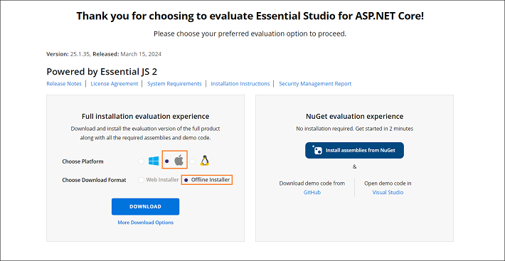
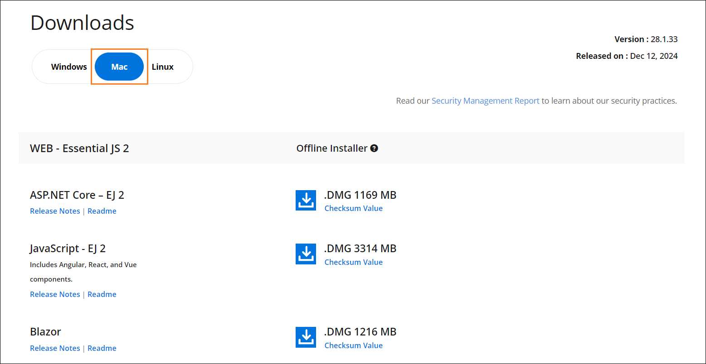
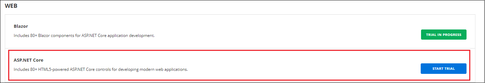
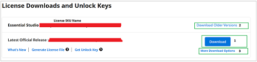

# Downloading Syncfusion&reg; ASP.NET Core EJ2 Mac Installer

The Syncfusion&reg; ASP.NET Core - EJ2 Mac Installer can be downloaded from the [Syncfusion](https://www.syncfusion.com/aspnet-core-ui-controls) website. You can either download the licensed installer or try our trial installer depending on your license. This guide covers the following options:

* Trial Installer
* Licensed Installer

**Prerequisites**

* A registered Syncfusion&reg; account. To create one, see the [Syncfusion downloads page](https://www.syncfusion.com/downloads).
* A macOS machine running a supported version (macOS Catalina / 10.15 or later is required by the current Mac installer).
* An active Syncfusion&reg; trial or licensed subscription to use the bundled samples.

## Download the Trial Version

The 30-day trial can be downloaded in two ways:

* Download Free Trial Setup
* Start Trials if using components through [NuGet.org](https://www.nuget.org/packages?q=syncfusion)

### Download Free Trial Setup

1. Evaluate the 30-day free trial by visiting the [Download Free Trial](https://www.syncfusion.com/downloads) page and selecting the ASP.NET Core platform.

2. After completing the required form or logging in with your registered Syncfusion&reg; account, download the ASP.NET Core EJ2 trial installer from the confirmation page (see the screenshot below).

    

3. With a trial license, only the latest version's trial installer can be downloaded.

4. After downloading, the Syncfusion&reg; ASP.NET Core - EJ2 trial installer can be unlocked using either the trial unlock key or the Syncfusion&reg; registered login credentials. For more information on generating an unlock key, see [this article](https://support.syncfusion.com/kb/article/7053/how-to-generate-unlock-key-for-essentials-studio-products).

5. Before the trial expires, you can download the trial installer at any time from your registered account's [Trials & Downloads](https://www.syncfusion.com/account/manage-trials/downloads) page (see the screenshot below).

    

6. Click **More Download Options** (element 2 in the above screenshot) to get the Essential Studio&reg; ASP.NET Core - EJ2 offline trial installer, which is available in `.DMG` format.

   

### Start Trials if Using Components Through NuGet.org

If you have already obtained Syncfusion&reg; components through [NuGet.org](https://www.nuget.org/packages?q=syncfusion), initiate an evaluation as follows:

1. Start your 30-day free trial for ASP.NET Core - EJ2 from the [Start Trial](https://www.syncfusion.com/account/manage-trials/start-trials) page in your account.

    

2. To access this page, you must sign up or log in with your Syncfusion&reg; account.

3. Begin your trial by selecting the ASP.NET Core - EJ2 product.

   > **Note:** If you've already used the trial products and they haven't expired, you won't be able to start the trial for the same product again.

4. After you've started the trial, go to the [Trials & Downloads](https://www.syncfusion.com/account/manage-trials/downloads) page to get the latest version trial installer. You can generate the [unlock key](https://support.syncfusion.com/kb/article/7053/how-to-generate-unlock-key-for-essentials-studio-products) and [license key](https://ej2.syncfusion.com/aspnetcore/documentation/licensing/how-to-generate) at any time before the trial period expires (see the screenshot below).

    

5. You can find your current active trial products on the [Trials & Downloads](https://www.syncfusion.com/account/manage-trials/downloads) page.

## Download the License Version

1. Syncfusion&reg; licensed products are available on the [License & Downloads](https://www.syncfusion.com/account/downloads) page under your registered Syncfusion&reg; account.

2. You can view all the licenses (both active and expired) associated with your account.

3. Download the ASP.NET Core - EJ2 Mac licensed installer by selecting **More Download Options** (element 3 in the screenshot below).

   

4. An unlock key is not required to install the Syncfusion&reg; ASP.NET Core - EJ2 Mac licensed installer.

5. For macOS, the `.DMG` format is available for download.

   

For step-by-step installation guidelines, refer to the [ASP.NET Core EJ2 Mac installer](https://ej2.syncfusion.com/aspnetcore/documentation/installation/mac-installer/how-to-install) documentation.

## Troubleshooting

| Issue | Possible Cause | Suggested Fix |
| --- | --- | --- |
| The Mac installer is not listed under **More Download Options**. | The signed-in account does not own a license, or the product filter is set to a different platform. | Confirm the account owns an ASP.NET Core license, then filter the list to the ASP.NET Core / Mac platform. |
| Gatekeeper blocks the installer on macOS Catalina or later. | The unsigned installer is not allowed by default. | Right-click the `.dmg` → **Open With** → **DiskImageMounter (Default)**, or allow it in **System Settings** → **Privacy & Security**. |
| License warning appears after install. | The unlock key was not applied, or the trial expired. | Re-run the installer and sign in with the licensed account. See [Common Installation Errors](https://ej2.syncfusion.com/aspnetcore/documentation/installation/common-installation-errors). |