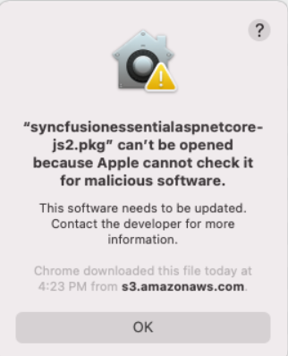
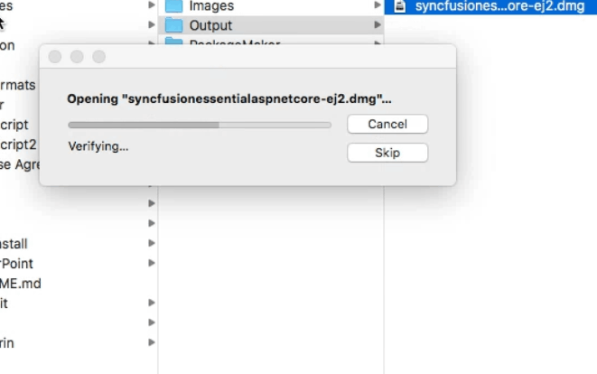
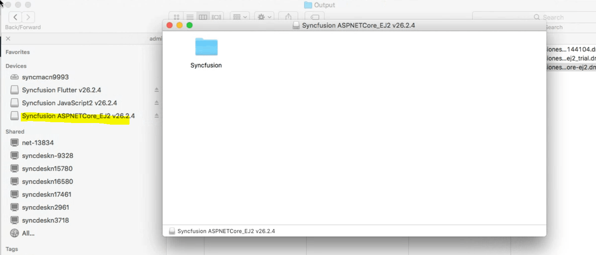
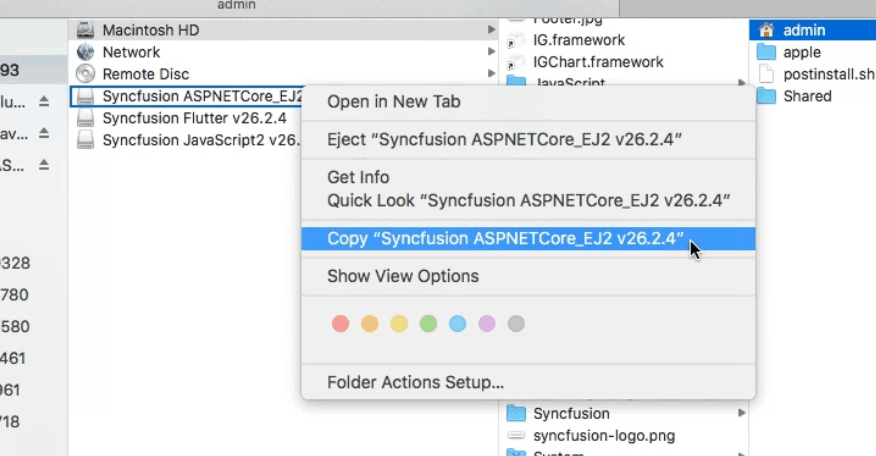
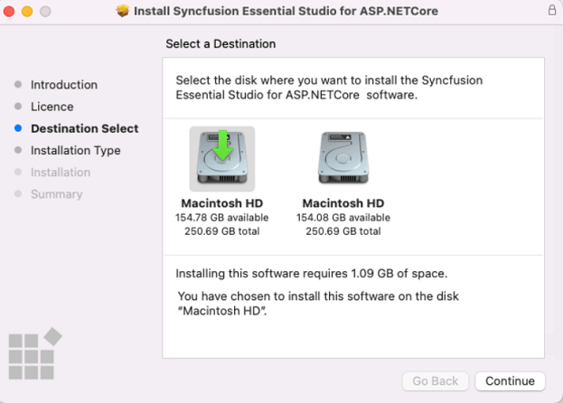
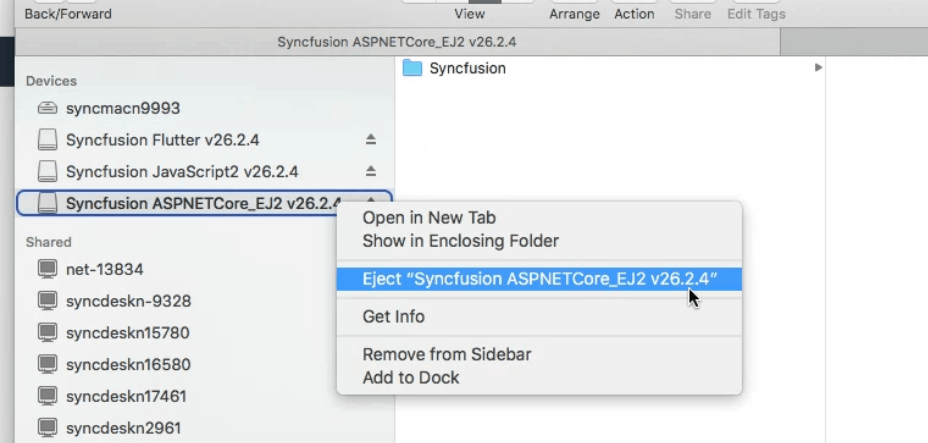

# Installing Syncfusion&reg; ASP.NET Core EJ2 Mac Installer

The Essential Studio&reg; ASP.NET Core EJ2 Mac installer allows you to create the ASP.NET Core EJ2 application in Visual Studio for Mac with the Syncfusion&reg; ASP.NET Core EJ2 components.

**Prerequisites**

* A macOS machine running macOS Catalina (10.15) or later. Earlier versions are not officially supported by the current Mac installer.
* The downloaded Syncfusion&reg; ASP.NET Core - EJ2 Mac installer (`.dmg`). See [Downloading Syncfusion Mac installer](https://ej2.syncfusion.com/aspnetcore/documentation/installation/mac-installer/how-to-download).
* Administrator access on your Mac so that you can copy the installer into the **Applications** folder.

## Steps to resolve the warning message in macOS Catalina or later

While running Essential Studio&reg; ASP.NET Core - EJ2 Mac Installer on macOS Catalina or later, the alert below may be displayed.

If you receive this alert, follow the below steps for the easiest solution.

1. Locate the downloaded `.dmg` file in **Finder** (typically in the **Downloads** folder).
2. Right-click the `.dmg` file (do **not** double-click it).
3. Select the **Open With** option and choose **DiskImageMounter (Default)**. The following pop-up appears.

	

4. Click **Open** in the pop-up. The installer window opens.

> If you continue to see a "cannot be opened because the developer cannot be verified" message, open **System Settings** → **Privacy & Security**, scroll to the bottom, and click **Open Anyway** next to the blocked installer entry. Then re-run the steps above.

## Step-by-step installation

The steps below show how to install the Essential Studio&reg; ASP.NET Core - EJ2 Mac installer.

1. Locate the downloaded `.dmg` file in **Finder** and double-click it to mount the disk image.

   

2. macOS automatically mounts the disk image and creates a virtual drive on your desktop and in the Finder sidebar. If a license agreement appears, review it and click **Agree** to continue.

   

3. In the mounted disk window, select the Syncfusion&reg; installer application and copy it (right-click → **Copy**, or press **⌘ + C**).

   

4. Open the **Applications** folder (from the Finder sidebar or by pressing **⌘ + Shift + A**) and paste the installer there (right-click → **Paste**, or press **⌘ + V**). Running the installer from **Applications** is required so that macOS Gatekeeper can verify it.

   

   N> The Unlock key is not required to install the Mac installer. The Syncfusion&reg; Essential Studio&reg; ASP.NET Core - EJ2 Mac installer can be used for development purposes without registering the Unlock key. A license key is only required later to run the bundled samples and demo source without a license-warning message.

5. Open the **Applications** folder, then open the Syncfusion&reg; Essential Studio&reg; Mac installer to explore the included packages and samples.

   

6. To clean up, right-click the virtual drive on your desktop or in the Finder sidebar and select **Eject** to unmount the disk image. You can also delete the installer from the **Applications** folder once you no longer need it.

   

## License key registration in samples

After installation, a license key is required to run the demo source included in the Mac installer without the Syncfusion&reg; license-warning overlay. To learn about the steps for license registration for the ASP.NET Core - EJ2 Mac installer, refer to the following:

* Register the license key in the [`Program.cs`](https://ej2.syncfusion.com/aspnetcore/documentation/licensing/how-to-register-in-an-application#for-aspnet-core-application-using-net-60) file if you created the ASP.NET Core web application with Visual Studio 2022 and .NET 6.0.
* Register the license key in the `Configure` method of [`Startup.cs`](https://ej2.syncfusion.com/aspnetcore/documentation/licensing/how-to-register-in-an-application#for-aspnet-core-application-using-net-50-or-net-31) for .NET 5.0 or .NET 3.1 applications.

> If the sample still shows a license warning after registration, verify that the license key is registered against the same Syncfusion&reg; account that owns the active subscription, and restart the sample app so the new key is picked up.

## Troubleshooting

| Issue | Possible Cause | Suggested Fix |
| --- | --- | --- |
| "App is damaged and can't be opened" on macOS Catalina or later. | Gatekeeper is blocking the unsigned installer. | Use the right-click → **Open With** → **DiskImageMounter (Default)** flow described above, or allow the app in **System Settings** → **Privacy & Security**. |
| Installer does not launch after being copied to **Applications**. | The installer was run from the mounted disk image only. | Copy the installer into the **Applications** folder and run it from there. |
| Sample apps display a license-warning overlay. | License key has not been registered for this project/account. | Register the license key using one of the methods in [License Key Registration in Samples](#license-key-registration-in-samples). |
| "Image not found" or missing platform files when running a sample. | The installer was not fully extracted, or required runtimes are missing. | Re-run the installer from **Applications**, and confirm that your .NET SDK version is compatible with the sample. |

For additional help, see [Common Installation Errors](https://ej2.syncfusion.com/aspnetcore/documentation/installation/common-installation-errors).