# NuGet Packages for ASP.NET Core UI Controls

<style>
img
{
width:100%;
height: auto;
}
</style>

## Overview

**NuGet** is a Package management system for Visual Studio. It makes it easy to add, update and remove external libraries in our application. Syncfusion publishing all ASP.NET Core NuGet packages in [nuget.org](https://www.nuget.org/packages?q=Tag%3A%22EJ2%22+Syncfusion). The Syncfusion ASP.NET Core NuGet packages can be used without installing the Essential Studio or ASP.NET Core platform installation to implement the Syncfusion ASP.NET Core controls.

## Installation using Package Manager

The NuGet Package Manager UI allows you to search, install, uninstall, and update Syncfusion ASP.NET Core NuGet packages in your applications and solutions. You can find and install the Syncfusion ASP.NET Core NuGet packages in your Visual Studio ASP.NET Core application and this process is easy with the steps below:

1. Right-click on the ASP.NET Core application or solution in the Solution Explorer, and choose **Manage NuGet Packages...**

    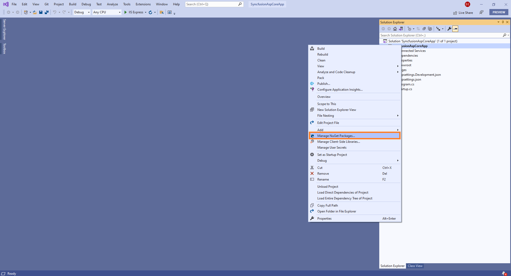

    As an alternative, after opening the ASP.NET Core application in Visual Studio, go to the **Tools** menu and after hovering **NuGet Package Manager**, select **Manage NuGet Packages for Solution...**

2. The Manage NuGet Packages window will open. Navigate to the **Browse** tab, then search for the Syncfusion Essential JS 2 ASP.NET Core NuGet packages using a term like **"Syncfusion.EJ2.AspNet.Core"** and select the appropriate Syncfusion ASP.NET Core NuGet package for your development.

    > The [nuget.org](https://api.nuget.org/v3/index.json) package source is selected by default in the Package source drop-down. If your Visual Studio does not have nuget.org configured, follow the instructions in the [Microsoft documents](https://docs.microsoft.com/en-us/nuget/tools/package-manager-ui#package-sources) to set up the nuget.org feed URL.

    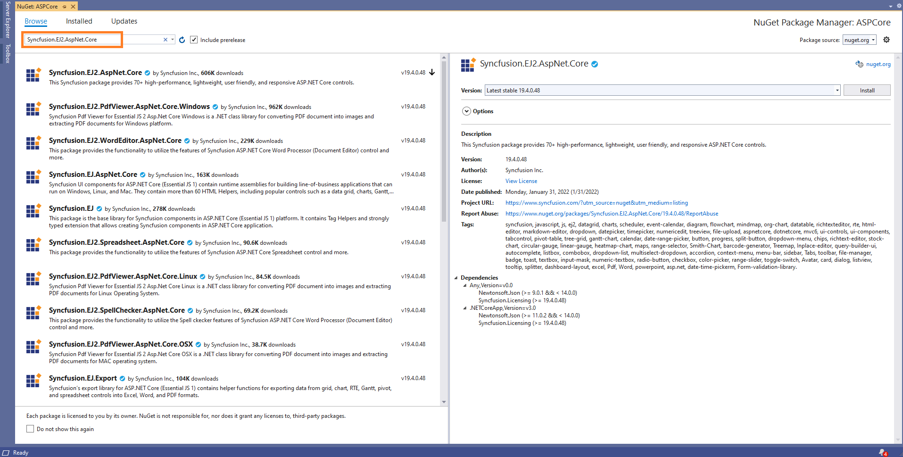

3. When you select a Syncfusion ASP.NET Core package, the right side panel will provide more information about it.

4. By default, the package selected with latest version. You can choose the required version and click the **Install** button and accept the license terms. The package will be added to your ASP.NET Core application.

    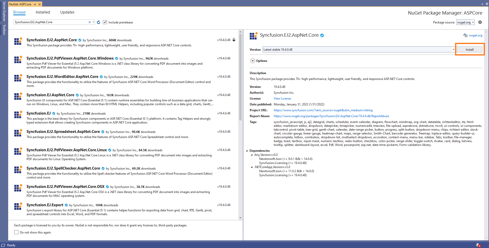

5. At this point, your application has all the required Syncfusion assemblies, and you will be ready to start building high-performance, responsive app with [Syncfusion ASP.NET Core controls](https://www.syncfusion.com/aspnet-core-ui-controls). Also, you can refer to the [Syncfusion ASP.NET Core help document](https://ej2.syncfusion.com/aspnetcore/documentation/introduction/) for development.

## Installation using Package Manager Console

The Package Manager Console saves NuGet packages installation time since you don’t have to search for the Syncfusion ASP.NET Core NuGet package which you want to install, and you can just type the installation command to install the appropriate Syncfusion ASP.NET Core NuGet package. Follow the instructions below to use the Package Manager Console to reference the Syncfusion ASP.NET Core component as NuGet packages in your ASP.NET Core application.

1. To show the Package Manager Console, open your ASP.NET Core application in Visual Studio and navigate to **Tools -> NuGet Package Manager -> Package Manager Console**.

    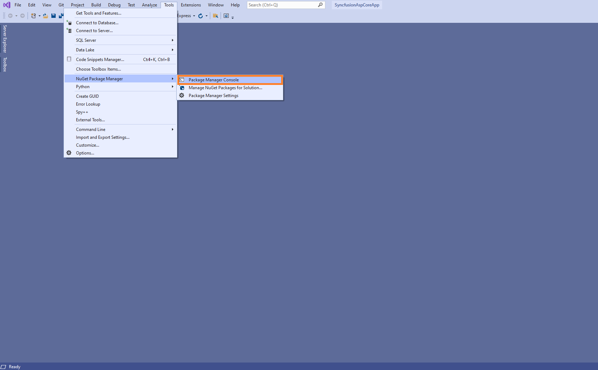

2. The **Package Manager Console** will be shown at the bottom of the screen. You can install the Syncfusion ASP.NET Core NuGet packages by enter the following NuGet installation commands.

    ***Install specified Syncfusion ASP.NET Core NuGet package.***

    The below command will install the Syncfusion ASP.NET Core NuGet package in the default ASP.NET Core application.

    <!-- markdownlint-disable MD033 -->

    ```Install-Package <Package Name>```

    **For example:**

    ```cmd
    Install-Package Syncfusion.EJ2.AspNet.Core
    ```

    > You can find the list of Syncfusion ASP.NET Core NuGet packages which are published in nuget.org from [here](https://www.nuget.org/packages?q=Tags%3A%22EJ2%22+syncfusion)

    ***Install specified Syncfusion ASP.NET Core NuGet package in specified ASP.NET Core application***

    The below command will install the Syncfusion ASP.NET Core NuGet package in the given ASP.NET Core application.

    ```Install-Package <Package Name> - ProjectName <Project Name>```

    **For example:**

    ```cmd
    Install-Package Syncfusion.EJ2.AspNet.Core -ProjectName SyncfusionDemoApp
    ```

3. By default, the package will be installed with latest version. You can give the required version with the -Version term like below to install the Syncfusion ASP.NET Core NuGet packages in the appropriate version.

    ```cmd
    Install-Package Syncfusion.EJ2.AspNet.Core -Version 19.4.0.47
    ```

    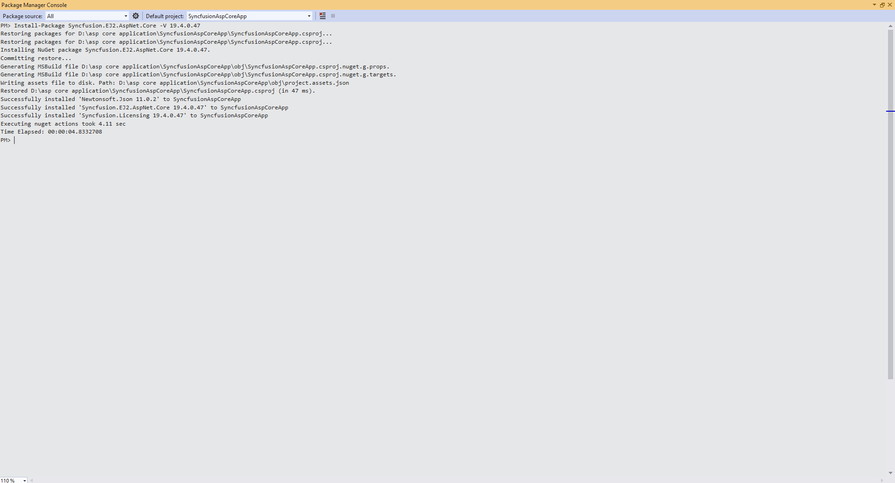

4. The NuGet package manager console will install the Syncfusion ASP.NET Core NuGet package as well as the dependencies it has. When the installation is complete, the console will show that your Syncfusion ASP.NET Core package has been successfully added to the application.

5. At this point, your application has all the required Syncfusion assemblies, and you will be ready to start building high-performance, responsive app with [Syncfusion ASP.NET Core controls](https://www.syncfusion.com/aspnet-core-ui-controls). Also, you can refer to the [Syncfusion ASP.NET Core help document](https://ej2.syncfusion.com/aspnetcore/documentation/introduction/) for development.

## Install and manage using Dotnet (.NET) CLI

The [dotnet Command Line Interface (CLI)](https://docs.microsoft.com/en-us/nuget/consume-packages/install-use-packages-dotnet-cli), allows you to add, restore, pack, publish, and manage packages without making any changes to your application files. [Dotnet add package](https://docs.microsoft.com/en-us/dotnet/core/tools/dotnet-add-package?tabs=netcore2x) adds a package reference to the application file, then runs [dotnet restore](https://docs.microsoft.com/en-us/dotnet/core/tools/dotnet-restore?tabs=netcore2x) to install the package.

Follow the below instructions to use the dotnet CLI command to install the Syncfusion ASP.NET Core NuGet packages.

1. Open a command prompt and navigate to the directory where your ASP.NET Core application file is located.

2. To install a NuGet package, run the following command.

    ```dotnet add package <Package name>```
    <!-- markdownlint-enable MD033 -->

    **For Example:**

    ```cmd
    dotnet add package Syncfusion.EJ2.AspNet.Core
    ```

    > If you don’t provide a version flag, this command will be upgrading to the latest version by default. To specify a version, add the -v parameter: dotnet add package Syncfusion.EJ2.AspNet.Core -v 19.4.0.47.

3. Examine the ASP.NET Core application file after the command has completed to ensure that the Syncfusion ASP.NET Core package was installed. To see the added reference, open the .csproj file.

    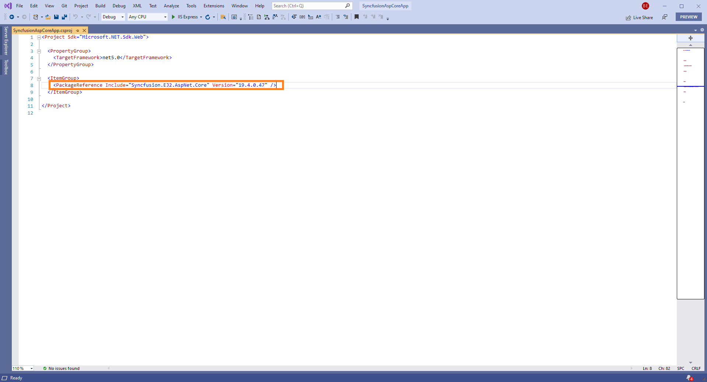

4. Then run  [dotnet restore](https://docs.microsoft.com/en-us/dotnet/core/tools/dotnet-restore?tabs=netcore2x) command to restores all the packages listed in the application file.

    > Restoring is done automatically with **dotnet build** and **dotnet run** in .NET Core 2.0 and later.

5. At this point, your application has all the required Syncfusion assemblies, and you will be ready to start building high-performance, responsive app with [Syncfusion ASP.NET Core controls](https://www.syncfusion.com/aspnet-core-ui-controls). Also, you can refer to the [Syncfusion ASP.NET Core help document](https://ej2.syncfusion.com/aspnetcore/documentation/introduction/) for development.

## Install and manage NuGet packages in Visual Studio for Mac

The NuGet Package Manager UI in Visual Studio for Mac allows you to search, install, uninstall, and update Syncfusion ASP.NET Core NuGet packages in your applications and solutions. You can find and install the Syncfusion ASP.NET Core NuGet packages in your Visual Studio for Mac ASP.NET Core application and this process is easy with the steps below:

1. Right-click on the ASP.NET Core application or solution in the Solution Window, and choose **Manage NuGet Packages...**

    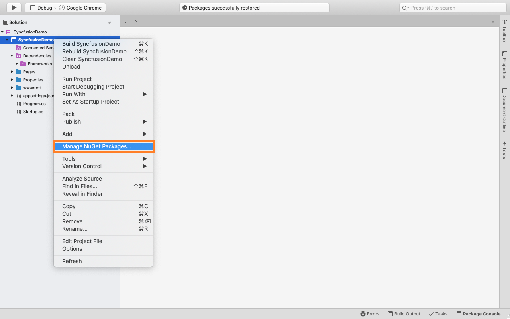

2. The NuGet Packages window will open. Navigate to the **Browse** tab, then search for the Syncfusion Essential JS 2 ASP.NET Core NuGet packages using a term like **"Syncfusion.EJ2.AspNet.Core"** and select the appropriate Syncfusion ASP.NET Core NuGet package for your development.

    > The [nuget.org](https://api.nuget.org/v3/index.json) package source is selected by default in the Package source drop-down. If you want to add other package source to Visual Studio for mac, follow the instructions in the [Microsoft documents](https://docs.microsoft.com/en-us/visualstudio/mac/nuget-walkthrough?toc=%2Fnuget%2Ftoc.json&view=vsmac-2019#adding-package-sources) to set up the other package source.

    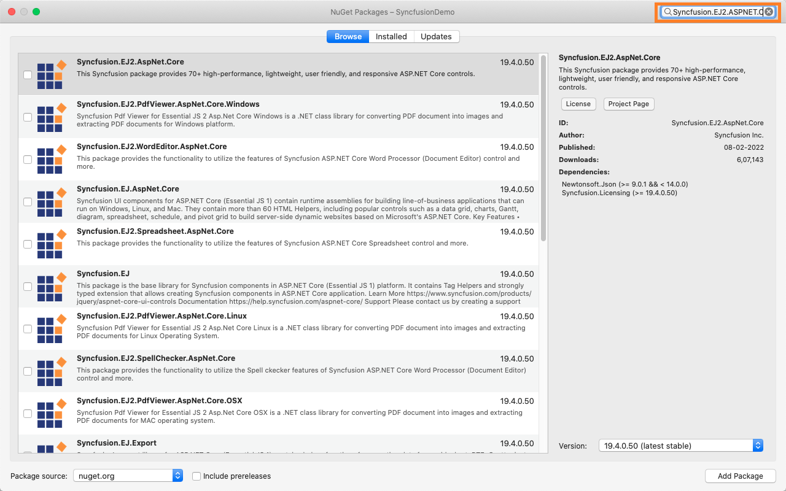

3. When you select a Syncfusion ASP.NET Core package, the right side panel will provide more information about it.

4. By default, the package selected with latest version. You can choose the required version and click the **Add Package** button and accept the license terms. The package will be added to your ASP.NET Core application.

    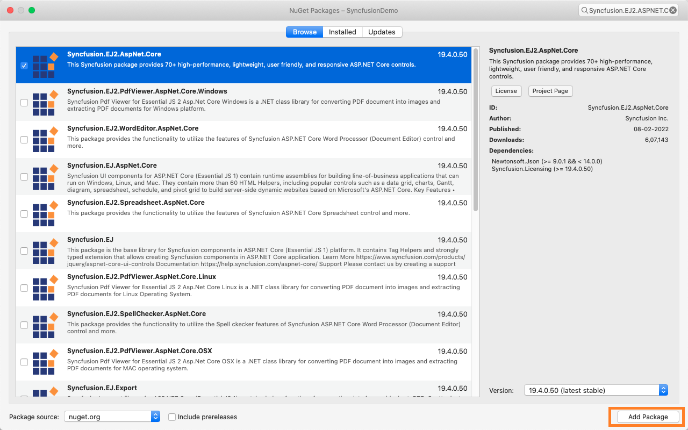

5. Using **Update** context menu from Visual Studio for Mac application, NuGet packages can be updated. Right-click on the Syncfusion ASP.NET Core Nuget Package in the ASP.NET Core application, and select **Update**.

    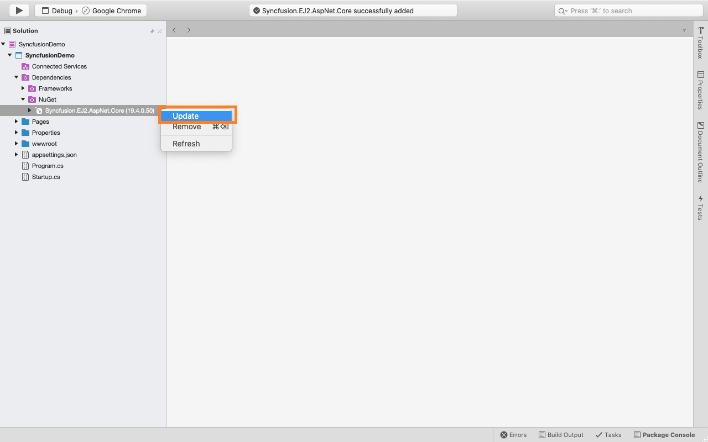

    > To update all the Nuget Packages from solution, use **Update Nuget Packages** option in the solution level.

6. You can restore all Nuget Packages from solution using **Restore Nuget Packages** option in the solution level like below.

    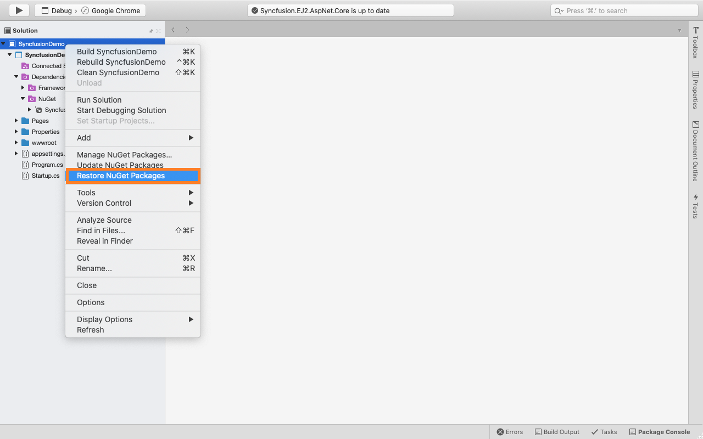

7. At this point, your application has all the required Syncfusion assemblies, and you will be ready to start building high-performance, responsive app with [Syncfusion ASP.NET Core controls](https://www.syncfusion.com/aspnet-core-ui-controls). Also, you can refer to the [Syncfusion ASP.NET Core help document](https://ej2.syncfusion.com/aspnetcore/documentation/introduction/) for development.
