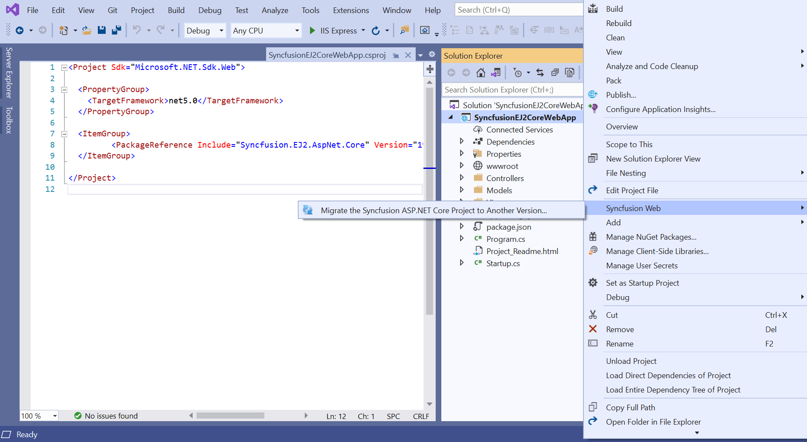
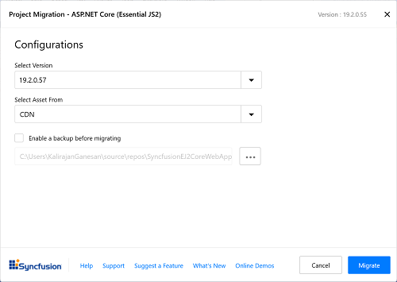

# Upgrading Syncfusion ASP.NET Core JS2 components to latest version

The Syncfusion ASP.NET Core JS2 migration add-in for Visual Studio allows you to migrate an existing Syncfusion ASP.NET Core web application from one version of Essential Studio version to another version. This reduces the amount of manual work required when migrating the Syncfusion version.

The steps below will assist you to upgrade the Syncfusion version in the Syncfusion ASP.NET Core Web application via Visual Studio 2019:

> Before use the Syncfusion ASP.NET Core Web application Migration, check whether the Syncfusion ASP.NET Core JS2  Extension installed or not in Visual Studio Extension Manager by clicking on the Extensions -> Manage Extensions -> Installed. If this extension not installed, please install the extension by follow the steps from the [download and installation](https://ej2.syncfusion.com/aspnetcore/documentation/visual-studio-integration/VS2019-Extensions/download-and-installation) help topic.

1. Open the Syncfusion ASP.NET Core Web application that uses the Syncfusion component.

2. Open the Migration Wizard,  by right-click the **Syncfusion ASP.NET Core Application** from Solution Explorer and select **Syncfusion Web**. Choose **Migrate the Syncfusion ASP.NET Core Project to Another Version…**

    

3. The Syncfusion Project Migration window will appear. You can choose the required version of Syncfusion ASP.NET Core to migrate.

    > The versions are loaded from the Syncfusion ASP.NET Core NuGet packages published in [`NuGet.org`](https://www.nuget.org/packages?q=Tags%3A%22AspNet.Core%20EJ2%22+syncfusion) and it requires internet connectivity.

    

4. Click **Migrate** button, then the Syncfusion.EJ2.AspNet.Core NuGet packages will be updated to the respective chosen version in the application.

5. If you installed the trial setup or NuGet packages from nuget.org you must register the Syncfusion license key to your application since Syncfusion introduced the licensing system from 2018 Volume 2 (v16.2.0.41) Essential Studio release. Navigate to the [help topic](https://help.syncfusion.com/common/essential-studio/licensing/license-key#how-to-generate-syncfusion-license-key) to generate and register the Syncfusion license key to your application. Refer to this [blog](https://blog.syncfusion.com/post/Whats-New-in-2018-Volume-2-Licensing-Changes-in-the-1620x-Version-of-Essential-Studio.aspx?_ga=2.11237684.1233358434.1587355730-230058891.1567654773) post for understanding the licensing changes introduced in Essential Studio.