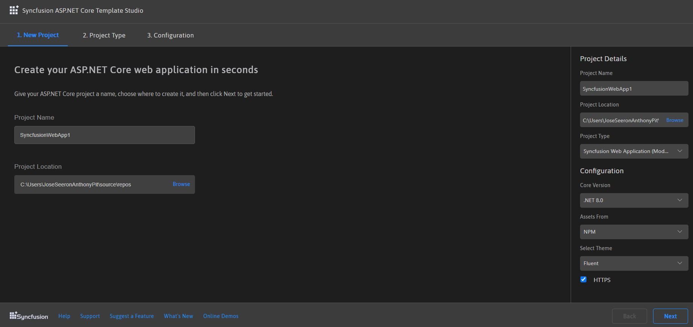
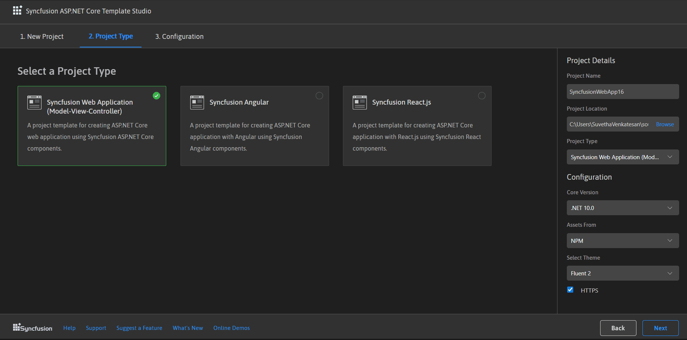
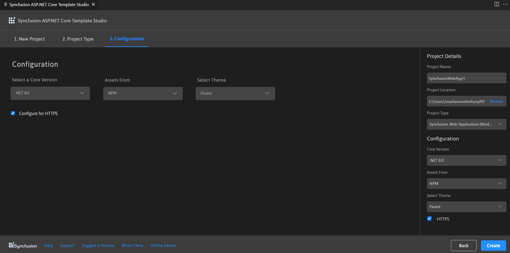
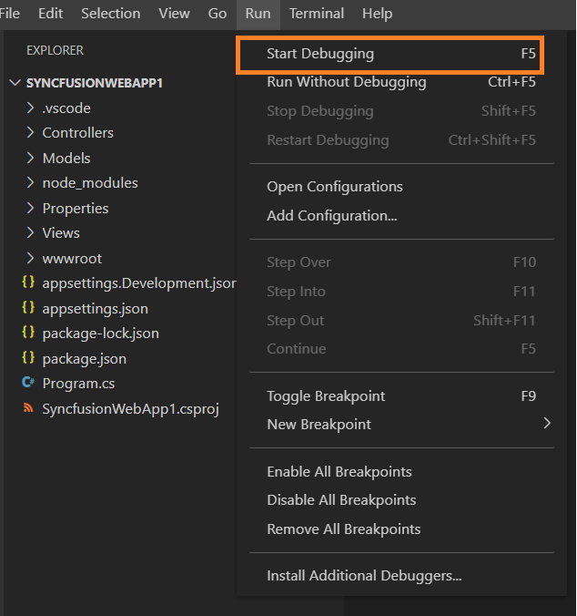

# Creating a Syncfusion® ASP.NET Core Application

Syncfusion® provides **Visual Studio Code project templates** for creating a Syncfusion® ASP.NET Core application. The generated application includes the required Syncfusion® NuGet packages, namespaces, styles, and component render code for the Calendar, Button, and DataGrid components, making Syncfusion® component development easier.

N> The Syncfusion® Visual Studio Code project template provides support for ASP.NET Core project templates from v20.1.0.47.

The following instructions assist you in creating **Syncfusion ASP.NET Core Applications** using **Visual Studio Code**:

1. To create a Syncfusion® ASP.NET Core application in Visual Studio Code, open the command palette by pressing **Ctrl+Shift+P**. Search for the word **Syncfusion** in the Visual Studio Code palette to get the templates provided by Syncfusion®.

     

2. Select **Syncfusion ASP.NET Core Template Studio: Launch** and press **Enter**. The template studio wizard for configuring the Syncfusion® ASP.NET Core application is launched. Provide the **Project Name** and **Project Path**.

     

3. Select either **Next** or the **Project Type** tab. The Syncfusion® ASP.NET Core Project Types will be displayed. Select one of the following Syncfusion® ASP.NET Core project types:

    * Syncfusion Web Application (Model-View-Controller)
    * Syncfusion Angular
    * Syncfusion React.js

    

4. The configuration section is displayed when you click either **Next** or the **Configuration** tab. Here, you can select the required .NET Core version, theme, HTTPS configuration, and assets from (NPM, CDN, Installed Location).

    

    N> The **Installed Location** option under **Assets From** is available only when the Syncfusion® Essential JavaScript 2 build has been installed on your machine.

5. Click the **Create** button. The Syncfusion® ASP.NET Core application will be created with the Syncfusion® NuGet packages, NPM packages, styles, and the component render code for the Syncfusion® component added to the index page.

6. You can run the application to see the Syncfusion® components. Click **F5** or go to **Run > Start Debugging**.

    

7. If you installed the trial setup or NuGet packages from nuget.org, you must register the Syncfusion® license key to your application since Syncfusion® introduced the licensing system from 2018 Volume 2 (v16.2.0.41) Essential Studio® release. Navigate to the [help topic](https://help.Syncfusion.com/common/essential-studio/licensing/license-key#how-to-generate-Syncfusion-license-key) to generate and register the Syncfusion® license key to your application. Refer to this [blog](https://blog.Syncfusion.com/post/Whats-New-in-2018-Volume-2-Licensing-Changes-in-the-1620x-Version-of-Essential-Studio.aspx?_ga=2.11237684.1233358434.1587355730-230058891.1567654773) post for understanding the licensing changes introduced in Essential Studio®. 
