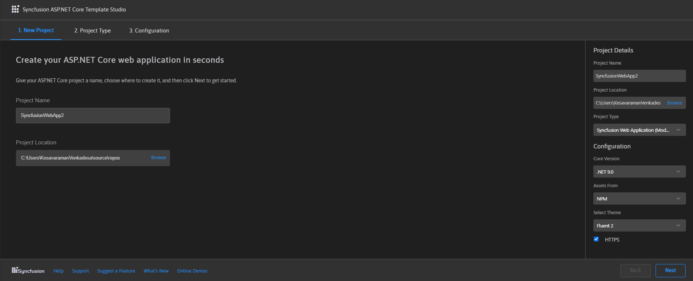
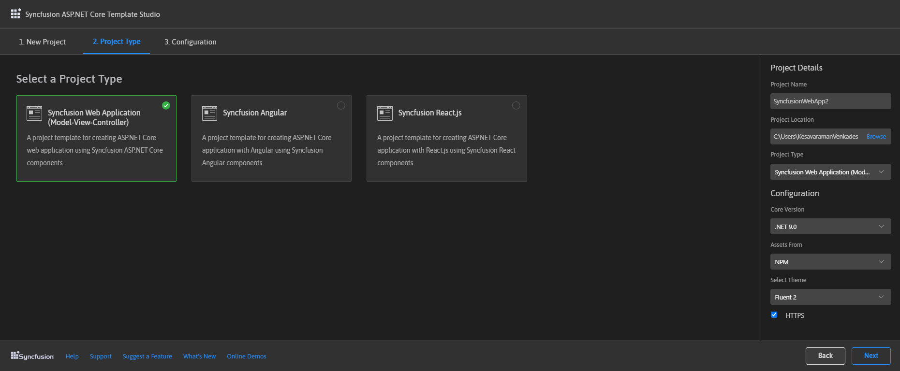
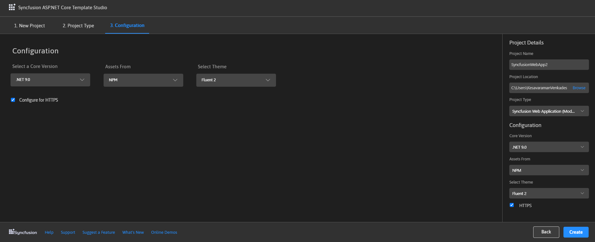

# Creating a Syncfusion&reg; ASP.NET Core Application

Syncfusion&reg; provides **Visual Studio Code project templates** for creating Syncfusion&reg; ASP.NET Core application. Syncfusion&reg; ASP.NET Core generates application that includes the necessary Syncfusion&reg; NuGet packages, namespaces, and component render code for the Calendar, Button, and DataGrid components, as well as the style for making Syncfusion&reg; component development easier.

N> The Syncfusion&reg; Visual Studio Code project template provides support for ASP.NET Core project templates from v20.1.0.47.

The following instructions assist you in creating **Syncfusion&reg; ASP.NET Core Applications** using **Visual Studio Code**:

1. To create a Syncfusion&reg; ASP.NET Core application in Visual Studio Code, open the command palette by pressing **Ctrl+Shift+P**. Search for the word **Syncfusion** in the Visual Studio Code palette to get the templates provided by Syncfusion.

     

2. Select **Syncfusion&reg; ASP.NET Core Template Studio: Launch**, then press **Enter** key. The template studio wizard for configuring the Syncfusion&reg; ASP.NET Core application is launched. Then, provide the Project Name and Project Path.
 
     

3. Select either **Next** or the **Project Type** tab. Syncfusion&reg; ASP.NET Core Project Types will be displayed. Select one of the following Syncfusion&reg; ASP.NET Core project types:

    * Syncfusion&reg; Web Application (Model-View-Controller)
    * Syncfusion&reg; Angular
    * Syncfusion&reg; React.js

    

4. The configuration section is displayed when you click either Next or the Configuration tab. Here, you have the option for selecting the required .NET Core version, themes, https configuration, and assets from (NPM, CDN, Installed Location).

    

    N> In assets from the Installed location option will be available when the Syncfusion&reg; Essential&reg; JavaScript 2 build has been installed.

5. Click the **Create** button. The Syncfusion&reg; ASP.NET Core application will be created. The created Syncfusion&reg; ASP.NET Core application has the Syncfusion&reg; NuGet packages, NPM Packages, styles, and the component render code for the Syncfusion&reg; component added to the index page.T

6. You can run the application to see the Syncfusion&reg; components. Click **F5** or go to **Run>Start Debugging**.

    

7. If you installed the trial setup or NuGet packages from nuget.org, you must register the Syncfusion&reg; license key to your application since Syncfusion&reg; introduced the licensing system from 2018 Volume 2 (v16.2.0.41) Essential Studio&reg; release. Navigate to the [help topic](https://help.syncfusion.com/common/essential-studio/licensing/license-key#how-to-generate-syncfusion-license-key) to generate and register the Syncfusion&reg; license key to your application. Refer to this [blog](https://blog.syncfusion.com/post/Whats-New-in-2018-Volume-2-Licensing-Changes-in-the-1620x-Version-of-Essential-Studio.aspx?_ga=2.11237684.1233358434.1587355730-230058891.1567654773) post for understanding the licensing changes introduced in Essential Studio&reg; 
