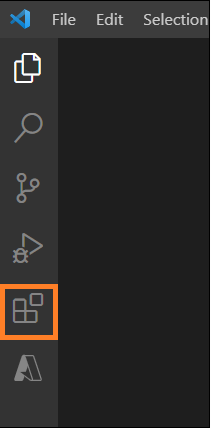
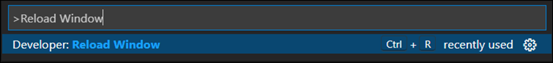
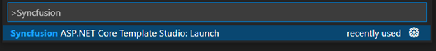

# Download and Installation

Syncfusion publishes the Visual Studio Code extension in Visual Studio Code marketplace. You can either install it from the Visual Studio Code or download and install it from the Visual Studio Code marketplace.

## Prerequisites

To install the Syncfusion ASP.NET Core Visual Studio Code extension and the creation of Syncfusion ASP.NET Core apps using any of the project types (Syncfusion Web Application (Model-View-Controller), Syncfusion Angular, and Syncfusion React), the following required software must be installed:

* [Visual Studio Code 1.29.0 or later](https://code.visualstudio.com/download)
* [Visual Studio 2019 16.3 Preview 2](https://visualstudio.microsoft.com/vs/) or later
* [.NET Core 3.1](https://dotnet.microsoft.com/download/dotnet-core/3.1) or later
* [C# Extension](https://marketplace.visualstudio.com/items?itemName=ms-vscode.csharp)
* [Node.js](https://nodejs.org/en/download/)

## Install through the Visual Studio Code extensions

The following steps explain how to install the Syncfusion ASP.NET Core Visual Studio Code extensions from Visual Studio Code:

1. Open Visual Studio Code.

2. Go to **View > Extensions** or give command **Ctrl+Shift+X** or click Extension icon appear on the left side of the window, then Extension window will open.

    

3. Type “**ASP.NET Core VS Code Extensions – Syncfusion**” in the search box.

4. Install the "**ASP.NET Core VS Code Extensions - Syncfusion**" extension by clicking the **Install** button.

5. Using the Reload Window command in the Visual Studio Code palette, reload Visual Studio Code after installation. By using **Ctrl+Shift+P**, you can bring up the command palette and select Reload Window from the list of Visual Studio Code commands.

    

6. Now, you can create a new Syncfusion ASP.NET Core application by using the Syncfusion ASP.NET Core extensions from the Visual Studio Code Palette. Find the Syncfusion ASP.NET Core Template Studio: Launch from Visual Studio Code commands to open the Syncfusion ASP.NET Core Template Studio wizard.

   

## Install from the Visual Studio Code Marketplace

The following steps explain how to install Syncfusion ASP.NET Core applications from the Visual Studio Code Marketplace:

1. Open the Syncfusion ASP.NET Core Visual Studio Code Extension in Visual Studio Code Marketplace.

2. Click Install from Visual Studio Code Marketplace to open the popup with the information, “**Open Visual Studio Code.**” Then, click Open Visual Studio Code, and Syncfusion ASP.NET Core Extension will open in Visual Studio Code.

3. Click the Install button in the “**ASP.NET Core VS Code Extensions - Syncfusion**” extension.

4. Use the Reload Window command in the Visual Studio Code palette and reload Visual Studio Code after installation. By using **Ctrl+Shift+P**, you can bring up the command palette and select Reload Window from the list of Visual Studio Code commands.

     

5. Now, you can create a new Syncfusion ASP.NET Core application by using the Syncfusion ASP.NET Core extensions from the Visual Studio Code Palette. Find the **Syncfusion ASP.NET Core Template Studio: Launch** from Visual Studio Code commands to open the Syncfusion ASP.NET Core Template Studio wizard.

     