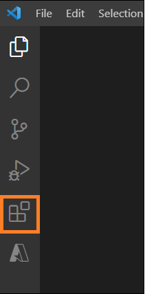
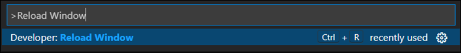
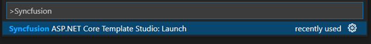

# Download and Installation

Syncfusion® publishes the Visual Studio Code extension in the Visual Studio Code marketplace. You can either install it from inside Visual Studio Code or download and install it from the Visual Studio Code marketplace.

## Prerequisites

To install the Syncfusion® ASP.NET Core Visual Studio Code extension and create Syncfusion® ASP.NET Core apps using any of the supported project types (Syncfusion Web Application (Model-View-Controller), Syncfusion Angular, and Syncfusion React), the following software must be installed:

* [Visual Studio Code 1.29.0 or later](https://code.visualstudio.com/download?_exp_download=fb315fc982)
* [.NET SDK 8.0 or later](https://dotnet.microsoft.com/en-us/download) (.NET 8 LTS is recommended)
* [C# Extension for Visual Studio Code](https://marketplace.visualstudio.com/items?itemName=ms-vscode.csharp)
* [Node.js](https://nodejs.org/en/download)

## Install through the Visual Studio Code extensions

The following steps explain how to install the Syncfusion® ASP.NET Core Visual Studio Code extension from inside Visual Studio Code:

1. Open Visual Studio Code.

2. Go to **View > Extensions**, press **Ctrl+Shift+X**, or click the **Extensions** icon that appears on the left side of the window. The Extensions window will open.

    

3. Type **ASP.NET Core VS Code Extensions – Syncfusion** in the search box.

4. Install the **ASP.NET Core VS Code Extensions - Syncfusion** extension by clicking the **Install** button.

5. After installation, reload Visual Studio Code using the **Reload Window** command. Press **Ctrl+Shift+P** to open the command palette, then select **Developer: Reload Window**.

    

6. You can now create a new Syncfusion® ASP.NET Core application using the Syncfusion® ASP.NET Core extension from the Visual Studio Code palette. Find the **Syncfusion ASP.NET Core Template Studio: Launch** command and select it to open the Syncfusion ASP.NET Core Template Studio wizard.

   

## Install from the Visual Studio Code Marketplace

The following steps explain how to install the Syncfusion® ASP.NET Core extension from the Visual Studio Code Marketplace:

1. Open the [Syncfusion® ASP.NET Core Visual Studio Code Extension](https://marketplace.visualstudio.com/items?itemName=SyncfusionInc.ASPNETCore-VSCode-Extensions) page in the Visual Studio Code Marketplace.

2. Click **Install** on the marketplace page. A popup will appear with the message **Open Visual Studio Code**. Click **Open Visual Studio Code**, and the Syncfusion® ASP.NET Core extension will open in Visual Studio Code.

3. Click **Install** in the **ASP.NET Core VS Code Extensions - Syncfusion** extension page within Visual Studio Code.

4. After installation, reload Visual Studio Code using the **Reload Window** command. Press **Ctrl+Shift+P** to open the command palette, then select **Developer: Reload Window**.

     

5. You can now create a new Syncfusion® ASP.NET Core application using the Syncfusion® ASP.NET Core extension from the Visual Studio Code palette. Find the **Syncfusion ASP.NET Core Template Studio: Launch** command and select it to open the Syncfusion ASP.NET Core Template Studio wizard.

     

## Next steps

* Continue with [Creating a Syncfusion® ASP.NET Core Application](create-project.md) to scaffold your first project.

## Troubleshooting

* If the **Install** button is disabled, ensure the extension supports your operating system and that Visual Studio Code is up to date.
* If the **Developer: Reload Window** prompt does not appear, close and reopen Visual Studio Code manually.
* If the **Syncfusion ASP.NET Core Template Studio: Launch** command is missing after install, verify that all prerequisites above are installed and that the extension is enabled in the **Extensions** view.