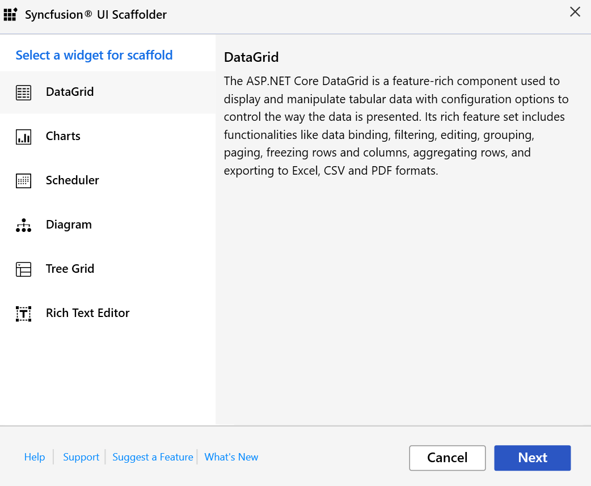
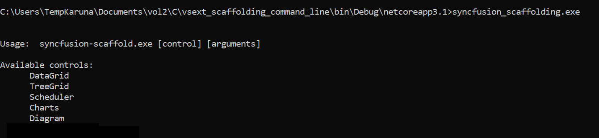

# Scaffolding

Syncfusion provides **Visual Studio Scaffolding** for Syncfusion ASP.NET Core platform to quickly add code that interacts with data models and reduce the amount of time to develop with data operation in your project. Scaffolding provides an easier way to create Views and Controller action methods for Syncfusion ASP.NET Core DataGrid, Charts, Scheduler, Diagram, Tree Grid, Rich Text Editor, Document Editor, and PDF Viewer controls.

> Check that at least one Entity Framework model exists, and the application has been compiled once. If no Entity Framework model exist in your application, refer to this [documentation](https://docs.microsoft.com/en-us/aspnet/core/tutorials/first-mvc-app/adding-model?view=aspnetcore-3.1) to generate the Entity Framework model. After the model file has been added, check that the required DBContext and properties have been added. Build the application before try scaffolding. If any changes have been done in the model properties, rebuild the application once before performing scaffolding.

<!-- markdownlint-disable MD026 -->

> The Syncfusion ASP.NET Core UI Scaffolder is available from 18.4.0.39 to ASP.NET Core web application.

## Add a scaffolded item

The following steps explain you how to add a scaffolded item to your ASP.NET Core Web application.

> Before use, the Syncfusion ASP.NET Core Scaffolding, check whether the **ASP.NET Core Extensions - Syncfusion** installed or not in Visual Studio Extension Manager by clicking on the Tools -> Extensions and Updates -> Installed for Visual Studio 2017 or lower and for Visual Studio 2019 by clicking on the Extensions -> Manage Extensions -> Installed. If this extension not installed, please install the extension by follow the steps from the [download and installation](https://ej2.syncfusion.com/aspnetcore/documentation/visual-studio-integration/VS2019-Extensions/download-and-installation/) help topic.

 1. Right-click the **Controllers** folder in the Solution Explorer, click **Add**, and then select **New Scaffolded Item…**

    

 2. In the **Add Scaffold dialog**, select **Syncfusion ASP.NET Core UI Scaffolder**, and then click **‘Add’**.

    

 3. In the Syncfusion UI Scaffolder dialog, select the desired Syncfusion control to perform scaffolding, and then click **Next**.

    

 4. Selected control model dialog will be launched in the Syncfusion UI Scaffolder. Enter the **Controller Name** and **View Name** as application requirements, and then select the required **Model Class** of the active project and its relevant **Data Context Class**, and then click **Next**.

    

 5. Selected control feature dialog will be launched in the Syncfusion UI Scaffolder. Choose the required features, update the required data field, and then click **Add**.

    

 6. The **Controller** and the corresponding **View** files will be added into the application with the selected features of Syncfusion control code snippet.

    

 7. Then, add navigation to the created view file based on your requirement to open in the webpage.

 8. If you installed the trial setup or NuGet packages from nuget.org you have to register the Syncfusion license key to your project since Syncfusion introduced the licensing system from 2018 Volume 2 (v16.2.0.41) Essential Studio release. Navigate to the [help topic](https://help.syncfusion.com/common/essential-studio/licensing/license-key#how-to-generate-syncfusion-license-key) to generate and register the Syncfusion license key to your project. Refer to this [blog](https://blog.syncfusion.com/post/Whats-New-in-2018-Volume-2-Licensing-Changes-in-the-1620x-Version-of-Essential-Studio.aspx?_ga=2.11237684.1233358434.1587355730-230058891.1567654773) post for understanding the licensing changes introduced in Essential Studio.

## Syncfusion ASP.NET Core Command-line Scaffolding

Syncfusion provides **Scaffolding command-line** for Syncfusion ASP.NET Core to quickly add code that interacts with data models and reduce the amount of time to develop with data operation in your project. Scaffolding provides an easier way to create view file and Controller action methods for Syncfusion ASP.NET Core DataGrid, Charts, Scheduler, Diagram, Tree Grid, Rich Text Editor, Document Editor, and PDF Viewer controls.

> Check that at least one Entity Framework model exists. If no Entity Framework model exist in your application, refer to this [documentation](https://docs.microsoft.com/en-us/aspnet/core/tutorials/first-mvc-app/adding-model?view=aspnetcore-3.1) to generate the Entity Framework model. After the model file has been added, check that the required DBContext and properties are added. Now, build the application, and try scaffolding. If any changes made in the model properties, rebuild the application once before perform scaffolding.

## Install Command-line Scaffolding

Install **syncfusion.scaffolding** tool globally by using below command.

   ```dotnet tool install -g syncfusion.scaffolding```

## Update Command-line scaffolding

Update **syncfusion.scaffolding** tool globally by using below command.

   ```dotnet tool update -g syncfusion.scaffolding```

## Add a scaffolded item from command-line

The following steps explains how to add a scaffolded item from command-line to your ASP.NET Core application.

> Before adding the scaffolded item from command-line, check whether the **dotnet-aspnet-codegenerator** tool is installed or not by **dotnet tool list -g** command in command prompt. if it is not installed, then install **dotnet-aspnet-codegenerator** tool globally by using this command **dotnet tool install -g dotnet-aspnet-codegenerator**.

1. After installed syncfusion.scaffolding tool, we can invoke syncfusion_scaffold command it shows the available controls

    **syncfusion_scaffold**

    

2. To add a scaffolded item from command-line you have to invoke syncfusion_scaffold application like below syntax

    **syncfusion_scaffold [control][arguments]**

    | Parameter                         | Description                                                                   | Control             |
    |-----------------------------------|-------------------------------------------------------------------------------|---------------------|
    | -p&#124;--project                 | Path to .csproj file in the project.                                          |  All Controls       |
    | -cname&#124;--controller-filename | Name of controller file to be added in project.                               | All controls        |
    | -vname&#124;--view-filename       | Name of view file to be added in project.                                     | All Controls        |
    | -m&#124;--model                   | Database model name with namespace (example: WebApplication1.Models.Tasks).   | All Controls        |
    | -dc&#124;--db-context             | DbContext name with namespace (example: WebApplication1.Models.TasksContext). | All Controls        |
    | -pkey&#124;--primary-key          | Set Feature name/column name as primary key.                                  | Data Grid/Tree Grid |
    | -tid&#124;--treegrid-id           | Id of Tasks.                                                                  | Tree Grid           |
    | -pid&#124;--parent-id             | Parent Id value                                                               | Tree Grid/Diagram   |
    | -x&#124;--x-axis                  | X-axis of Chart                                                               | Charts              |
    | -Y&#124;--Y-axis                  | Y-axis of Chart                                                               | Charts              |
    | -sid&#124;--scheduler-id          | Id of Scheduler Event.                                                        | Scheduler           |
    | -stime&#124;--start-time          | Start Time of Scheduler Event.                                                | Scheduler           |
    | -etime&#124;--end-time            | End Time of Scheduler Event.                                                  | Scheduler           |
    | --is-all-day                      | Set IsALLDay for Scheduler Event.                                             | Scheduler           |
    | -did&#124;--diagram-id            | Id of Diagram layout.                                                         | Diagram             |

3. If you run the syncfusion_scaffold [control] command, the parameters of control shown like below image.

    

4. Run the following command to generate controller and view files through command-line by passing required arguments of the given control.

    ```syncfusion_scaffold {controlName} --project "{projectFileNamewithPath}" --model {model} -dc {dbContext} -cname {controllerName} -vname {viewName} [controlMantoryParameter] [controlMantatoryParameterValue]```

    

5. As we can see controller and view files generated successfully and also added the Syncfusion NuGet packages and styles which is required to render Syncfusion control.

    
    

<!-- markdownlint-disable MD026 -->

## How to render Syncfusion control?

Refer to the following UG links to render Syncfusion control after performed scaffolding.

[Configure using Syncfusion.EJ2.AspNet.Core package](https://ej2.syncfusion.com/aspnetcore/documentation/getting-started/visual-studio-2017/)
