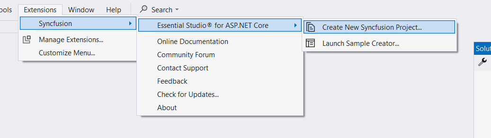
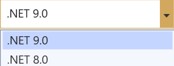

# Visual Studio Extensions

## Create project

Syncfusion provides the **Visual Studio Project Templates** for the Syncfusion ASP.NET Core platform to create the Syncfusion ASP.NET Core Web Application using Essential JS 2 components.

> The Syncfusion ASP.NET Core (Essential JS 2) project templates are available from v16.2.0.41.

The following steps is used to create the **Syncfusion ASP.NET Core (Essential JS 2) Web Application** through the **Visual Studio Project Template**.

> Before use the Syncfusion ASP.NET Core Project Template, check whether the **ASP.NET Core Extensions - Syncfusion** installed or not in Visual Studio Extension Manager by clicking on the **Extensions -> Manage Extensions -> Installed**  for Visual Studio 2019 or later and for Visual Studio 2017 by clicking on the **Tools -> Extensions and Updates -> Installed**. If this extension not installed, please install the extension by follow the steps from the [download and installation](download-and-installation) help topic.

1. To create the Syncfusion ASP.NET Core (Essential JS 2) project, follow either one of the options below:

    **Option 1**

    Click **Extensions->Syncfusion Menu** and choose **Essential Studio for ASP.NET Core (EJ2) > Create New Syncfusion Project…** in **Visual Studio**.

    

    > In Visual Studio 2017, Click Syncfusion Menu and choose Essential Studio for ASP.NET Core (EJ2) > Create New Syncfusion Project… in Visual Studio.

    

    **Option 2**

    Choose **File -> New -> Project**. Opens a new dialog to create a new project. By filtering the project type with Syncfusion or using the **Syncfusion** keyword in the search option, you can get the templates offered by Syncfusion for ASP.NET Core.

    

    Choose **File > New > Project** and navigate to **Syncfusion > .NET Core > Syncfusion ASP.NET Core Web Application** in **Visual Studio**.

2. Name the **Project**, choose the destination location, and then click **OK**. The Project Configuration Wizard appears.

3. Choose the options to configure the Syncfusion ASP.NET Core (Essential JS 2) Application in the following Project Configuration dialog.

    

    > .NET 6.0 is available from v19.4.0.38 and support from Visual Studio 2022.

    **Project configurations**

    | <b>Project Type</b> | <b>.NET Core Version</b> | <b>Themes</b> | <b>Assets From</b> |
    |---------------------|--------------------------|---------------|--------------------|
    | Web Application (Model-View-Controller) | 2.0, 2.1, 2.2, 3.0, 3.1, .NET 5.0, and .NET 6.0 | Material, Fabric, Bootstrap 4, Bootstrap 5, High Contrast, Tailwind CSS | CDN, NPM, Installed Location |
    | Angular | 2.0, 2.1, 2.2, 3.0, 3.1, .NET 5.0, and .NET 6.0 | Material, Fabric, Bootstrap 4, Bootstrap 5, High Contrast, Tailwind CSS | CDN, NPM |
    | React | 2.0, 2.1, 2.2, 3.0, 3.1, .NET 5.0, and .NET 6.0 | Material, Fabric, Bootstrap 4, Bootstrap 5, High Contrast, Tailwind CSS | CDN, NPM |

    > The Syncfusion ASP.NET Core (Essential JS 2) Project Template provides ASP.NET Core, Angular, and React project templates support from v17.1.0.47.

    **.NET Core Version**: Select the version of ASP.NET Core Project.

    

    **Assets From**: Load the Syncfusion Essential JS 2 assets to ASP.NET Core Project, either NPM, CDN, or Installed Location.

    > Installed location option will be available only when the Syncfusion Essential JavaScript 2 setup has been installed.

    **Theme Selection**: Themes will be listed out based on the selected project type and choose the required theme from the available list.

    

4. Click Create, the Syncfusion ASP.NET Core (Essential JS 2) Application has been created.

    

5. The created Syncfusion ASP.NET Core application configures with most recent Syncfusion ASP.NET Core NuGet packages, selected style, scripts, and NPM packages for use Syncfusion components.

6. Then, Syncfusion licensing registration required message box will be shown, if you installed the trial setup or NuGet packages since Syncfusion introduced the licensing system from 2018 Volume 2 (v16.2.0.41) Essential Studio release. Navigate to the [help topic](https://help.syncfusion.com/common/essential-studio/licensing/license-key#how-to-generate-syncfusion-license-key), which is shown in the licensing message box to generate and register the Syncfusion license key to your project. Refer to this [blog](https://blog.syncfusion.com/post/whats-new-in-2018-volume-2-licensing-changes-in-the-1620x-version-of-essential-studio.aspx) post for understanding the licensing changes introduced in Essential Studio.

    
