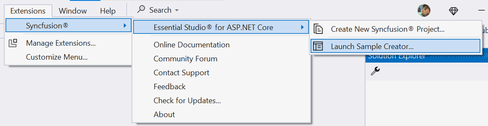
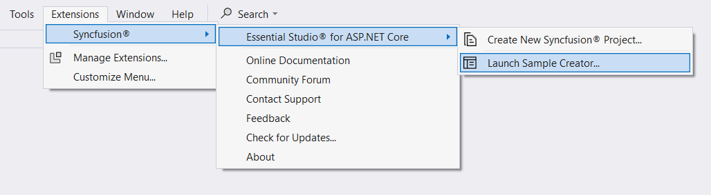
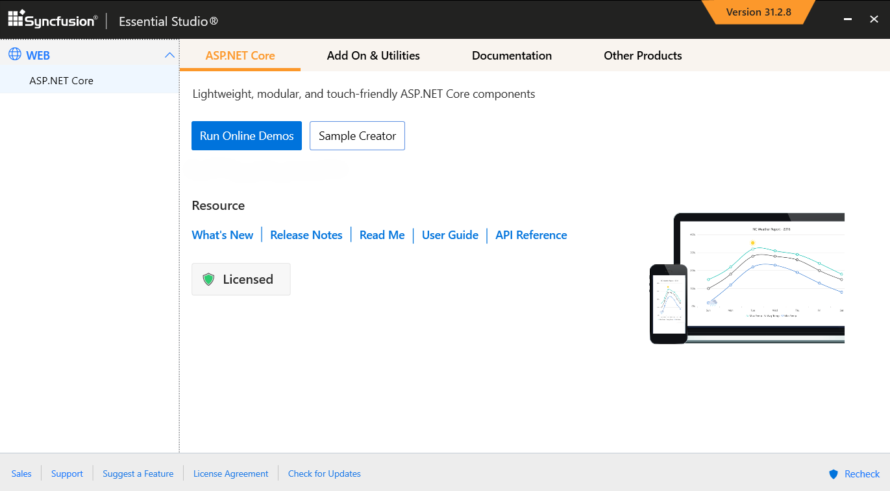
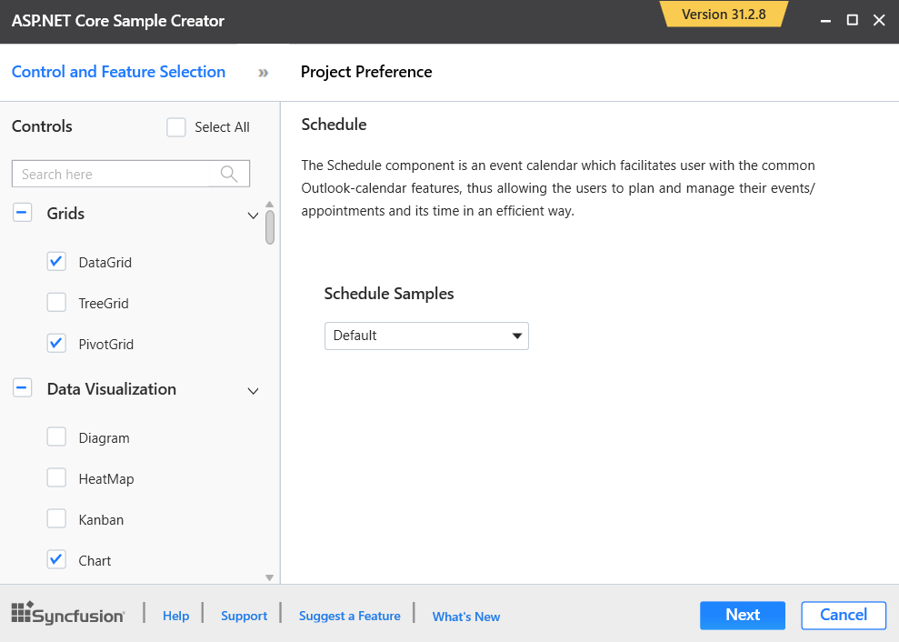
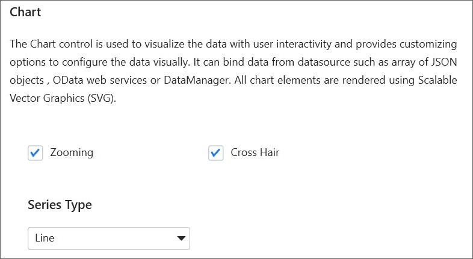
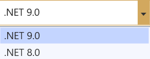
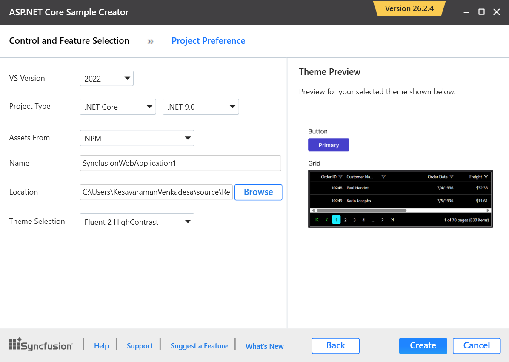
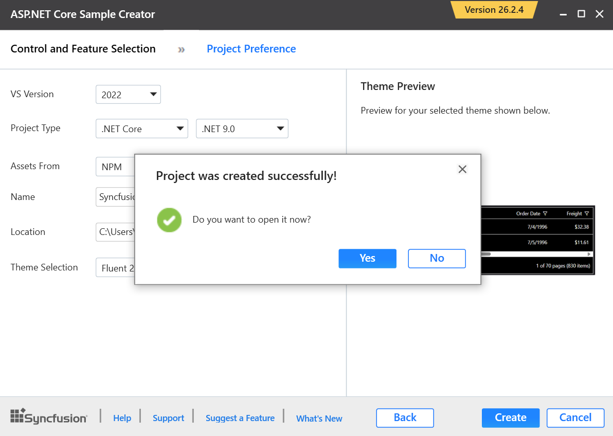

# Create Sample

The Syncfusion Sample Creator is a tool that lets you make Syncfusion ASP.NET Core (Essential JS 2) projects with sample code for required Syncfusion component features and Syncfusion control configuration.

> The Syncfusion ASP.NET Core Sample Creator utility is available from v16.3.0.17.

The following steps is used to create the Syncfusion ASP.NET Core Application by using the Sample Creator utility:

1. Follow one of the options below to launch the ASP.NET Core  Sample Creator application:

    **Option 1:**

    Click **Extensions->Syncfusion Menu** and choose **Essential Studio for ASP.NET Core (EJ2) > Launch Sample Creator…** in **Visual Studio.**

    

    > In Visual Studio 2017, Click Syncfusion Menu and choose Essential Studio for ASP.NET Core > Launch Sample Creator…

    

    **Option 2:**

    Launch the Syncfusion ASP.NET Core Control Panel and click the Sample Creator button to launch the ASP.NET Core Sample Creator utility. For further information, see the screenshot below.

    

2. Syncfusion controls and features are listed in the ASP.NET Core Sample Creator.

    

    **Controls Selection:** Choose the required controls. The controls are grouped with Syncfusion products.

    

    **Feature Selection:** Based on the controls, the feature is enabled to choose the features of the corresponding controls.

    

## Project Configuration

1. You can configure the project with following details.

    **VS Version**: Choose the Visual Studio version and Framework.

    **Project Type**: Select the type of ASP.NET Core Project.

    **ASP.NET Core Version**: Select the version of ASP.NET Core Project.

    

    > .NET 6.0 is available from v19.4.0.38 and support from Visual Studio 2022.

    **Assets From**: Choose the Syncfusion Essential JS 2 assets to ASP.NET Core Project, either NPM, CDN, or Installed Location.

    > Installed location option will be available only when the Syncfusion Essential JavaScript 2 setup has been installed.

    **Name**: Name your Syncfusion ASP.NET Core Application.

    **Location**: Choose the target location of your project.

    **Theme Selection**: Choose the required theme. This section shows the controls preview before creating the Syncfusion project.

    

2. Click **Create** button. After creating the project, open the project by clicking **Yes**. If you click **No**, the corresponding location of the project will be opened. Refer to the following screenshot for more information.

    

3. The new Syncfusion ASP.NET Core sample is created. Required controller and view file for selected controls, selected style, scripts and corresponding Syncfusion NuGet packages are added in the created sample.