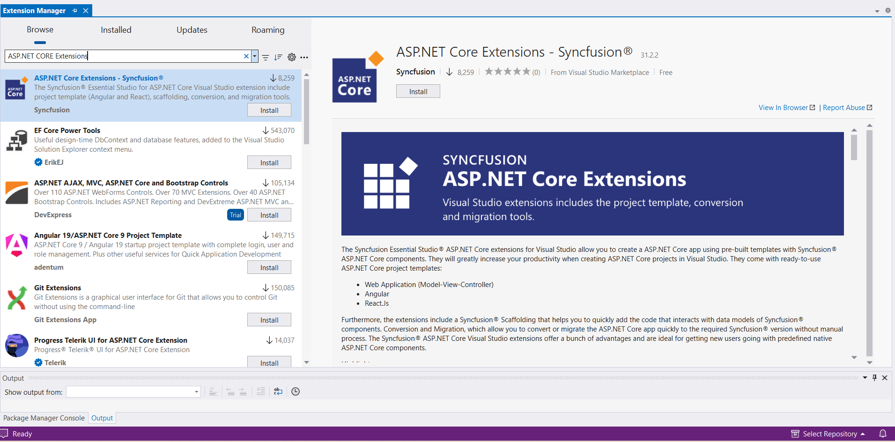
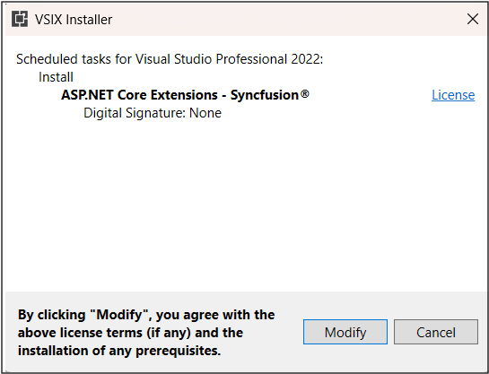
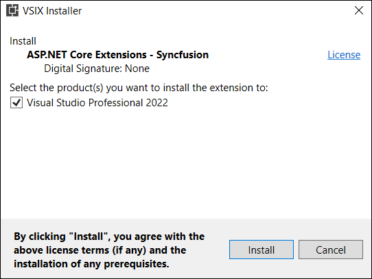

# Download and Installation

Syncfusion publishes the Visual Studio extension in the below Visual Studio marketplace link. You can either install it directly from Visual Studio or download and install it from the Visual Studio marketplace.

[Visual Studio 2022](https://marketplace.visualstudio.com/items?itemName=SyncfusionInc.ASPNETCoreVSExtensions)

[Visual Studio 2019 or lower](https://marketplace.visualstudio.com/items?itemName=SyncfusionInc.ASPNETCoreExtensions)

## Prerequisites

The following software prerequisites must be installed to install the Syncfusion ASP.NET Core extension, as well as to creating, adding snippet, converting, and upgrading Syncfusion ASP.NET Core applications.

* [Visual Studio 2017 or later](https://visualstudio.microsoft.com/downloads).

* [.NET Core 3.0 or later](https://dotnet.microsoft.com/download/dotnet-core).

## Install through the Visual Studio Manage Extensions

The steps below assist you to how to install the Syncfusion ASP.NET Core extensions from **Visual Studio Manage Extensions**.

1. Open the Visual Studio.

2. Navigate to **Extension ->Manage Extensions** and open the Manage Extensions.

    >  In Visual Studio 2017, go to Tools -> Extensions and Updates.

3. On the left, click the **Online** tab and type **"Syncfusion EJ2"** in the **search box**.

    

4. Click the **Download** button in the **“ASP.NET Core Extension - Syncfusion”**.

5. Close all Visual Studio instances after downloading the extensions to begin the installation process. You will see the following VSIX installation prompt.

    

6. Click the **Modify** button.

7. After the installation is complete, open Visual Studio.

8. Now, under the menu **Extensions**, you can use the Syncfusion extensions from the Visual Studio.

    

    > In Visual Studio 2017, you can see the Syncfusion menu directly in the Visual Studio menu

## Install from the Visual Studio Marketplace

The steps below illustrate how to download and install the Syncfusion ASP.NET Core extension from the Visual Studio Marketplace.

1. Download the Syncfusion ASP.NET Core Extensions from the below Visual Studio Marketplace.

    [Visual Studio 2022](https://marketplace.visualstudio.com/items?itemName=SyncfusionInc.ASPNETCoreVSExtensions)

    [Visual Studio 2019 or lower](https://marketplace.visualstudio.com/items?itemName=SyncfusionInc.ASPNETCoreExtensions)

2. Close all Visual Studio instances running, if any.

3. Double-click to install the downloaded VSIX file. You will see the VSIX installation prompts with the corresponding installed Visual Studio version checkbox for select the Visual Studio to install extension.

    

4. Click the **Modify** button.

5. After the installation is complete, open Visual Studio. You can now use Syncfusion extensions from the Visual Studio under the **Extensions** menu.

     

     > In Visual Studio 2017, you can see the Syncfusion menu directly in the Visual Studio menu