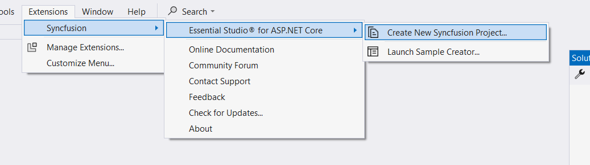
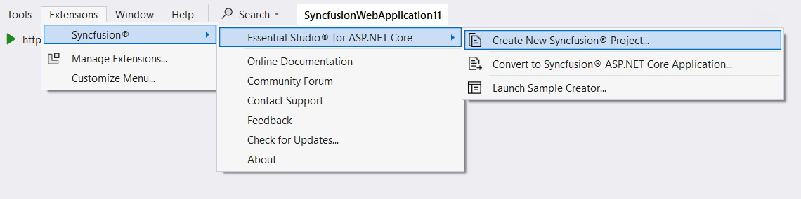
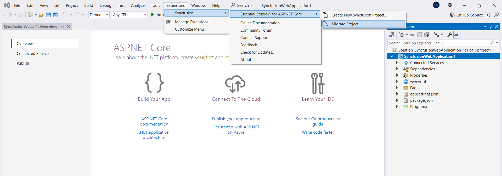

# Visual Studio Integration

## Overview

The Syncfusion ASP.NET Core (Essential JS 2) Visual Studio Extensions can be accessed through the Syncfusion Menu to create and configure the project with Syncfusion references in Visual Studio.

> Syncfusion Extension is published in Visual Studio Marketplace. You can download ASP.NET Core (EJ2) Extensions [here](https://marketplace.visualstudio.com/items?itemName=SyncfusionInc.ASPNETCoreExtensions)

## IMPORTANT

The Syncfusion ASP.NET Core (Essential JS 2) menu option is available from v17.1.0.32.

The Syncfusion provides the following supports in Visual Studio:

1. [Project-Template](./visual-studio-extensions/create-project):  Creates the Syncfusion ASP.NET Core (Essential JS 2) application by adding the required Essential JS 2 components.
2. [Convert project](./visual-studio-extensions/convert-project): Converts an existing ASP.NET Core application into a Syncfusion ASP.NET Core (Essential JS 2) application by adding the required Syncfusion assemblies and resource files.
3. [Upgrade project](./visual-studio-extensions/upgrade-project): Upgrades the existing Syncfusion ASP.NET Core (Essential JS 2) application from one Essential Studio version to another version.
4. [Creator sample](./visual-studio-extensions/create-samples): Creates the Syncfusion ASP.NET Core (Essential JS2) application with the sample code of required controls and features.

### No project selected in Visual Studio

### Selected Microsoft ASP.NET Core Web application in Visual Studio

### Selected Syncfusion ASP.NET Core (Essential JS2) application in Visual Studio

> From Visual Studio 2019, Syncfusion menu is available under Extension in Visual Studio menu.
