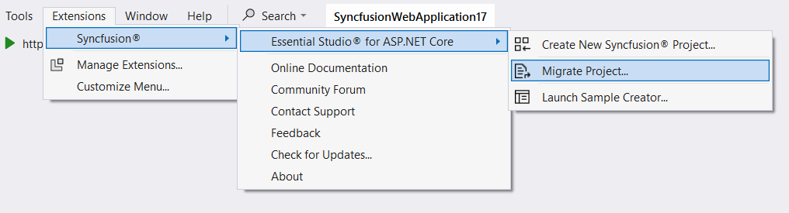
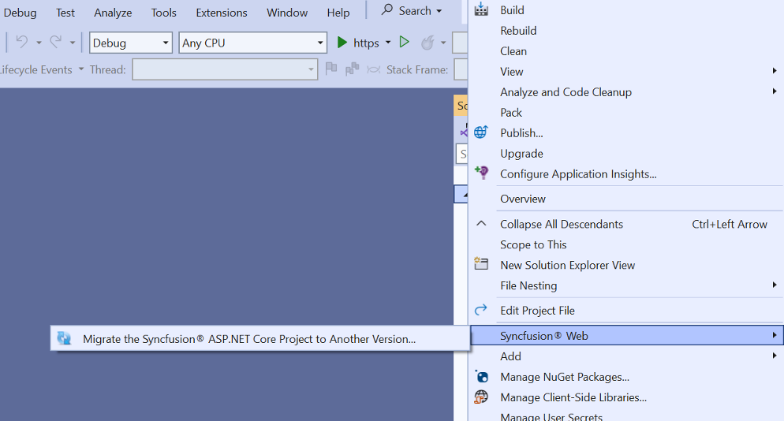
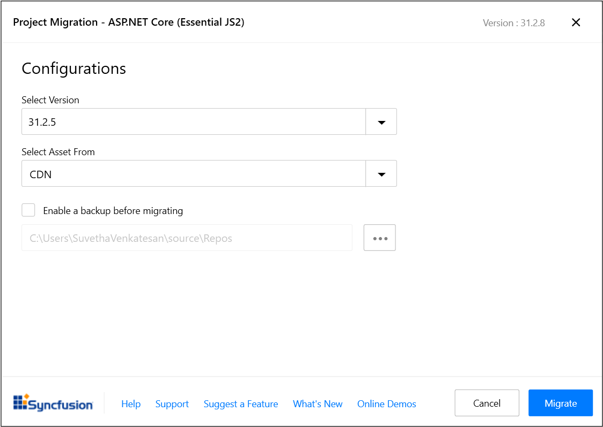

# Upgrading Syncfusion® ASP.NET Core application to latest version

The Syncfusion&reg; ASP.NET Core migration add-in for Visual Studio allows you to migrate an existing Syncfusion&reg; ASP.NET Core application from one version of Essential Studio&reg; version to another version. This reduces the amount of manual work required when migrating the Syncfusion&reg; version.

## IMPORTANT

The Syncfusion&reg; ASP.NET Core (Essential&reg; JS 2) Web Application Project Migration utility is available from v16.3.0.17.

> Before using the Syncfusion&reg; ASP.NET Core Project Migration, check whether the **ASP.NET Core Extensions - Syncfusion&reg;** is installed in the Visual Studio Extension Manager. For Visual Studio 2022 or later, click **Extensions -> Manage Extensions -> Installed**. If this extension is not installed, please install it by following the steps in the [download and installation](https://ej2.syncfusion.com/aspnetcore/documentation/visual-studio-integration/download-and-installation) help topic. Also, check whether the corresponding Essential Studio&reg; version build is installed. If the Essential Studio&reg; version is not the same for both the Extension and the build, the Project Migration option will not be shown.

The steps below will assist you to upgrade the Syncfusion&reg; version in the Syncfusion&reg; ASP.NET Core application via Visual Studio:

1. Open the Syncfusion&reg; ASP.NET Core application that uses the Syncfusion&reg; component.

2. To open the Migration Wizard, either one of the following options should be followed:

    **Option 1**

    Click **Extensions > Syncfusion&reg;** and choose **Essential Studio&reg; for ASP.NET Core > Migrate Project…** in **Visual Studio Menu**.

    

    **Option 2**

    Right-click the **Syncfusion&reg; ASP.NET Core Application** from Solution Explorer and select **Syncfusion&reg; Web**. Choose **Migrate the Syncfusion&reg; ASP.NET Core Project to Another Version…**

    

3. The Syncfusion&reg; Project Migration window will appear. You can choose the required version of Syncfusion&reg; ASP.NET Core to migrate. The list contains all Syncfusion&reg; ASP.NET Core versions published on NuGet.org.

    

    > The versions are loaded from the Syncfusion&reg; ASP.NET Core NuGet packages which are published on [NuGet.org](https://www.nuget.org/packages?q=Tags%3A%22aspnetcore%22syncfusion), and an active internet connection is required.

    **Assets From:** Load the Syncfusion&reg; Essential&reg; JS 2 assets to ASP.NET Core Project, from either NPM, CDN or Installed Location.

    > Installed location option will be available only when the Syncfusion&reg; Essential&reg; JavaScript 2 setup has been installed.

4. Check the **“Enable a backup before migrating”** checkbox if you want to take the project backup and choose location.

5. The Syncfusion&reg; Reference Assemblies, NuGet packages, Scripts, and CSS are updated to the corresponding version in the project. The specific changes include:

    * The `Syncfusion.EJ2.AspNet.Core` NuGet package is upgraded to the selected version.
    * The `ej2.min.css` and `ej2.min.js` script and style references in `_Layout.cshtml` are updated.
    * Any Syncfusion&reg; configuration files (such as `SyncfusionLicensing`) are updated to the new version.

    If you enabled the project backup before migrating, the old project was saved in the specified backup path location, as shown below once the migration process is completed.

    

6. If you have installed the trial setup or NuGet packages from nuget.org, you must register the Syncfusion&reg; license key to your project since Syncfusion&reg; introduced the licensing system from the 2018 Volume 2 (v16.2.0.41) Essential Studio&reg; release. Navigate to the [help topic](https://help.syncfusion.com/common/essential-studio/licensing/overview#how-to-generate-syncfusion-license-key) to generate and register the Syncfusion&reg; license key to your project. Refer to this [blog](https://blog.syncfusion.com/post/whats-new-in-2018-volume-2-licensing-changes-in-the-1620x-version-of-essential-studio.aspx) post for understanding the licensing changes introduced in Essential Studio&reg;.