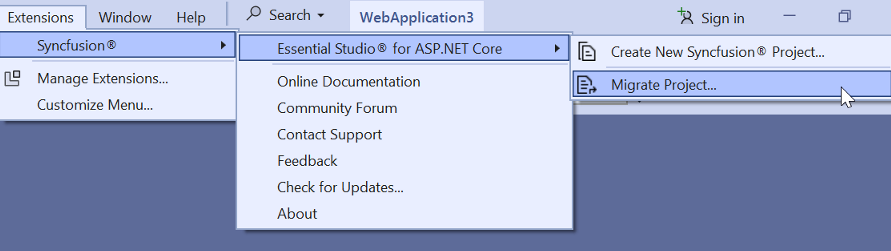

# Upgrading Syncfusion&reg; ASP.NET Core application to latest version

The Syncfusion&reg; ASP.NET Core migration add-in for Visual Studio allows to migrate an existing Syncfusion&reg; ASP.NET Core application from one version of Essential Studio&reg; version to another version. This reduces the amount of manual work required when migrating the Syncfusion&reg; version.

## IMPORTANT

The Syncfusion&reg; ASP.NET Core (Essential JS 2) Web Application Project Migration utility is available from v16.3.0.17.

N> Before use, the Syncfusion&reg; ASP.NET Core Project Migration, check whether the **ASP.NET Core Extensions - Syncfusion** installed or not in Visual Studio Extension Manager by clicking on the **Extensions -> Manage Extensions -> Installed**  for Visual Studio 2019 or later and for Visual Studio 2017 by clicking on the **Tools -> Extensions and Updates -> Installed**. If this extension not installed, install the extension by follow the steps from the [download and installation](download-and-installation) help topic. Also, check whether the corresponding Essential Studio&reg; version build installed or not. If the Essential Studio&reg; version is not same for both the Extension and build, then the Project Migration will not be shown.

The steps below will assist you to upgrade the Syncfusion&reg; version in the Syncfusion&reg; ASP.NET Core application via Visual Studio:

1. Open the Syncfusion&reg; ASP.NET Core application that uses the Syncfusion&reg; component.

2. To open the Migration Wizard, either one of the following options should be followed:

    **Option 1**

    Click **Extensions-> Syncfusion&reg; Menu** and choose **Essential Studio&reg; for ASP.NET Core > Migrate Project…** in **Visual Studio Menu**.

    

    N>In Visual Studio 2017, Click Syncfusion&reg; Menu and choose Essential Studio&reg; for ASP.NET Core > Migrate Project… in Visual Studio Menu.

    

    **Option 2**

    Right-click the **Syncfusion&reg; ASP.NET Core Application** from Solution Explorer and select **Syncfusion&reg; Web**. Choose **Migrate the Syncfusion&reg; ASP.NET Core Project to Another Version…**

    

3. The Syncfusion&reg; Project Migration window will appear. You can choose the required version of Syncfusion&reg; ASP.NET Core to migrate.

    

    N> The versions are loaded from the Syncfusion&reg; ASP.NET Core NuGet packages which published in [NuGet.org](https://www.nuget.org/packages?q=Tags%3A%22aspnetcore%22syncfusion) and it requires internet connectivity.

    **Assets From:** Load the Syncfusion&reg; Essential&reg; JS 2 assets to ASP.NET Core Project, from either NPM, CDN or Installed Location.

    N> Installed location option will be available only when the Syncfusion&reg; Essential&reg; JavaScript 2 setup has been installed.

4. Check the **“Enable a backup before migrating”** checkbox, if you want to take the project backup and choose location.

5. The Syncfusion&reg; Reference Assemblies, scripts, and styles are updated to the selected version in the application.

    If you enabled project backup before migrating, the old project was saved in the specified backup path location, as shown below once the migration process is completed.

    

6. If you installed the trial setup or NuGet packages from nuget.org you must register the Syncfusion&reg; license key to your project since Syncfusion&reg; introduced the licensing system from 2018 Volume 2 (v16.2.0.41) Essential Studio&reg; release. Navigate to the [help topic](https://help.syncfusion.com/common/essential-studio/licensing/license-key#how-to-generate-syncfusion-license-key) to generate and register the Syncfusion&reg; license key to your project. Refer to this [blog](https://www.syncfusion.com/blogs/post/introducing-license-key-validation-for-the-essential-js-2-platforms.aspx) post for understanding the licensing changes introduced in Essential Studio&reg;