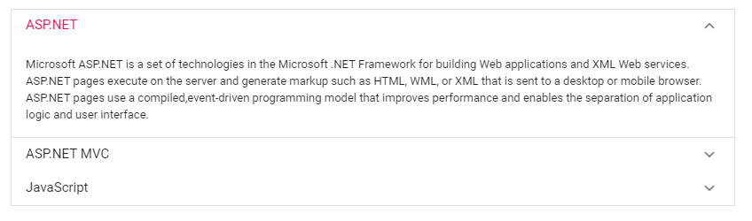
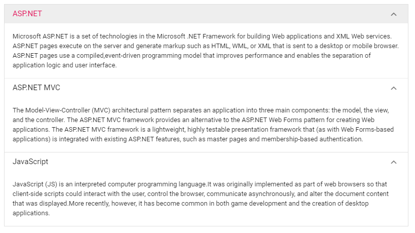

# Expand Mode

 The Accordion supports the two listed types of expand modes while expanding or collapsing the item.

* Single
* Multiple

## Single

The property enables to expand only one Accordion item at a time. If you expand any new item, the previously expanded one is collapsed and new item changed to expanded state.
























Output be like the below.

## Multiple

Default expand mode of the Accordion is `Multiple`. It enables you to expand more than one Accordion item at a time. Expand/collapse action can also be toggled by clicking on it again. For example, expanded item is collapsed when you click on it again.
























Output be like the below.

## See Also

* [How to keep single pane open always](./how-to/to-keep-single-pane-open-always)