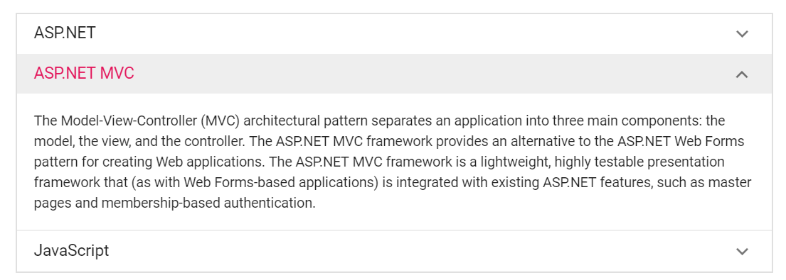

# Customize Accordion expand or collapse animation behavior

Accordion component supports customizing the expand or collapse animation action behavior. You can manually change the expand animation action performed after the collapse animation operation performed on already expand pane when the expand icons are clicked.

By default, the Accordion component pane is expanded or collapsed, when click the expand or collapse icon. It is not affected on already expand pane.

The following sample demonstrates, how to expand the collapsed Accordion item after collapse animation performed on the expanded Accordion item using `created`, `expanding`, and `expanded` event. In the Expanding event, get the previously expanded item index and prevent the expanding behavior using `args.cancel` option. Expand the Accordion item dynamically based on specifying the `index` value using the `expandItem` public method and `expanded` event.
























Output be like the below.

