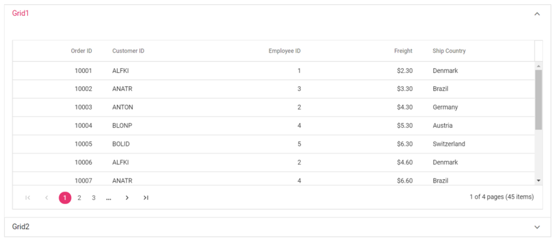
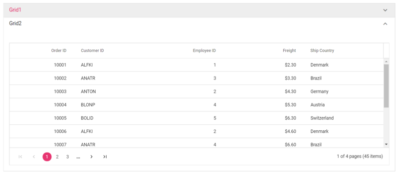

# Load the content as partial view to Accordion

Since Accordion is a Navigation control, it doesn't have support to load any content directly or using any DataAdaptor. But it is provided with the items support. So to load the content as partial view, you would need to make use of the AJAX or EJ2 Datamanager as described in our [How-To](./load-accordion-with-data-source) section help document.

In the below demo, we have explained on how to create the Accordion items dynamically and then to load the other Syncfusion controls in it from partial views.





Output be like the below.

