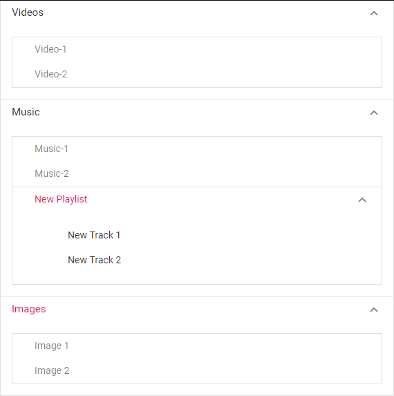

# Set the nested Accordion

Accordion supports to render `nested` level of Accordion by using content property. You can give nested Accordion content inside the parent Accordion content property by using `id` of nested element.
























Output be like the below.

