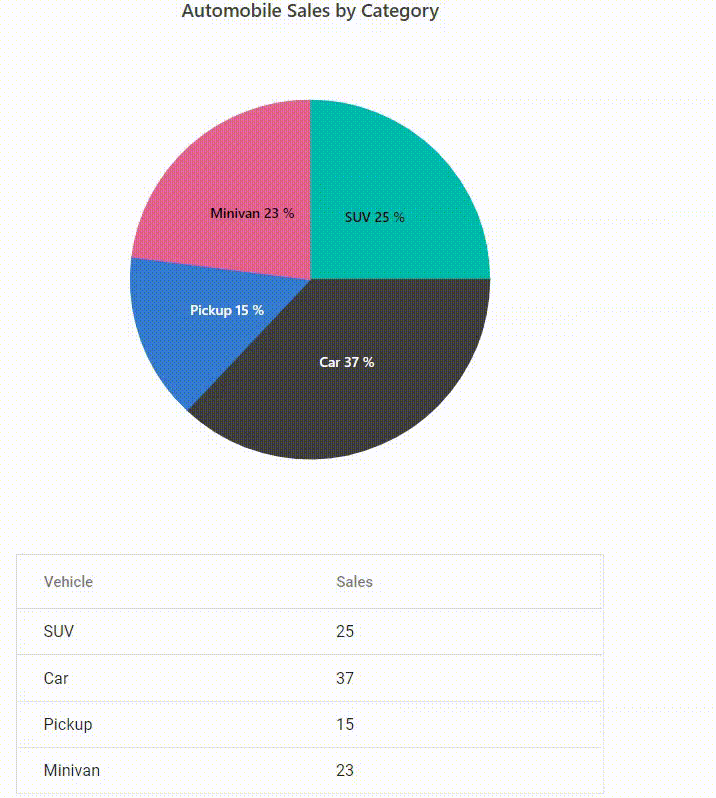

# Multilevel pie chart drill-down and display corresponding data in Grid

You can achieve multilevel drill-down in pie chart and display corresponsding data in Grid by using chart's [pointClick](https://help.syncfusion.com/cr/aspnetcore-js2/Syncfusion.EJ2.Charts.AccumulationChart.html#Syncfusion_EJ2_Charts_AccumulationChart_PointClick) and [chartMouseClick](https://help.syncfusion.com/cr/aspnetcore-js2/Syncfusion.EJ2.Charts.AccumulationChart.html#Syncfusion_EJ2_Charts_AccumulationChart_ChartMouseClick) events.

Pie chart drill-down can be achieved by processing corresponding nested data using `pointClick` event and You can drill up by using `chartMouseClick` event.










