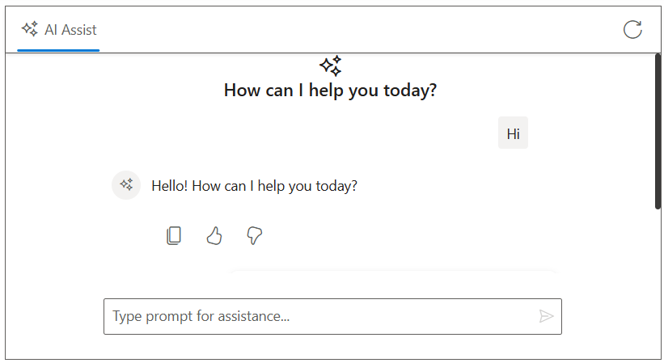

 
# Integration of LLM via Ollama With AI AssistView component

The Syncfusion AI AssistView supports integration with [LLM via Ollama](https://ollama.com), enabling advanced conversational AI features in your applications. The component acts as a UI for a support bot, where user prompts are sent to the selected AI service via API calls.

## Getting Started With the AI AssistView control
 
Before integrating LLM Model, ensure that the Syncfusion AI AssistView control is correctly rendered in your Vue application:
 
[ MVC Getting Started Guide](../getting-started)
 
## Prerequisites

* [System requirements for ASP.NET MVC controls](https://ej2.syncfusion.com/aspnetmvc/documentation/system-requirements) to create MVC application
 
## Install Packages
 
Install the Syncfusion ASP.NET MVC package in the application  using Package Manager Console.
 
```bash
 
NuGet\Install-Package Syncfusion.EJ2.MVC5
 
```

Install the LLM Model package in the application using Package Manager Console.
 
```bash
 
NuGet\Install-Package Microsoft.Extensions.AI

NuGet\Install-Package Microsoft.Extensions.AI.Ollama
 
```
 
##  Integration LLM Model with AI AssistView

Add services in `Program.cs` file 

```bash

using Microsoft.Extensions.AI;

builder.Services.AddControllersWithViews();
builder.Services.AddCors(options =>
{
    options.AddPolicy("AllowAll",
        builder => builder.AllowAnyOrigin().AllowAnyMethod().AllowAnyHeader());
});
builder.Services.AddChatClient(new OllamaChatClient(new Uri("http://localhost:11434/"), "deepseek-r1"))
    .UseDistributedCache()
    .UseLogging();

```









 


## Run and Test
 
Run the application in the browser using the following command.
 
Build and run the app (Ctrl + F5).
 
Open `https://localhost:7121/` to interact with your LLM Model for dynamic response.