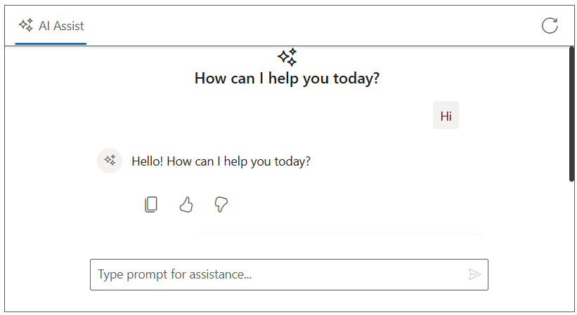

 
# Integration of Open AI With AI AssistView control
 
The Syncfusion AI AssistView supports integration with [OpenAI](https://platform.openai.com/docs/overview), enabling advanced conversational AI features in your Core applications.
 
## Getting Started With the AI AssistView control
 
Before integrating Open AI, ensure that the Syncfusion AI AssistView control is correctly rendered in your Vue application:
 
[ CORE Getting Started Guide](../getting-started)
 
## Prerequisites
 
* OpenAI account to generate an API key for accessing the `OpenAI` API
* [System requirements for ASP.NET MVC controls](https://ej2.syncfusion.com/aspnetmvc/documentation/system-requirements) to create Core application
 
## Install Packages
 
Install the Syncfusion ASP.NET Core package in the application using Package Manager Console.
 
```bash
 
NuGet\Install-Package Syncfusion.EJ2.MVC5

```
 
Install the Open AI package in the application using Package Manager Console.
 
```bash
 
NuGet\Install-Package OpenAI
 
```
 
## Generate API Key
 
1. Go to [Open AI](https://platform.openai.com/docs/overview) and sign in with your Google account. If you don’t have one, create a new account. 

2. Once logged in, click on your profile icon in the top-right corner and select `API Keys` from the dropdown menu.  

3. Click the `+ Create new secret key` button. You’ll be prompted to name the key (optional). Confirm to generate the key. 

4. Your API key will be displayed once. Copy it and store it securely, as it won’t be shown again.

> `Security Note`: Never commit the API key to version control. Use environment variables or a secret manager for production.
 
##  Integration Open AI with AI AssistView
 
You can add the below respective files in your application:
 
N> Add your generated `API Key` at the line in .cs file
 
```bash
 
string apiKey = 'Place your API key here';
 
```
 










 
## Run and Test
 
Run the application in the browser using the following command.
 
Build and run the app (Ctrl + F5).
 
Open `https://localhost:44321` to interact with your Open AI for dynamic response.