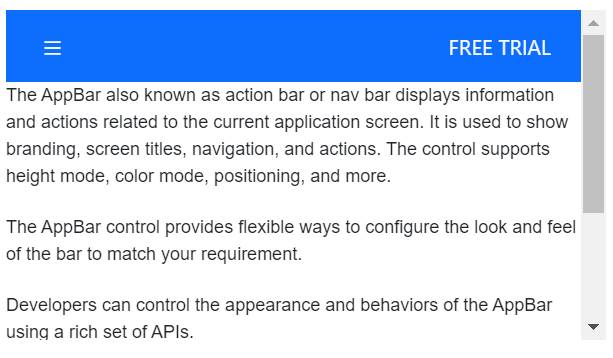
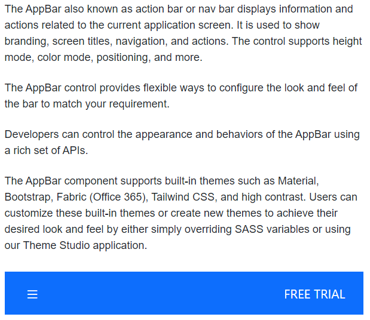
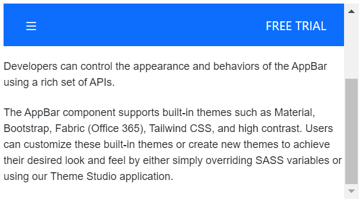

# Positioning in ##Platform_Name## AppBar Control

The position of the AppBar can be set using the position and sticky property. The AppBar provides the following options for setting its position:

* Top AppBar
* Bottom AppBar
* Sticky AppBar

### Top AppBar

The top AppBar is the default one in which it positions the AppBar at the top of the content.
























### Bottom AppBar

This position can be set to the AppBar by setting `Bottom` to the position property. The bottom AppBar positions the AppBar at the bottom of the content.
























### Sticky AppBar

This position can be set to the AppBar by setting `true` to the sticky property. AppBar will be sticky while scrolling the AppBar content.
























