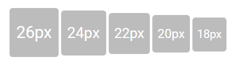

# Avatar Customization

## Colour customization

The avatar comes with default background colour (grey). This can be easily customized to desired colour by adding
custom class or directly selecting the avatar class from the CSS.
























Output be like the below.

## Customize avatar sizes

Even though the avatar comes with five predefined sizes, sometimes it's not enough. So, the avatar is designed in such
a way that the width and height will be relative to font-size. By changing the `font-size` of the avatar element, you can
change the width and height automatically.
























Output be like the below.

## Use various media in avatar

Avatars can be used with a wide variety of media formats like SVG, font-icons, images, letters, words, etc. Some of them are given below.
























Output be like the below.

